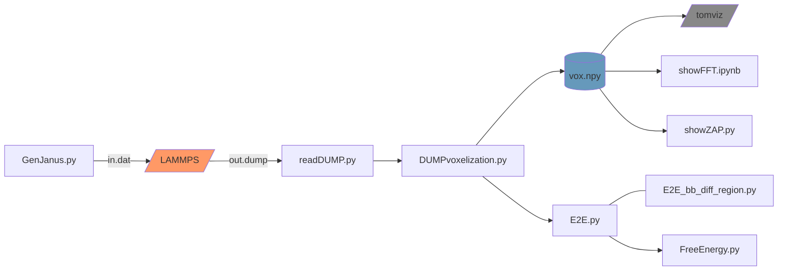
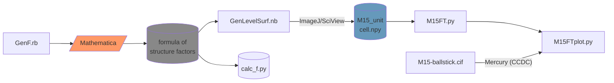

# IMCmesh
Code repo for the ***IMC self-assembled multilayer nanomesh*** paper and the ***diblock Janus bottlebrush copolymer phase simulation*** paper.

## Citation

Please consider citing the following paper if you find our code and/or data useful.

* Sun, Z.†; Liu, R.†; Su, T.; Huang, H.; Kawamoto, K.; Liang, R.; Liu, B.; Zhong, M.; Alexander-Katz, A.; Ross, C. A.\*; Johnson, J. A.\* *Nat. Nanotechnol.* **2022**.
[](https://doi.org/10.1038/s41565-022-01293-z)

  † Equal contribution

## Widgets
### Components

See each file for more details.

[`readAPS-SAXS.py`](/readAPS-SAXS.py)
> Read and process the 1D averaged SAXS profile from Argonne APS. The traces will be stacked into a single graph.
>
> **Usage**: readAPS-SAXS.py [*file1*] [*file2*] ...

[`readAgilent.py`](/readAgilent.py)
> Read and process the ASCII output file from Agilent GPC. The traces will be normalized for the designated time window and stacked into a single graph. Output of the processed data into a .csv file is optional.
> 
> **Usage**: readAgilent.py [*file1*] [*file2*] ...

<br>

## Workflow for simulation



### Components

See each file for more details.

[`GenJanus.py`](/GenJanus.py)
> This script will generate an input .dat file for LAMMPS to simulate di- or tri-JBBCP self-assembly

[`readDUMP.py`](/readDUMP.py)
> This is a module file that will be imported by other python scripts. The `readDUMP.read` method reads the DUMP files from DPD simulations and outputs the data to an organized dict. The structure of the dict is shown below
>
> *dict*{\<*int* `frame`\>: \<*dict* `frameData`\>, ...}
>   - `frameData`: *dict*{`isTriblock`: *Boolean*, `timestep`: *int*, `boxsize`: \<*float[]* `lx`,`ly`,`lz`\>, \<*int* `type`\>: \<*dict* `beadData`\>, ...}
>     - `beadData`: *dict*{\<*int* `beadID`\>: \<*float[]* `x`,`y`,`z`\>}

[`DUMPvoxelization.py`](/DUMPvoxelization.py)
> Read the DUMP files from DPD simulations. Extract the coordinates of a certain type bead in a certain frame. Voxelize the box and count # beads of interest in each voxel. Output the voxel array into .npy binary files. The .npy file could be visualized by loading it into tomviz; its reciprocal space pattern could be calculated by `numpy.fft.fftn` (See also: [`M15FT.py`](/M15FT.py) and [`showFFT.ipynb`](/showFFT.ipynb)).
> 
> **Usage**: DUMPvoxelization.py [*file*] [*frame*] [*type*]
> - *file*: the dump filename
> - *frame*: the specific frame of interest in the DUMP file; usually the last frame (at equilibrium)
> - *type*: the type of the bead of interest; usually the minority block. In our case, it is usually set as 3 (3=PDMS; see [`GenJanus.py`](/GenJanus.py))

[`showFFT.ipynb`](/showFFT.ipynb)
> Show 3D FFT results for simulated morphologies

[`showZAP.py`](/showZAP.py)
> Show [*uvw*] zone axis pattern, *i.e.* projection of the reciprocal space pattern calculated by 3D FFT. Click canvas or press any key to show/hide points/indices.

[`E2E.py`](/E2E.py)
> This script, on its own, presents statistical results for end to end distance of JBBCP backbones and branches (neglecting the homo-C domain), read from a DUMP file from DPD simulations. This is also a module file that will be imported by other python scripts.
> 
> When `E2E.show_plot` is turned on, backbone and branch beads in the A-branch-B domain will be visualized. Click the <kbd>&gt;</kbd> button to move to the next A-B branch, or click the <kbd>&gt;&gt;</kbd> button to fast forward (interval=`E2E.fastforward_interval`) to the last A-B branch of the current JBBCP macromolecule. In this process, all backbone beads from previous branches will remain visible unless `E2E.show_current_bb_only` is set. Do not close the matplotlib window until the last branch in the whole box is analyzed. You can make use of <kbd>&gt;|</kbd> button to speed up the process. After that, click the <kbd>&gt;</kbd> button again to finalize the analysis.
>
> When importing this module in other python scripts, you may want to turn on `E2E.silent`, which effectively turns off `E2E.show_plot` and `E2E.verbose`.

[`E2E_bb_diff_region.py`](/E2E_bb_diff_region.py)
> Present statistical results for end to end distance of JBBCP backbones in the homo-C domains in different lamellar superstructures, read from a DUMP file from DPD simulations. This generates **Fig S51**.
> 
> This script is similar to [`E2E.py`](/E2E.py), but only backbones not branches are analyized, so the <kbd>&gt;</kbd> button has the same function as the <kbd>&gt;&gt;</kbd> button. You can make use of <kbd>&gt;|</kbd> button to speed up the process. After that, click the <kbd>&gt;</kbd> button again to finalize the analysis. Refer to [`E2E.py`](/E2E.py) for more info.

[`FreeEnergy.py`](/FreeEnergy.py)
> Average enthalpy from .out file and entropy from .dump file to generate Fig S56

A screenshot for the output for some of the scripts above is shown below:

<p align="center">

</p>

<br>

## Workflow for M<sup>15</sup> structure generateion and elucidation



### Components

See each file for more details.

[`GenF.rb`](/GenF.rb)
> Output a string for `Mathematica` to calculate the Fourier series of a certain *hkl* index.

The calculated simplified results have been shown in Equations S9–S11 (for O<sup>70</sup>, M<sup>15</sup>, and T<sup>131</sup>, respectively), copied below:

For O<sup>70</sup>:
```math
\begin{align}
\Re(F_{111})&=16 [\cos (2 \pi  x) \cos (2 \pi  y) \cos (2 \pi  z)) + \sin (2 \pi  x) \sin (2 \pi  y) \sin (2 \pi  z)]\\
F_{022}&=16 [\cos (4 \pi  (y-z))+\cos (4 \pi  (y+z))]\\
F_{202}&=16 [\cos (4 \pi  (z-x))+\cos (4 \pi  (z+x))]\\
F_{004}&=32 \cos (8 \pi  z)\\
\Re(F_{113})&=16 [\cos (2 \pi  x) \cos (2 \pi  y) \cos (6 \pi z)-\sin (2 \pi  x) \sin (2 \pi  y) \sin (6 \pi z)]
\end{align}
```

For M<sup>15</sup>:
```math
\begin{align}
F_{110}&=8\cos(2\pi x)\cos(2\pi y)\\
F_{002}&=8\cos(4\pi z)\\
F_{021}&=-8\sin(4\pi y)\sin(2\pi z)\\
F_{111}&=-8\sin(2\pi y)\sin(2\pi (x+z)) 
\end{align}
```

For T<sup>131</sup>:
```math
\begin{align}
F_{110}&=8[\cos(2\pi(x-y))+\cos(2\pi(x+y))]\\
F_{100}&=8[\cos(2\pi x)+\cos(2\pi y)]\\
F_{101}&=8[\cos(2\pi x)-\cos(2\pi y)]\cos(2\pi z)
\end{align}
```

[`GenLevelSurf.nb`](/GenLevelSurf.nb)
> Visualize the O<sup>70</sup>, M<sup>15</sup>, and T<sup>131</sup> networks and generate their 3D models (.stl files)

[`M15FT.py`](/M15FT.py)
> Simulate the SAXS curves by Fourier transform (FT) for 1) 3D continuous M15 and 2) sliced M15-in-LAM structures.
> 
> First, the real space models for the 2 cases are generated. This is based on the model [`M15FT/M15_unitcell.npy`](/M15FT/M15_unitcell.npy), which is generated by Mathematica (see [`GenLevelSurf.nb`](/GenLevelSurf.nb)) and then voxelized and binaried into a 10*20*17 array.
> For each of the 2 cases, the generation methods are elaborated below, and the final outcomes are shown in [`M15FT/M15-c.png`](/M15FT/M15-c.png) and [`M15FT/M15-s.png`](/M15FT/M15-s.png), repectively.
> Then, the FFT is done, and the results are saved to [`M15FT/M15-c_FT.npy`](/M15FT/M15-c_FT.npy) and [`M15FT/M15-s_FT.npy`](M15FT/M15-s_FT.npy), respectively. The results can be visualized by [`M15FTplot.py`](/M15FTplot.py)

[`M15FTplot.py`](/M15FTplot.py)
> Show the simulated SAXS curves for 1) 3D continuous M15 and 2) sliced M15-in-LAM structures.
> See also: `M15FT.py`
> The "powder XRD pattern" for the first case is predicted by `Mercury (CCDC)` from an "artifical" crystal file of M15 space group, [`M15FT/M15-ballstick.cif`](M15FT/M15-ballstick.cif). 

The direct space images for Cases 1) and 2) generated in [`M15FT.py`](/M15FT.py) are shown below:

<p align="center">

</p>

A rough 3D model for M<sup>15</sup> generated by [`GenLevelSurf.nb`](/GenLevelSurf.nb) (with `PlotPoints -> 10`) is shown below. A finer, more accurate model can be downloaded from Supplementary Data 1.

```stl
solid M15
facet normal -0.8273 -0.3818 -0.4121
outer loop
vertex 0.6111 0.6353 1.2028
vertex 0.5838 0.6944 1.2028
vertex 0.6111 0.6944 1.148
endloop
endfacet
facet normal 0.9791 -0.1659 0.1175
outer loop
vertex 1.1667 1.9231 1.7802
vertex 1.1844 2.0278 1.7802
vertex 1.1667 2.0278 1.928
endloop
endfacet
facet normal 0.7918 -0.2258 -0.5674
outer loop
vertex 1.1801 2.25 1.0104
vertex 1.1667 2.203 1.0104
vertex 1.1667 2.25 0.9917
endloop
endfacet
facet normal -0.8308 -0.2442 -0.5002
outer loop
vertex 1.2778 1.4307 1.0104
vertex 1.2329 1.5833 1.0104
vertex 1.2778 1.5833 0.9358
endloop
endfacet
facet normal -0.8196 -0.377 0.4314
outer loop
vertex 1.2017 1.3611 1.3953
vertex 1.2778 1.1956 1.3953
vertex 1.2778 1.3611 1.5399
endloop
endfacet
facet normal -0.4974 0.2567 -0.8287
outer loop
vertex 1.2532 1.8056 1.0104
vertex 1.2778 1.8532 1.0104
vertex 1.2778 1.8056 0.9956
endloop
endfacet
facet normal 0.6919 -0.3503 0.6314
outer loop
vertex 1.1667 1.5984 1.5877
vertex 1.2715 1.8056 1.5877
vertex 1.1667 1.8056 1.7026
endloop
endfacet
facet normal -0.959 -0.2652 -0.0998
outer loop
vertex 0.8333 2.0084 1.5877
vertex 0.828 2.0278 1.5877
vertex 0.8333 2.0278 1.5361
endloop
endfacet
facet normal -0.7176 -0.5902 -0.3697
outer loop
vertex 1.3889 1.2254 1.0104
vertex 1.46 1.1389 1.0104
vertex 1.3889 1.1389 1.1484
endloop
endfacet
facet normal -0.7906 0.4924 -0.3641
outer loop
vertex 1.4081 1.3611 1.9726
vertex 1.3889 1.3302 1.9726
vertex 1.3889 1.3611 2.0144
endloop
endfacet
facet normal -0.8487 0.3187 -0.4221
outer loop
vertex 1.1775 0.9167 1.9726
vertex 1.1667 0.8879 1.9726
vertex 1.1667 0.9167 1.9943
endloop
endfacet
facet normal 0.7407 0.3423 0.5781
outer loop
vertex 1.1813 0.6944 0.8179
vertex 1.1667 0.726 0.8179
vertex 1.1667 0.6944 0.8366
endloop
endfacet
facet normal -0.8602 0.4301 -0.2741
outer loop
vertex 1.2187 1.1389 2.1651
vertex 1.2778 1.2571 2.1651
vertex 1.2778 1.1389 1.9797
endloop
endfacet
facet normal -0.8863 -0.4087 -0.2178
outer loop
vertex 1.3889 0.8692 1.5877
vertex 1.367 0.9167 1.5877
vertex 1.3889 0.9167 1.4987
endloop
endfacet
facet normal 0.8602 -0.4301 0.2739
outer loop
vertex 1.2778 0.3541 0.433
vertex 1.3369 0.4722 0.433
vertex 1.2778 0.4722 0.6186
endloop
endfacet
facet normal 0.5512 -0.3077 -0.7756
outer loop
vertex 1.3422 0.4722 1.9726
vertex 1.2778 0.3569 1.9726
vertex 1.2778 0.4722 1.9269
endloop
endfacet
facet normal -0.8499 0.4457 -0.2813
outer loop
vertex 1.2801 1.1389 1.9726
vertex 1.2778 1.1344 1.9726
vertex 1.2778 1.1389 1.9797
endloop
endfacet
facet normal -0.8258 -0.4396 -0.3533
outer loop
vertex 1.3889 1.0952 1.2028
vertex 1.3656 1.1389 1.2028
vertex 1.3889 1.1389 1.1484
endloop
endfacet
facet normal -0.796 0.3333 -0.5053
outer loop
vertex 0.8825 0.6944 0.8179
vertex 0.8333 0.5769 0.8179
vertex 0.8333 0.6944 0.8954
endloop
endfacet
facet normal -0.8013 0.3691 -0.4708
outer loop
vertex 1.1775 0.9167 1.9726
vertex 1.2778 1.1344 1.9726
vertex 1.2778 0.9167 1.8019
endloop
endfacet
facet normal -0.8467 -0.4474 -0.288
outer loop
vertex 1.2778 1.3037 1.2028
vertex 1.2475 1.3611 1.2028
vertex 1.2778 1.3611 1.1136
endloop
endfacet
facet normal -0.6289 0.2169 0.7466
outer loop
vertex 1.2778 1.3054 0.6255
vertex 1.2203 1.1389 0.6255
vertex 1.2778 1.1389 0.6739
endloop
endfacet
facet normal -0.8757 0.4379 -0.2036
outer loop
vertex 1.3906 1.5833 0.6255
vertex 1.3889 1.58 0.6255
vertex 1.3889 1.5833 0.6327
endloop
endfacet
facet normal -0.5331 -0.6942 -0.4837
outer loop
vertex 1.5 1.1082 1.0104
vertex 1.46 1.1389 1.0104
vertex 1.5 1.1389 0.9663
endloop
endfacet
facet normal -0.8725 -0.4442 -0.2036
outer loop
vertex 1.3889 0.9641 1.3953
vertex 1.413 0.9167 1.3953
vertex 1.3889 0.9167 1.4987
endloop
endfacet
facet normal -0.7317 0.485 -0.479
outer loop
vertex 1.4081 1.3611 1.9726
vertex 1.5 1.4997 1.9726
vertex 1.5 1.3611 1.8323
endloop
endfacet
facet normal 0.8442 -0.4221 0.3303
outer loop
vertex 1.3889 0.5763 0.433
vertex 1.448 0.6944 0.433
vertex 1.3889 0.6944 0.584
endloop
endfacet
facet normal -0.2186 -0.9557 0.1973
outer loop
vertex 1.3895 0.6944 1.7802
vertex 1.5 0.6692 1.7802
vertex 1.5 0.6944 1.9026
endloop
endfacet
facet normal 0.4855 -0.2086 0.849
outer loop
vertex 1.3889 0.7824 0.6255
vertex 1.4466 0.9167 0.6255
vertex 1.3889 0.9167 0.6584
endloop
endfacet
facet normal -0.7791 -0.6053 -0.1628
outer loop
vertex 1.5 0.6874 1.5877
vertex 1.4945 0.6944 1.5877
vertex 1.5 0.6944 1.5615
endloop
endfacet
facet normal 0.959 0.2652 0.0998
outer loop
vertex 1.172 0.4722 1.0104
vertex 1.1667 0.4916 1.0104
vertex 1.1667 0.4722 1.062
endloop
endfacet
facet normal 0.8661 0.4572 0.2019
outer loop
vertex 1.0288 0.6944 1.2028
vertex 1.0556 0.6438 1.2028
vertex 1.0556 0.6944 1.0881
endloop
endfacet
facet normal -0.7294 0.4918 -0.4756
outer loop
vertex 0.9814 0.4722 1.9726
vertex 0.9444 0.4174 1.9726
vertex 0.9444 0.4722 2.0293
endloop
endfacet
facet normal -0.8558 0.4736 -0.2082
outer loop
vertex 0.9489 0.6944 0.6255
vertex 0.9444 0.6863 0.6255
vertex 0.9444 0.6944 0.644
endloop
endfacet
facet normal -0.5548 0.3581 -0.751
outer loop
vertex 0.9814 0.4722 1.9726
vertex 1.0556 0.5871 1.9726
vertex 1.0556 0.4722 1.9178
endloop
endfacet
facet normal 0.8487 0.4332 0.3035
outer loop
vertex 1.3097 2.0278 1.3953
vertex 1.2778 2.0904 1.3953
vertex 1.2778 2.0278 1.4846
endloop
endfacet
facet normal 0.8102 -0.2823 -0.5137
outer loop
vertex 1.2395 2.25 1.9726
vertex 1.1667 2.0409 1.9726
vertex 1.1667 2.25 1.8577
endloop
endfacet
facet normal -0.8006 -0.3874 -0.4571
outer loop
vertex 1.5 0.8762 1.2028
vertex 1.4804 0.9167 1.2028
vertex 1.5 0.9167 1.1685
endloop
endfacet
facet normal -0.4513 0.4233 0.7856
outer loop
vertex 1.3889 1.3847 1.5877
vertex 1.3668 1.3611 1.5877
vertex 1.3889 1.3611 1.6004
endloop
endfacet
facet normal -0.5705 0.8043 -0.1661
outer loop
vertex 1.4644 1.8056 0.8179
vertex 1.5 1.8308 0.8179
vertex 1.5 1.8056 0.6955
endloop
endfacet
facet normal 0.8273 0.3818 0.4121
outer loop
vertex 1.4162 1.8056 1.3953
vertex 1.3889 1.8647 1.3953
vertex 1.3889 1.8056 1.45
endloop
endfacet
facet normal -0.8291 0.4145 -0.3753
outer loop
vertex 1.4409 1.5833 2.1651
vertex 1.5 1.7015 2.1651
vertex 1.5 1.5833 2.0345
endloop
endfacet
facet normal -0.677 0.5124 -0.5284
outer loop
vertex 1.4644 1.8056 0.8179
vertex 1.3889 1.7058 0.8179
vertex 1.3889 1.8056 0.9146
endloop
endfacet
facet normal 0.8707 0.4652 0.1594
outer loop
vertex 1.4696 1.8056 1.2028
vertex 1.5 1.7486 1.2028
vertex 1.5 1.8056 1.0366
endloop
endfacet
facet normal 0.6816 -0.4354 0.5882
outer loop
vertex 1.5 1.0003 0.6255
vertex 1.4466 0.9167 0.6255
vertex 1.5 0.9167 0.5635
endloop
endfacet
facet normal -0.8755 -0.4009 -0.27
outer loop
vertex 1.2778 1.4307 1.0104
vertex 1.3096 1.3611 1.0104
vertex 1.2778 1.3611 1.1136
endloop
endfacet
facet normal -0.844 0.422 -0.331
outer loop
vertex 1.3298 1.3611 2.1651
vertex 1.3889 1.4793 2.1651
vertex 1.3889 1.3611 2.0144
endloop
endfacet
facet normal -0.8853 0.3878 -0.2565
outer loop
vertex 1.3352 1.5833 0.8179
vertex 1.3889 1.7058 0.8179
vertex 1.3889 1.5833 0.6327
endloop
endfacet
facet normal 0.8129 0.3934 -0.4296
outer loop
vertex 1.2778 2.1828 1.2028
vertex 1.3528 2.0278 1.2028
vertex 1.2778 2.0278 1.0608
endloop
endfacet
facet normal -0.8296 0.4727 -0.2971
outer loop
vertex 0.8413 2.25 1.9726
vertex 0.8333 2.236 1.9726
vertex 0.8333 2.25 1.9949
endloop
endfacet
facet normal 0.7068 -0.2719 0.6531
outer loop
vertex 1.2778 0.478 0.6255
vertex 1.3611 0.6944 0.6255
vertex 1.2778 0.6944 0.7156
endloop
endfacet
facet normal 0.8337 -0.4168 0.3622
outer loop
vertex 0.9444 1.6874 0.433
vertex 1.0035 1.8056 0.433
vertex 0.9444 1.8056 0.569
endloop
endfacet
facet normal -0.6816 0.4354 -0.5882
outer loop
vertex 0.5534 1.5833 1.9726
vertex 0.5 1.4997 1.9726
vertex 0.5 1.5833 2.0345
endloop
endfacet
facet normal 0.5331 0.6942 0.4837
outer loop
vertex 0.54 1.3611 1.5877
vertex 0.5 1.3918 1.5877
vertex 0.5 1.3611 1.6318
endloop
endfacet
facet normal -0.4855 0.2086 -0.849
outer loop
vertex 0.5534 1.5833 1.9726
vertex 0.6111 1.7176 1.9726
vertex 0.6111 1.5833 1.9396
endloop
endfacet
facet normal 0.8006 0.3874 0.4571
outer loop
vertex 0.5196 1.5833 1.3953
vertex 0.5 1.6238 1.3953
vertex 0.5 1.5833 1.4296
endloop
endfacet
facet normal -0.7732 0.4955 0.3957
outer loop
vertex 0.6111 1.9589 0.6255
vertex 0.5129 1.8056 0.6255
vertex 0.6111 1.8056 0.8174
endloop
endfacet
facet normal 0.7791 0.6053 0.1628
outer loop
vertex 0.5055 1.8056 1.0104
vertex 0.5 1.8126 1.0104
vertex 0.5 1.8056 1.0366
endloop
endfacet
facet normal -0.8129 -0.3934 0.4296
outer loop
vertex 0.6472 0.4722 1.3953
vertex 0.7222 0.3172 1.3953
vertex 0.7222 0.4722 1.5373
endloop
endfacet
facet normal -0.8487 -0.4332 -0.3035
outer loop
vertex 0.7222 0.4096 1.2028
vertex 0.6903 0.4722 1.2028
vertex 0.7222 0.4722 1.1134
endloop
endfacet
facet normal -0.8442 0.4221 -0.3303
outer loop
vertex 0.552 1.8056 2.1651
vertex 0.6111 1.9237 2.1651
vertex 0.6111 1.8056 2.0141
endloop
endfacet
facet normal 0.7732 -0.4955 -0.3957
outer loop
vertex 1.3889 0.6944 1.7806
vertex 1.4871 0.6944 1.9726
vertex 1.3889 0.5411 1.9726
endloop
endfacet
facet normal -0.7407 -0.3423 -0.5781
outer loop
vertex 0.8333 1.774 1.7802
vertex 0.8187 1.8056 1.7802
vertex 0.8333 1.8056 1.7615
endloop
endfacet
facet normal -0.8271 -0.4909 -0.2738
outer loop
vertex 0.8333 0.3161 1.0104
vertex 0.8726 0.25 1.0104
vertex 0.8333 0.25 1.1289
endloop
endfacet
facet normal 0.8487 -0.3187 0.4221
outer loop
vertex 0.8333 1.6121 0.6255
vertex 0.8225 1.5833 0.6255
vertex 0.8333 1.5833 0.6038
endloop
endfacet
facet normal 0.8013 -0.3691 0.4708
outer loop
vertex 0.7222 1.3656 0.6255
vertex 0.8225 1.5833 0.6255
vertex 0.7222 1.5833 0.7962
endloop
endfacet
facet normal 0.8308 0.2442 0.5002
outer loop
vertex 0.7671 0.9167 1.5877
vertex 0.7222 1.0693 1.5877
vertex 0.7222 0.9167 1.6622
endloop
endfacet
facet normal -0.8563 0.3958 -0.3318
outer loop
vertex 0.7249 2.0278 1.9726
vertex 0.7222 2.022 1.9726
vertex 0.7222 2.0278 1.9795
endloop
endfacet
facet normal 0.8602 -0.4301 0.2741
outer loop
vertex 0.7222 1.2429 0.433
vertex 0.7813 1.3611 0.433
vertex 0.7222 1.3611 0.6184
endloop
endfacet
facet normal 0.8467 0.4474 0.288
outer loop
vertex 0.7525 1.1389 1.3953
vertex 0.7222 1.1963 1.3953
vertex 0.7222 1.1389 1.4844
endloop
endfacet
facet normal 0.8196 0.377 -0.4314
outer loop
vertex 0.7222 1.3044 1.2028
vertex 0.7983 1.1389 1.2028
vertex 0.7222 1.1389 1.0582
endloop
endfacet
facet normal -0.8393 -0.4484 -0.3073
outer loop
vertex 0.8333 2.1993 1.2028
vertex 0.8063 2.25 1.2028
vertex 0.8333 2.25 1.1289
endloop
endfacet
facet normal 0.6289 -0.2169 -0.7466
outer loop
vertex 0.7797 1.3611 1.9726
vertex 0.7222 1.1946 1.9726
vertex 0.7222 1.3611 1.9242
endloop
endfacet
facet normal 0.8725 0.4442 0.2036
outer loop
vertex 0.587 1.5833 1.2028
vertex 0.6111 1.5359 1.2028
vertex 0.6111 1.5833 1.0994
endloop
endfacet
facet normal -0.8707 -0.4652 -0.1594
outer loop
vertex 0.5 0.7514 1.3953
vertex 0.5304 0.6944 1.3953
vertex 0.5 0.6944 1.5615
endloop
endfacet
facet normal 0.677 -0.5124 0.5284
outer loop
vertex 0.6111 0.7942 1.7802
vertex 0.5356 0.6944 1.7802
vertex 0.6111 0.6944 1.6835
endloop
endfacet
facet normal 0.8291 -0.4145 0.3753
outer loop
vertex 0.5 0.7985 0.433
vertex 0.5591 0.9167 0.433
vertex 0.5 0.9167 0.5635
endloop
endfacet
facet normal -0.8542 0.4271 -0.2966
outer loop
vertex 0.7743 0.25 2.1651
vertex 0.8333 0.3682 2.1651
vertex 0.8333 0.25 1.9949
endloop
endfacet
facet normal -0.7918 0.2258 0.5674
outer loop
vertex 0.8333 0.297 1.5877
vertex 0.8199 0.25 1.5877
vertex 0.8333 0.25 1.6064
endloop
endfacet
facet normal -0.6919 0.3503 -0.6314
outer loop
vertex 0.7285 0.6944 1.0104
vertex 0.8333 0.9016 1.0104
vertex 0.8333 0.6944 0.8954
endloop
endfacet
facet normal -0.9791 0.1659 -0.1175
outer loop
vertex 0.8156 0.4722 0.8179
vertex 0.8333 0.5769 0.8179
vertex 0.8333 0.4722 0.6701
endloop
endfacet
facet normal 0.8863 0.4087 0.2178
outer loop
vertex 0.633 1.5833 1.0104
vertex 0.6111 1.6308 1.0104
vertex 0.6111 1.5833 1.0994
endloop
endfacet
facet normal 0.4513 -0.4233 -0.7856
outer loop
vertex 0.6332 1.1389 1.0104
vertex 0.6111 1.1153 1.0104
vertex 0.6111 1.1389 0.9977
endloop
endfacet
facet normal 0.8499 -0.4457 0.2813
outer loop
vertex 0.7222 1.3656 0.6255
vertex 0.7199 1.3611 0.6255
vertex 0.7222 1.3611 0.6184
endloop
endfacet
facet normal 0.8258 0.4396 0.3533
outer loop
vertex 0.6344 1.3611 1.3953
vertex 0.6111 1.4048 1.3953
vertex 0.6111 1.3611 1.4497
endloop
endfacet
facet normal 0.8755 0.4009 0.27
outer loop
vertex 0.6904 1.1389 1.5877
vertex 0.7222 1.0693 1.5877
vertex 0.7222 1.1389 1.4844
endloop
endfacet
facet normal 0.4974 -0.2567 0.8287
outer loop
vertex 0.7222 0.6468 1.5877
vertex 0.7468 0.6944 1.5877
vertex 0.7222 0.6944 1.6025
endloop
endfacet
facet normal 0.8029 -0.2539 0.5393
outer loop
vertex 1.3889 0.7824 0.6255
vertex 1.3611 0.6944 0.6255
vertex 1.3889 0.6944 0.584
endloop
endfacet
facet normal -0.8029 0.2539 -0.5393
outer loop
vertex 0.6389 1.8056 1.9726
vertex 0.6111 1.7176 1.9726
vertex 0.6111 1.8056 2.0141
endloop
endfacet
facet normal 0.844 -0.422 0.331
outer loop
vertex 0.6111 1.0207 0.433
vertex 0.6702 1.1389 0.433
vertex 0.6111 1.1389 0.5836
endloop
endfacet
facet normal 0.7176 0.5902 0.3697
outer loop
vertex 0.54 1.3611 1.5877
vertex 0.6111 1.2746 1.5877
vertex 0.6111 1.3611 1.4497
endloop
endfacet
facet normal 0.7317 -0.485 0.479
outer loop
vertex 0.5 1.0003 0.6255
vertex 0.5919 1.1389 0.6255
vertex 0.5 1.1389 0.7658
endloop
endfacet
facet normal 0.5705 -0.8043 0.1661
outer loop
vertex 0.5 0.6692 1.7802
vertex 0.5356 0.6944 1.7802
vertex 0.5 0.6944 1.9026
endloop
endfacet
facet normal 0.7906 -0.4924 0.3641
outer loop
vertex 0.6111 1.1698 0.6255
vertex 0.5919 1.1389 0.6255
vertex 0.6111 1.1389 0.5836
endloop
endfacet
facet normal 0.8757 -0.4379 0.2035
outer loop
vertex 0.6111 0.92 1.9726
vertex 0.6094 0.9167 1.9726
vertex 0.6111 0.9167 1.9654
endloop
endfacet
facet normal 0.8853 -0.3878 0.2565
outer loop
vertex 0.6111 0.7942 1.7802
vertex 0.6648 0.9167 1.7802
vertex 0.6111 0.9167 1.9654
endloop
endfacet
facet normal -0.5512 0.3077 0.7756
outer loop
vertex 0.7222 2.1431 0.6255
vertex 0.6578 2.0278 0.6255
vertex 0.7222 2.0278 0.6712
endloop
endfacet
facet normal -0.9839 -0.1342 -0.1181
outer loop
vertex 0.8333 0.3421 0.8179
vertex 0.8156 0.4722 0.8179
vertex 0.8333 0.4722 0.6701
endloop
endfacet
facet normal -0.8602 0.4301 -0.2739
outer loop
vertex 0.6631 2.0278 2.1651
vertex 0.7222 2.1459 2.1651
vertex 0.7222 2.0278 1.9795
endloop
endfacet
facet normal -0.7068 0.2719 -0.6531
outer loop
vertex 0.6389 1.8056 1.9726
vertex 0.7222 2.022 1.9726
vertex 0.7222 1.8056 1.8825
endloop
endfacet
facet normal -0.8091 -0.3705 -0.4561
outer loop
vertex 1.0556 1.7566 1.2028
vertex 1.0331 1.8056 1.2028
vertex 1.0556 1.8056 1.1631
endloop
endfacet
facet normal 0.8542 -0.4271 0.2966
outer loop
vertex 1.1667 2.1318 0.433
vertex 1.2257 2.25 0.433
vertex 1.1667 2.25 0.6032
endloop
endfacet
facet normal 0.8296 -0.4727 0.2971
outer loop
vertex 1.1667 0.264 0.6255
vertex 1.1587 0.25 0.6255
vertex 1.1667 0.25 0.6032
endloop
endfacet
facet normal 0.7927 -0.5403 0.2821
outer loop
vertex 1.0556 1.7147 1.7802
vertex 1.1175 1.8056 1.7802
vertex 1.0556 1.8056 1.9541
endloop
endfacet
facet normal -0.8423 -0.4097 -0.3502
outer loop
vertex 1.1667 1.5196 1.2028
vertex 1.1357 1.5833 1.2028
vertex 1.1667 1.5833 1.1283
endloop
endfacet
facet normal 0.8423 0.4097 0.3502
outer loop
vertex 0.8643 0.9167 1.3953
vertex 0.8333 0.9804 1.3953
vertex 0.8333 0.9167 1.4698
endloop
endfacet
facet normal 0.5776 -0.1894 0.794
outer loop
vertex 0.8333 1.6121 0.6255
vertex 0.8968 1.8056 0.6255
vertex 0.8333 1.8056 0.6716
endloop
endfacet
facet normal -0.8891 -0.4326 -0.1496
outer loop
vertex 0.8333 2.0765 1.3953
vertex 0.857 2.0278 1.3953
vertex 0.8333 2.0278 1.5361
endloop
endfacet
facet normal -0.8367 -0.494 -0.2366
outer loop
vertex 0.9444 1.7683 1.5877
vertex 0.9225 1.8056 1.5877
vertex 0.9444 1.8056 1.51
endloop
endfacet
facet normal 0.8286 0.3642 0.4251
outer loop
vertex 1.0775 0.6944 1.0104
vertex 1.1667 0.4916 1.0104
vertex 1.1667 0.6944 0.8366
endloop
endfacet
facet normal 0.8558 -0.4736 0.2082
outer loop
vertex 1.0556 1.8137 1.9726
vertex 1.0511 1.8056 1.9726
vertex 1.0556 1.8056 1.9541
endloop
endfacet
facet normal -0.839 0.4729 0.2691
outer loop
vertex 0.8333 2.1512 1.7802
vertex 0.8891 2.25 1.7802
vertex 0.8333 2.25 1.6064
endloop
endfacet
facet normal -0.8661 -0.4572 -0.2019
outer loop
vertex 0.9444 1.8562 1.3953
vertex 0.9712 1.8056 1.3953
vertex 0.9444 1.8056 1.51
endloop
endfacet
facet normal -0.6512 0.4378 0.6199
outer loop
vertex 1.1667 1.0413 0.6255
vertex 1.0828 0.9167 0.6255
vertex 1.1667 0.9167 0.7135
endloop
endfacet
facet normal -0.8286 -0.3642 -0.4251
outer loop
vertex 0.8333 2.0084 1.5877
vertex 0.9225 1.8056 1.5877
vertex 0.8333 1.8056 1.7615
endloop
endfacet
facet normal 0.8334 0.4288 -0.3487
outer loop
vertex 0.8333 1.0665 1.2028
vertex 0.9104 0.9167 1.2028
vertex 0.8333 0.9167 1.0185
endloop
endfacet
facet normal -0.5776 0.1894 -0.794
outer loop
vertex 1.1032 0.6944 1.9726
vertex 1.1667 0.8879 1.9726
vertex 1.1667 0.6944 1.9265
endloop
endfacet
facet normal 0.6512 -0.4378 -0.6199
outer loop
vertex 0.9172 1.5833 1.9726
vertex 0.8333 1.4587 1.9726
vertex 0.8333 1.5833 1.8846
endloop
endfacet
facet normal 0.839 -0.4729 -0.2691
outer loop
vertex 1.1109 0.25 0.8179
vertex 1.1667 0.3488 0.8179
vertex 1.1667 0.25 0.9917
endloop
endfacet
facet normal 0.8544 -0.4272 0.2957
outer loop
vertex 0.8333 1.4652 0.433
vertex 0.8924 1.5833 0.433
vertex 0.8333 1.5833 0.6038
endloop
endfacet
facet normal -0.8544 0.4272 -0.2957
outer loop
vertex 1.1076 0.9167 2.1651
vertex 1.1667 1.0348 2.1651
vertex 1.1667 0.9167 1.9943
endloop
endfacet
facet normal -0.8335 0.4168 -0.3627
outer loop
vertex 0.8854 0.4722 2.1651
vertex 0.9444 0.5904 2.1651
vertex 0.9444 0.4722 2.0293
endloop
endfacet
facet normal 0.8891 0.4326 0.1496
outer loop
vertex 1.143 0.4722 1.2028
vertex 1.1667 0.4235 1.2028
vertex 1.1667 0.4722 1.062
endloop
endfacet
facet normal 0.8335 -0.4168 0.3627
outer loop
vertex 1.0556 1.9096 0.433
vertex 1.1146 2.0278 0.433
vertex 1.0556 2.0278 0.5688
endloop
endfacet
facet normal -0.8337 0.4168 -0.3622
outer loop
vertex 0.9965 0.6944 2.1651
vertex 1.0556 0.8126 2.1651
vertex 1.0556 0.6944 2.0291
endloop
endfacet
facet normal -0.7927 0.5403 -0.2821
outer loop
vertex 0.8825 0.6944 0.8179
vertex 0.9444 0.7853 0.8179
vertex 0.9444 0.6944 0.644
endloop
endfacet
facet normal -0.8103 -0.4164 -0.4123
outer loop
vertex 0.9444 1.9886 1.2028
vertex 0.9243 2.0278 1.2028
vertex 0.9444 2.0278 1.1633
endloop
endfacet
facet normal 0.8103 0.4164 0.4123
outer loop
vertex 1.0757 0.4722 1.3953
vertex 1.0556 0.5114 1.3953
vertex 1.0556 0.4722 1.4348
endloop
endfacet
facet normal -0.8334 -0.4288 0.3487
outer loop
vertex 1.0896 1.5833 1.3953
vertex 1.1667 1.4335 1.3953
vertex 1.1667 1.5833 1.5795
endloop
endfacet
facet normal 0.7235 -0.3215 0.6109
outer loop
vertex 0.9444 1.9129 0.6255
vertex 0.8968 1.8056 0.6255
vertex 0.9444 1.8056 0.569
endloop
endfacet
facet normal 0.5548 -0.3581 0.751
outer loop
vertex 0.9444 1.9129 0.6255
vertex 1.0186 2.0278 0.6255
vertex 0.9444 2.0278 0.6802
endloop
endfacet
facet normal 0.8271 0.4909 0.2738
outer loop
vertex 1.1274 2.25 1.5877
vertex 1.1667 2.1839 1.5877
vertex 1.1667 2.25 1.4692
endloop
endfacet
facet normal 0.8563 -0.3958 0.3318
outer loop
vertex 1.2778 0.478 0.6255
vertex 1.2751 0.4722 0.6255
vertex 1.2778 0.4722 0.6186
endloop
endfacet
facet normal 0.8367 0.494 0.2366
outer loop
vertex 1.0775 0.6944 1.0104
vertex 1.0556 0.7317 1.0104
vertex 1.0556 0.6944 1.0881
endloop
endfacet
facet normal 0.8091 0.3705 0.4561
outer loop
vertex 0.9669 0.6944 1.3953
vertex 0.9444 0.7434 1.3953
vertex 0.9444 0.6944 1.435
endloop
endfacet
facet normal 0.9839 0.1342 0.1181
outer loop
vertex 1.1667 2.0278 1.928
vertex 1.1844 2.0278 1.7802
vertex 1.1667 2.1579 1.7802
endloop
endfacet
facet normal -0.7235 0.3215 -0.6109
outer loop
vertex 1.1032 0.6944 1.9726
vertex 1.0556 0.5871 1.9726
vertex 1.0556 0.6944 2.0291
endloop
endfacet
facet normal 0.8393 0.4484 0.3073
outer loop
vertex 1.1937 0.25 1.3953
vertex 1.1667 0.3007 1.3953
vertex 1.1667 0.25 1.4692
endloop
endfacet
facet normal 0.796 -0.3333 0.5053
outer loop
vertex 1.1667 1.9231 1.7802
vertex 1.1175 1.8056 1.7802
vertex 1.1667 1.8056 1.7026
endloop
endfacet
facet normal 0.7294 -0.4918 0.4756
outer loop
vertex 1.0556 2.0826 0.6255
vertex 1.0186 2.0278 0.6255
vertex 1.0556 2.0278 0.5688
endloop
endfacet
facet normal -0.8722 -0.4011 -0.2798
outer loop
vertex 1.3656 1.1389 1.2028
vertex 1.3039 1.1389 1.3953
vertex 1.2778 1.1956 1.3953
endloop
endfacet
facet normal -0.8532 -0.4547 -0.2553
outer loop
vertex 1.3656 1.1389 1.2028
vertex 1.2778 1.1956 1.3953
vertex 1.2778 1.3037 1.2028
endloop
endfacet
facet normal 0.8515 -0.48 0.2112
outer loop
vertex 1.1667 0.3488 0.8179
vertex 1.1109 0.25 0.8179
vertex 1.1587 0.25 0.6255
endloop
endfacet
facet normal 0.8489 -0.4837 0.2132
outer loop
vertex 1.1667 0.3488 0.8179
vertex 1.1587 0.25 0.6255
vertex 1.1667 0.264 0.6255
endloop
endfacet
facet normal 0.8594 0.4525 0.2379
outer loop
vertex 1.247 2.25 1.2028
vertex 1.1937 2.25 1.3953
vertex 1.2778 2.0904 1.3953
endloop
endfacet
facet normal 0.8915 0.4083 0.1961
outer loop
vertex 1.247 2.25 1.2028
vertex 1.2778 2.0904 1.3953
vertex 1.2778 2.1828 1.2028
endloop
endfacet
facet normal -0.8567 -0.4577 -0.2377
outer loop
vertex 0.5838 0.6944 1.2028
vertex 0.5304 0.6944 1.3953
vertex 0.5 0.7514 1.3953
endloop
endfacet
facet normal -0.8763 -0.4042 -0.2621
outer loop
vertex 0.5838 0.6944 1.2028
vertex 0.5 0.7514 1.3953
vertex 0.5 0.8762 1.2028
endloop
endfacet
facet normal -0.9371 0.3078 -0.1643
outer loop
vertex 1.2778 1.3054 0.6255
vertex 1.2961 1.3611 0.6255
vertex 1.3298 1.3611 0.433
endloop
endfacet
facet normal -0.8888 0.4444 -0.1118
outer loop
vertex 1.2778 1.3054 0.6255
vertex 1.3298 1.3611 0.433
vertex 1.2778 1.2571 0.433
endloop
endfacet
facet normal -0.8606 -0.5026 -0.082
outer loop
vertex 1.3889 1.2254 1.0104
vertex 1.3096 1.3611 1.0104
vertex 1.328 1.3611 0.8179
endloop
endfacet
facet normal -0.9093 -0.4161 -0.0056
outer loop
vertex 1.3889 1.2254 1.0104
vertex 1.328 1.3611 0.8179
vertex 1.3889 1.228 0.8179
endloop
endfacet
facet normal 0.8709 -0.4355 0.2278
outer loop
vertex 0.6094 0.9167 1.9726
vertex 0.5591 0.9167 2.1651
vertex 0.5 0.7985 2.1651
endloop
endfacet
facet normal 0.86 -0.4691 0.201
outer loop
vertex 0.6094 0.9167 1.9726
vertex 0.5 0.7985 2.1651
vertex 0.5 0.716 1.9726
endloop
endfacet
facet normal -0.9818 0.1683 0.088
outer loop
vertex 1.2899 0.9167 1.7802
vertex 1.328 1.1389 1.7802
vertex 1.3107 1.1389 1.5877
endloop
endfacet
facet normal -0.9035 -0.229 -0.3622
outer loop
vertex 1.2899 0.9167 1.7802
vertex 1.3107 1.1389 1.5877
vertex 1.367 0.9167 1.5877
endloop
endfacet
facet normal -0.4581 -0.2874 0.8411
outer loop
vertex 1.3889 0.9167 0.6584
vertex 1.3889 1.1389 0.7344
vertex 1.2778 1.1389 0.6739
endloop
endfacet
facet normal 0.2697 0.0682 0.9605
outer loop
vertex 1.3889 0.9167 0.6584
vertex 1.2778 1.1389 0.6739
vertex 1.2778 0.9167 0.6896
endloop
endfacet
facet normal 0.134 -0.2932 0.9466
outer loop
vertex 0.6111 0.596 1.5877
vertex 0.7222 0.6468 1.5877
vertex 0.7222 0.6944 1.6025
endloop
endfacet
facet normal 0.4631 -0.6181 0.6352
outer loop
vertex 0.6111 0.596 1.5877
vertex 0.7222 0.6944 1.6025
vertex 0.6111 0.6944 1.6835
endloop
endfacet
facet normal -0.888 -0.4085 -0.2113
outer loop
vertex 1.2778 1.1956 1.3953
vertex 1.2017 1.3611 1.3953
vertex 1.2475 1.3611 1.2028
endloop
endfacet
facet normal -0.8552 -0.4519 -0.2538
outer loop
vertex 1.2778 1.1956 1.3953
vertex 1.2475 1.3611 1.2028
vertex 1.2778 1.3037 1.2028
endloop
endfacet
facet normal -0.8506 -0.449 -0.2738
outer loop
vertex 1.0331 1.8056 1.2028
vertex 0.9712 1.8056 1.3953
vertex 0.9444 1.8562 1.3953
endloop
endfacet
facet normal -0.862 -0.4177 -0.2873
outer loop
vertex 1.0331 1.8056 1.2028
vertex 0.9444 1.8562 1.3953
vertex 0.9444 1.9886 1.2028
endloop
endfacet
facet normal -0.8762 0.4819 0.0074
outer loop
vertex 1.1667 1.0413 0.6255
vertex 1.2203 1.1389 0.6255
vertex 1.2187 1.1389 0.433
endloop
endfacet
facet normal -0.8943 0.4472 -0.0151
outer loop
vertex 1.1667 1.0413 0.6255
vertex 1.2187 1.1389 0.433
vertex 1.1667 1.0348 0.433
endloop
endfacet
facet normal -0.8723 -0.4483 -0.1953
outer loop
vertex 0.6903 0.4722 1.2028
vertex 0.6472 0.4722 1.3953
vertex 0.6111 0.5424 1.3953
endloop
endfacet
facet normal -0.8803 -0.4273 -0.2062
outer loop
vertex 0.6903 0.4722 1.2028
vertex 0.6111 0.5424 1.3953
vertex 0.6111 0.6353 1.2028
endloop
endfacet
facet normal -0.0371 -0.0574 -0.9977
outer loop
vertex 1.0556 2.0278 1.0518
vertex 1.1667 2.0278 1.0477
vertex 1.1667 1.8056 1.0604
endloop
endfacet
facet normal -0.6368 -0.3452 -0.6895
outer loop
vertex 1.0556 2.0278 1.0518
vertex 1.1667 1.8056 1.0604
vertex 1.0556 1.8056 1.1631
endloop
endfacet
facet normal -0.8824 -0.427 -0.1975
outer loop
vertex 0.7222 0.3172 1.3953
vertex 0.6472 0.4722 1.3953
vertex 0.6903 0.4722 1.2028
endloop
endfacet
facet normal -0.8702 -0.4441 -0.2134
outer loop
vertex 0.7222 0.3172 1.3953
vertex 0.6903 0.4722 1.2028
vertex 0.7222 0.4096 1.2028
endloop
endfacet
facet normal 0.8743 -0.4371 0.211
outer loop
vertex 1.1611 2.0278 1.9726
vertex 1.1146 2.0278 2.1651
vertex 1.0556 1.9096 2.1651
endloop
endfacet
facet normal 0.8759 -0.4318 0.2152
outer loop
vertex 1.1611 2.0278 1.9726
vertex 1.0556 1.9096 2.1651
vertex 1.0556 1.8137 1.9726
endloop
endfacet
facet normal -0.864 -0.4202 -0.2772
outer loop
vertex 1.3889 0.9641 1.3953
vertex 1.3039 1.1389 1.3953
vertex 1.3656 1.1389 1.2028
endloop
endfacet
facet normal -0.8407 -0.4475 -0.3048
outer loop
vertex 1.3889 0.9641 1.3953
vertex 1.3656 1.1389 1.2028
vertex 1.3889 1.0952 1.2028
endloop
endfacet
facet normal -0.9453 0.3261 0.008
outer loop
vertex 1.2187 1.1389 0.433
vertex 1.2203 1.1389 0.6255
vertex 1.2778 1.3054 0.6255
endloop
endfacet
facet normal -0.8888 0.4444 -0.1118
outer loop
vertex 1.2187 1.1389 0.433
vertex 1.2778 1.3054 0.6255
vertex 1.2778 1.2571 0.433
endloop
endfacet
facet normal -0.2882 -0.516 -0.8066
outer loop
vertex 0.9444 2.1546 1.0104
vertex 1.0556 2.0926 1.0104
vertex 1.0556 2.0278 1.0518
endloop
endfacet
facet normal -0.5393 -0.6481 -0.5377
outer loop
vertex 0.9444 2.1546 1.0104
vertex 1.0556 2.0278 1.0518
vertex 0.9444 2.0278 1.1633
endloop
endfacet
facet normal 0.8734 -0.4367 0.2157
outer loop
vertex 1.0556 1.9096 2.1651
vertex 1.0035 1.8056 2.1651
vertex 1.0511 1.8056 1.9726
endloop
endfacet
facet normal 0.8506 -0.4706 0.2346
outer loop
vertex 1.0556 1.9096 2.1651
vertex 1.0511 1.8056 1.9726
vertex 1.0556 1.8137 1.9726
endloop
endfacet
facet normal 0.8496 0.4356 0.2975
outer loop
vertex 0.587 1.5833 1.2028
vertex 0.5196 1.5833 1.3953
vertex 0.6111 1.4048 1.3953
endloop
endfacet
facet normal 0.8514 0.4335 0.2953
outer loop
vertex 0.587 1.5833 1.2028
vertex 0.6111 1.4048 1.3953
vertex 0.6111 1.5359 1.2028
endloop
endfacet
facet normal -0.8982 0.3823 -0.2168
outer loop
vertex 0.8333 0.4591 0.6255
vertex 0.8389 0.4722 0.6255
vertex 0.8854 0.4722 0.433
endloop
endfacet
facet normal -0.8751 0.4376 -0.2067
outer loop
vertex 0.8333 0.4591 0.6255
vertex 0.8854 0.4722 0.433
vertex 0.8333 0.3682 0.433
endloop
endfacet
facet normal 0.3847 0.6314 -0.6733
outer loop
vertex 0.6111 1.3611 1.8637
vertex 0.6111 1.272 1.7802
vertex 0.5 1.3397 1.7802
endloop
endfacet
facet normal 0.1065 0.92 -0.3771
outer loop
vertex 0.6111 1.3611 1.8637
vertex 0.5 1.3397 1.7802
vertex 0.5 1.3611 1.8323
endloop
endfacet
facet normal 0.8926 -0.4463 0.0639
outer loop
vertex 1.2395 2.25 1.9726
vertex 1.2257 2.25 2.1651
vertex 1.1667 2.1318 2.1651
endloop
endfacet
facet normal 0.9331 -0.3252 0.1536
outer loop
vertex 1.2395 2.25 1.9726
vertex 1.1667 2.1318 2.1651
vertex 1.1667 2.0409 1.9726
endloop
endfacet
facet normal 0.8533 0.3935 0.3421
outer loop
vertex 0.6111 1.6308 1.0104
vertex 0.633 1.5833 1.0104
vertex 0.7101 1.5833 0.8179
endloop
endfacet
facet normal 0.8565 0.3826 0.3464
outer loop
vertex 0.6111 1.6308 1.0104
vertex 0.7101 1.5833 0.8179
vertex 0.6111 1.805 0.8179
endloop
endfacet
facet normal -0.8767 0.4321 -0.2116
outer loop
vertex 0.8854 0.4722 0.433
vertex 0.8389 0.4722 0.6255
vertex 0.9444 0.6863 0.6255
endloop
endfacet
facet normal -0.873 0.4365 -0.2176
outer loop
vertex 0.8854 0.4722 0.433
vertex 0.9444 0.6863 0.6255
vertex 0.9444 0.5904 0.433
endloop
endfacet
facet normal -0.8729 0.4873 -0.0241
outer loop
vertex 0.6631 2.0278 0.433
vertex 0.6578 2.0278 0.6255
vertex 0.7222 2.1431 0.6255
endloop
endfacet
facet normal -0.8944 0.4472 0.0066
outer loop
vertex 0.6631 2.0278 0.433
vertex 0.7222 2.1431 0.6255
vertex 0.7222 2.1459 0.433
endloop
endfacet
facet normal 0.8691 -0.0794 0.4882
outer loop
vertex 0.8333 0.9167 1.4698
vertex 0.7671 0.9167 1.5877
vertex 0.7468 0.6944 1.5877
endloop
endfacet
facet normal 0.4843 0.2555 0.8368
outer loop
vertex 0.8333 0.9167 1.4698
vertex 0.7468 0.6944 1.5877
vertex 0.8333 0.6944 1.5376
endloop
endfacet
facet normal -0.8697 -0.4474 -0.2084
outer loop
vertex 1.1667 1.4335 1.3953
vertex 1.0896 1.5833 1.3953
vertex 1.1357 1.5833 1.2028
endloop
endfacet
facet normal -0.8825 -0.4292 -0.1922
outer loop
vertex 1.1667 1.4335 1.3953
vertex 1.1357 1.5833 1.2028
vertex 1.1667 1.5196 1.2028
endloop
endfacet
facet normal 0.8836 -0.4418 0.1549
outer loop
vertex 0.7039 1.1389 1.9726
vertex 0.6702 1.1389 2.1651
vertex 0.6111 1.0207 2.1651
endloop
endfacet
facet normal 0.902 -0.3826 0.2002
outer loop
vertex 0.7039 1.1389 1.9726
vertex 0.6111 1.0207 2.1651
vertex 0.6111 0.92 1.9726
endloop
endfacet
facet normal 0.8561 -0.4708 0.2129
outer loop
vertex 0.7199 1.3611 0.6255
vertex 0.672 1.3611 0.8179
vertex 0.6111 1.2503 0.8179
endloop
endfacet
facet normal 0.8513 -0.4841 0.2025
outer loop
vertex 0.7199 1.3611 0.6255
vertex 0.6111 1.2503 0.8179
vertex 0.6111 1.1698 0.6255
endloop
endfacet
facet normal -0.2686 0.1117 -0.9567
outer loop
vertex 0.6111 0.9167 1.0736
vertex 0.7222 0.9167 1.0424
vertex 0.7222 0.6944 1.0165
endloop
endfacet
facet normal -0.7467 -0.2112 -0.6307
outer loop
vertex 0.6111 0.9167 1.0736
vertex 0.7222 0.6944 1.0165
vertex 0.6111 0.6944 1.148
endloop
endfacet
facet normal 0.8926 -0.4463 0.0639
outer loop
vertex 1.2778 0.3541 2.1651
vertex 1.2257 0.25 2.1651
vertex 1.2395 0.25 1.9726
endloop
endfacet
facet normal 0.9415 -0.3369 -0.0049
outer loop
vertex 1.2778 0.3541 2.1651
vertex 1.2395 0.25 1.9726
vertex 1.2778 0.3569 1.9726
endloop
endfacet
facet normal 0.9014 -0.2882 0.3232
outer loop
vertex 1.2751 0.4722 0.6255
vertex 1.2061 0.4722 0.8179
vertex 1.1667 0.3488 0.8179
endloop
endfacet
facet normal 0.8691 -0.4526 0.1996
outer loop
vertex 1.2751 0.4722 0.6255
vertex 1.1667 0.3488 0.8179
vertex 1.1667 0.264 0.6255
endloop
endfacet
facet normal -0.8817 -0.4038 -0.2441
outer loop
vertex 0.8063 0.25 1.2028
vertex 0.753 0.25 1.3953
vertex 0.7222 0.3172 1.3953
endloop
endfacet
facet normal -0.8635 -0.4546 -0.2184
outer loop
vertex 0.8063 0.25 1.2028
vertex 0.7222 0.3172 1.3953
vertex 0.7222 0.4096 1.2028
endloop
endfacet
facet normal -0.8275 0.561 -0.0229
outer loop
vertex 0.6111 1.9589 0.6255
vertex 0.6578 2.0278 0.6255
vertex 0.6631 2.0278 0.433
endloop
endfacet
facet normal -0.8915 0.4457 -0.0814
outer loop
vertex 0.6111 1.9589 0.6255
vertex 0.6631 2.0278 0.433
vertex 0.6111 1.9237 0.433
endloop
endfacet
facet normal -0.9422 0.3283 -0.0675
outer loop
vertex 0.7743 0.25 0.433
vertex 0.7605 0.25 0.6255
vertex 0.8333 0.4591 0.6255
endloop
endfacet
facet normal -0.8751 0.4376 -0.2067
outer loop
vertex 0.7743 0.25 0.433
vertex 0.8333 0.4591 0.6255
vertex 0.8333 0.3682 0.433
endloop
endfacet
facet normal 0.8568 0.4578 0.2372
outer loop
vertex 1.1667 0.3007 1.3953
vertex 1.1937 0.25 1.3953
vertex 1.247 0.25 1.2028
endloop
endfacet
facet normal 0.8764 0.4059 0.2591
outer loop
vertex 1.1667 0.3007 1.3953
vertex 1.247 0.25 1.2028
vertex 1.1667 0.4235 1.2028
endloop
endfacet
facet normal 0.8743 -0.4371 0.211
outer loop
vertex 1.1667 2.1318 2.1651
vertex 1.1146 2.0278 2.1651
vertex 1.1611 2.0278 1.9726
endloop
endfacet
facet normal 0.9048 -0.3851 0.1819
outer loop
vertex 1.1667 2.1318 2.1651
vertex 1.1611 2.0278 1.9726
vertex 1.1667 2.0409 1.9726
endloop
endfacet
facet normal -0.6957 -0.1043 -0.7107
outer loop
vertex 0.7222 0.6944 1.0165
vertex 0.7285 0.6944 1.0104
vertex 0.7618 0.4722 1.0104
endloop
endfacet
facet normal -0.9224 -0.1544 -0.3539
outer loop
vertex 0.7222 0.6944 1.0165
vertex 0.7618 0.4722 1.0104
vertex 0.7222 0.4722 1.1134
endloop
endfacet
facet normal 0.9133 0.4072 0.0088
outer loop
vertex 1.1274 2.25 1.5877
vertex 1.1256 2.25 1.7802
vertex 1.1667 2.1579 1.7802
endloop
endfacet
facet normal 0.8579 0.5092 0.0689
outer loop
vertex 1.1274 2.25 1.5877
vertex 1.1667 2.1579 1.7802
vertex 1.1667 2.1839 1.5877
endloop
endfacet
facet normal 0.0195 -0.3033 -0.9527
outer loop
vertex 0.5 1.1082 1.0104
vertex 0.6111 1.1153 1.0104
vertex 0.6111 0.9167 1.0736
endloop
endfacet
facet normal -0.5501 -0.5318 -0.6439
outer loop
vertex 0.5 1.1082 1.0104
vertex 0.6111 0.9167 1.0736
vertex 0.5 0.9167 1.1685
endloop
endfacet
facet normal 0.0306 -0.4741 -0.8799
outer loop
vertex 0.6111 1.1389 0.9977
vertex 0.6111 1.1153 1.0104
vertex 0.5 1.1082 1.0104
endloop
endfacet
facet normal 0.1594 -0.81 -0.5644
outer loop
vertex 0.6111 1.1389 0.9977
vertex 0.5 1.1082 1.0104
vertex 0.5 1.1389 0.9663
endloop
endfacet
facet normal 0.8709 -0.4355 0.2278
outer loop
vertex 0.6111 1.0207 2.1651
vertex 0.5591 0.9167 2.1651
vertex 0.6094 0.9167 1.9726
endloop
endfacet
facet normal 0.8709 -0.4355 0.2278
outer loop
vertex 0.6111 1.0207 2.1651
vertex 0.6094 0.9167 1.9726
vertex 0.6111 0.92 1.9726
endloop
endfacet
facet normal 0.7415 0.5867 0.3255
outer loop
vertex 0.9444 0.8721 1.0104
vertex 1.0556 0.7317 1.0104
vertex 1.0556 0.8384 0.8179
endloop
endfacet
facet normal -0.3998 0.8355 -0.3769
outer loop
vertex 0.9444 0.8721 1.0104
vertex 1.0556 0.8384 0.8179
vertex 0.9444 0.7853 0.8179
endloop
endfacet
facet normal -0.8579 -0.4553 -0.238
outer loop
vertex 0.6111 0.5424 1.3953
vertex 0.5304 0.6944 1.3953
vertex 0.5838 0.6944 1.2028
endloop
endfacet
facet normal -0.89 -0.4107 -0.1982
outer loop
vertex 0.6111 0.5424 1.3953
vertex 0.5838 0.6944 1.2028
vertex 0.6111 0.6353 1.2028
endloop
endfacet
facet normal 0.8942 -0.4471 0.0247
outer loop
vertex 1.3889 0.5763 2.1651
vertex 1.3369 0.4722 2.1651
vertex 1.3422 0.4722 1.9726
endloop
endfacet
facet normal 0.8234 -0.5582 0.102
outer loop
vertex 1.3889 0.5763 2.1651
vertex 1.3422 0.4722 1.9726
vertex 1.3889 0.5411 1.9726
endloop
endfacet
facet normal -0.8643 -0.4584 -0.2071
outer loop
vertex 1.1357 1.5833 1.2028
vertex 1.0896 1.5833 1.3953
vertex 1.0556 1.6475 1.3953
endloop
endfacet
facet normal -0.883 -0.4083 -0.2316
outer loop
vertex 1.1357 1.5833 1.2028
vertex 1.0556 1.6475 1.3953
vertex 1.0556 1.7566 1.2028
endloop
endfacet
facet normal -0.8574 -0.383 -0.3437
outer loop
vertex 1.3889 0.695 1.7802
vertex 1.2899 0.9167 1.7802
vertex 1.367 0.9167 1.5877
endloop
endfacet
facet normal -0.8491 -0.3915 -0.3545
outer loop
vertex 1.3889 0.695 1.7802
vertex 1.367 0.9167 1.5877
vertex 1.3889 0.8692 1.5877
endloop
endfacet
facet normal 0.9549 0.1302 0.267
outer loop
vertex 1.1667 2.1579 1.7802
vertex 1.1844 2.0278 1.7802
vertex 1.2382 2.0278 1.5877
endloop
endfacet
facet normal 0.9076 0.416 0.0563
outer loop
vertex 1.1667 2.1579 1.7802
vertex 1.2382 2.0278 1.5877
vertex 1.1667 2.1839 1.5877
endloop
endfacet
facet normal 0.8942 -0.4471 0.0247
outer loop
vertex 1.3422 0.4722 1.9726
vertex 1.3369 0.4722 2.1651
vertex 1.2778 0.3541 2.1651
endloop
endfacet
facet normal 0.8731 -0.4875 -0.0071
outer loop
vertex 1.3422 0.4722 1.9726
vertex 1.2778 0.3541 2.1651
vertex 1.2778 0.3569 1.9726
endloop
endfacet
facet normal 0.8886 -0.4443 0.1142
outer loop
vertex 0.9444 1.6874 2.1651
vertex 0.8924 1.5833 2.1651
vertex 0.9172 1.5833 1.9726
endloop
endfacet
facet normal 0.8273 -0.5349 0.1719
outer loop
vertex 0.9444 1.6874 2.1651
vertex 0.9172 1.5833 1.9726
vertex 0.9444 1.6255 1.9726
endloop
endfacet
facet normal 0.8491 0.4525 0.2724
outer loop
vertex 0.6961 1.3611 1.2028
vertex 0.6344 1.3611 1.3953
vertex 0.7222 1.1963 1.3953
endloop
endfacet
facet normal 0.8845 0.4067 0.2284
outer loop
vertex 0.6961 1.3611 1.2028
vertex 0.7222 1.1963 1.3953
vertex 0.7222 1.3044 1.2028
endloop
endfacet
facet normal 0.7353 -0.6528 0.1824
outer loop
vertex 1.1587 2.25 0.6255
vertex 1.1109 2.25 0.8179
vertex 1.0556 2.1876 0.8179
endloop
endfacet
facet normal 0.8185 -0.5042 0.2752
outer loop
vertex 1.1587 2.25 0.6255
vertex 1.0556 2.1876 0.8179
vertex 1.0556 2.0826 0.6255
endloop
endfacet
facet normal 0.9059 0.4146 0.0863
outer loop
vertex 0.6111 1.272 1.7802
vertex 0.672 1.1389 1.7802
vertex 0.6904 1.1389 1.5877
endloop
endfacet
facet normal 0.8635 0.5042 0.0068
outer loop
vertex 0.6111 1.272 1.7802
vertex 0.6904 1.1389 1.5877
vertex 0.6111 1.2746 1.5877
endloop
endfacet
facet normal 0.8493 0.4521 0.2725
outer loop
vertex 0.6111 1.4048 1.3953
vertex 0.6344 1.3611 1.3953
vertex 0.6961 1.3611 1.2028
endloop
endfacet
facet normal 0.8619 0.4192 0.2855
outer loop
vertex 0.6111 1.4048 1.3953
vertex 0.6961 1.3611 1.2028
vertex 0.6111 1.5359 1.2028
endloop
endfacet
facet normal 0.2027 -0.2039 -0.9578
outer loop
vertex 1.0556 2.0926 1.0104
vertex 1.1667 2.203 1.0104
vertex 1.1667 2.0278 1.0477
endloop
endfacet
facet normal -0.0313 -0.5386 -0.842
outer loop
vertex 1.0556 2.0926 1.0104
vertex 1.1667 2.0278 1.0477
vertex 1.0556 2.0278 1.0518
endloop
endfacet
facet normal -0.2697 -0.0682 -0.9605
outer loop
vertex 0.6111 1.5833 1.9396
vertex 0.7222 1.5833 1.9084
vertex 0.7222 1.3611 1.9242
endloop
endfacet
facet normal 0.4581 0.2874 -0.8411
outer loop
vertex 0.6111 1.5833 1.9396
vertex 0.7222 1.3611 1.9242
vertex 0.6111 1.3611 1.8637
endloop
endfacet
facet normal 0.9035 0.229 0.3622
outer loop
vertex 0.7101 1.5833 0.8179
vertex 0.633 1.5833 1.0104
vertex 0.6893 1.3611 1.0104
endloop
endfacet
facet normal 0.9818 -0.1683 -0.088
outer loop
vertex 0.7101 1.5833 0.8179
vertex 0.6893 1.3611 1.0104
vertex 0.672 1.3611 0.8179
endloop
endfacet
facet normal 0.8441 0.4477 0.2951
outer loop
vertex 1.143 0.4722 1.2028
vertex 1.0757 0.4722 1.3953
vertex 1.1667 0.3007 1.3953
endloop
endfacet
facet normal 0.866 0.4214 0.269
outer loop
vertex 1.143 0.4722 1.2028
vertex 1.1667 0.3007 1.3953
vertex 1.1667 0.4235 1.2028
endloop
endfacet
facet normal 0.8836 -0.4418 0.1549
outer loop
vertex 0.7222 1.2429 2.1651
vertex 0.6702 1.1389 2.1651
vertex 0.7039 1.1389 1.9726
endloop
endfacet
facet normal 0.9472 -0.3111 0.0782
outer loop
vertex 0.7222 1.2429 2.1651
vertex 0.7039 1.1389 1.9726
vertex 0.7222 1.1946 1.9726
endloop
endfacet
facet normal 0.5673 -0.6999 -0.4339
outer loop
vertex 0.5 1.1603 0.8179
vertex 0.6111 1.2503 0.8179
vertex 0.6111 1.1389 0.9977
endloop
endfacet
facet normal 0.0402 -0.989 -0.1425
outer loop
vertex 0.5 1.1603 0.8179
vertex 0.6111 1.1389 0.9977
vertex 0.5 1.1389 0.9663
endloop
endfacet
facet normal 0.7252 0.5634 0.3958
outer loop
vertex 0.5 1.8126 1.0104
vertex 0.5055 1.8056 1.0104
vertex 0.6105 1.8056 0.8179
endloop
endfacet
facet normal 0.2221 0.9707 0.0919
outer loop
vertex 0.5 1.8126 1.0104
vertex 0.6105 1.8056 0.8179
vertex 0.5 1.8308 0.8179
endloop
endfacet
facet normal -0.881 -0.4038 -0.2464
outer loop
vertex 0.8333 0.3161 1.0104
vertex 0.7618 0.4722 1.0104
vertex 0.8156 0.4722 0.8179
endloop
endfacet
facet normal -0.9907 -0.1351 -0.0183
outer loop
vertex 0.8333 0.3161 1.0104
vertex 0.8156 0.4722 0.8179
vertex 0.8333 0.3421 0.8179
endloop
endfacet
facet normal -0.8299 0.5318 -0.1689
outer loop
vertex 0.552 1.8056 0.433
vertex 0.5129 1.8056 0.6255
vertex 0.6111 1.9589 0.6255
endloop
endfacet
facet normal -0.8915 0.4457 -0.0814
outer loop
vertex 0.552 1.8056 0.433
vertex 0.6111 1.9589 0.6255
vertex 0.6111 1.9237 0.433
endloop
endfacet
facet normal -0.8494 0.4839 -0.2107
outer loop
vertex 0.8333 2.236 1.9726
vertex 0.8413 2.25 1.9726
vertex 0.8891 2.25 1.7802
endloop
endfacet
facet normal -0.8514 0.4799 -0.2116
outer loop
vertex 0.8333 2.236 1.9726
vertex 0.8891 2.25 1.7802
vertex 0.8333 2.1512 1.7802
endloop
endfacet
facet normal 0.88 -0.44 0.1791
outer loop
vertex 1.5 0.7985 2.1651
vertex 1.448 0.6944 2.1651
vertex 1.4871 0.6944 1.9726
endloop
endfacet
facet normal 0.8393 -0.4998 0.2142
outer loop
vertex 1.5 0.7985 2.1651
vertex 1.4871 0.6944 1.9726
vertex 1.5 0.716 1.9726
endloop
endfacet
facet normal -0.4478 -0.8017 -0.396
outer loop
vertex 1.0556 2.1876 0.8179
vertex 1.0556 2.0926 1.0104
vertex 0.9444 2.1546 1.0104
endloop
endfacet
facet normal 0.1292 -0.9871 -0.0946
outer loop
vertex 1.0556 2.1876 0.8179
vertex 0.9444 2.1546 1.0104
vertex 0.9444 2.1731 0.8179
endloop
endfacet
facet normal 0.7467 0.2112 0.6307
outer loop
vertex 1.3889 1.5833 1.5245
vertex 1.3889 1.8056 1.45
vertex 1.2778 1.8056 1.5816
endloop
endfacet
facet normal 0.2686 -0.1117 0.9567
outer loop
vertex 1.3889 1.5833 1.5245
vertex 1.2778 1.8056 1.5816
vertex 1.2778 1.5833 1.5557
endloop
endfacet
facet normal -0.3037 0.6644 -0.6829
outer loop
vertex 1.2778 1.8532 1.0104
vertex 1.3889 1.904 1.0104
vertex 1.3889 1.8056 0.9146
endloop
endfacet
facet normal -0.5715 0.2428 -0.7839
outer loop
vertex 1.2778 1.8532 1.0104
vertex 1.3889 1.8056 0.9146
vertex 1.2778 1.8056 0.9956
endloop
endfacet
facet normal 0.8726 0.3995 0.2809
outer loop
vertex 0.9444 0.7434 1.3953
vertex 0.9669 0.6944 1.3953
vertex 1.0288 0.6944 1.2028
endloop
endfacet
facet normal 0.8524 0.4549 0.258
outer loop
vertex 0.9444 0.7434 1.3953
vertex 1.0288 0.6944 1.2028
vertex 0.9444 0.8525 1.2028
endloop
endfacet
facet normal 0.6368 0.3452 0.6895
outer loop
vertex 0.9444 0.4722 1.5463
vertex 0.9444 0.6944 1.435
vertex 0.8333 0.6944 1.5376
endloop
endfacet
facet normal 0.0371 0.0574 0.9977
outer loop
vertex 0.9444 0.4722 1.5463
vertex 0.8333 0.6944 1.5376
vertex 0.8333 0.4722 1.5504
endloop
endfacet
facet normal 0.8806 0.4061 0.2443
outer loop
vertex 1.4696 1.8056 1.2028
vertex 1.4162 1.8056 1.3953
vertex 1.5 1.6238 1.3953
endloop
endfacet
facet normal 0.8435 0.4507 0.2922
outer loop
vertex 1.4696 1.8056 1.2028
vertex 1.5 1.6238 1.3953
vertex 1.5 1.7486 1.2028
endloop
endfacet
facet normal 0.8944 -0.4472 -0.0076
outer loop
vertex 0.8333 1.4652 2.1651
vertex 0.7813 1.3611 2.1651
vertex 0.7797 1.3611 1.9726
endloop
endfacet
facet normal 0.8761 -0.4819 0.0163
outer loop
vertex 0.8333 1.4652 2.1651
vertex 0.7797 1.3611 1.9726
vertex 0.8333 1.4587 1.9726
endloop
endfacet
facet normal 0.395 0.707 0.5866
outer loop
vertex 0.9444 0.4074 1.5877
vertex 1.0556 0.3454 1.5877
vertex 1.0556 0.4722 1.4348
endloop
endfacet
facet normal 0.6454 0.4116 0.6434
outer loop
vertex 0.9444 0.4074 1.5877
vertex 1.0556 0.4722 1.4348
vertex 0.9444 0.4722 1.5463
endloop
endfacet
facet normal -0.8252 0.5548 -0.1061
outer loop
vertex 1.1076 0.9167 0.433
vertex 1.0828 0.9167 0.6255
vertex 1.1667 1.0413 0.6255
endloop
endfacet
facet normal -0.8943 0.4472 -0.0151
outer loop
vertex 1.1076 0.9167 0.433
vertex 1.1667 1.0413 0.6255
vertex 1.1667 1.0348 0.433
endloop
endfacet
facet normal 0.8652 0.4572 0.2059
outer loop
vertex 0.7222 1.1963 1.3953
vertex 0.7525 1.1389 1.3953
vertex 0.7983 1.1389 1.2028
endloop
endfacet
facet normal 0.8845 0.4069 0.2285
outer loop
vertex 0.7222 1.1963 1.3953
vertex 0.7983 1.1389 1.2028
vertex 0.7222 1.3044 1.2028
endloop
endfacet
facet normal -0.8556 0.4667 -0.2238
outer loop
vertex 1.4409 1.5833 0.433
vertex 1.3906 1.5833 0.6255
vertex 1.5 1.784 0.6255
endloop
endfacet
facet normal -0.8784 0.4392 -0.1882
outer loop
vertex 1.4409 1.5833 0.433
vertex 1.5 1.784 0.6255
vertex 1.5 1.7015 0.433
endloop
endfacet
facet normal 0.8819 0.4281 0.1974
outer loop
vertex 1.3528 2.0278 1.2028
vertex 1.3097 2.0278 1.3953
vertex 1.3889 1.8647 1.3953
endloop
endfacet
facet normal 0.8685 0.4464 0.2154
outer loop
vertex 1.3528 2.0278 1.2028
vertex 1.3889 1.8647 1.3953
vertex 1.3889 1.9576 1.2028
endloop
endfacet
facet normal -0.9394 0.3362 -0.0673
outer loop
vertex 0.7222 2.1431 0.6255
vertex 0.7605 2.25 0.6255
vertex 0.7743 2.25 0.433
endloop
endfacet
facet normal -0.8944 0.4472 0.0066
outer loop
vertex 0.7222 2.1431 0.6255
vertex 0.7743 2.25 0.433
vertex 0.7222 2.1459 0.433
endloop
endfacet
facet normal -0.8801 -0.4076 -0.2436
outer loop
vertex 0.8333 2.0765 1.3953
vertex 0.753 2.25 1.3953
vertex 0.8063 2.25 1.2028
endloop
endfacet
facet normal -0.8446 -0.4513 -0.288
outer loop
vertex 0.8333 2.0765 1.3953
vertex 0.8063 2.25 1.2028
vertex 0.8333 2.1993 1.2028
endloop
endfacet
facet normal 0.8716 0.4442 0.2074
outer loop
vertex 0.7983 1.1389 1.2028
vertex 0.7525 1.1389 1.3953
vertex 0.8333 0.9804 1.3953
endloop
endfacet
facet normal 0.8837 0.4273 0.1913
outer loop
vertex 0.7983 1.1389 1.2028
vertex 0.8333 0.9804 1.3953
vertex 0.8333 1.0665 1.2028
endloop
endfacet
facet normal -0.4886 -0.2457 -0.8372
outer loop
vertex 1.1667 0.6944 1.9265
vertex 1.2778 0.6944 1.8616
vertex 1.2778 0.4722 1.9269
endloop
endfacet
facet normal 0.1174 0.057 -0.9914
outer loop
vertex 1.1667 0.6944 1.9265
vertex 1.2778 0.4722 1.9269
vertex 1.1667 0.4722 1.9137
endloop
endfacet
facet normal -0.6314 -0.6946 -0.3446
outer loop
vertex 1.4945 0.6944 1.5877
vertex 1.3895 0.6944 1.7802
vertex 1.3889 0.695 1.7802
endloop
endfacet
facet normal -0.7751 -0.4684 -0.4241
outer loop
vertex 1.4945 0.6944 1.5877
vertex 1.3889 0.695 1.7802
vertex 1.3889 0.8692 1.5877
endloop
endfacet
facet normal -0.2214 -0.9677 -0.1208
outer loop
vertex 1.5 0.6692 1.7802
vertex 1.3895 0.6944 1.7802
vertex 1.4945 0.6944 1.5877
endloop
endfacet
facet normal -0.7883 -0.6125 -0.058
outer loop
vertex 1.5 0.6692 1.7802
vertex 1.4945 0.6944 1.5877
vertex 1.5 0.6874 1.5877
endloop
endfacet
facet normal 0.8791 0.4276 0.2107
outer loop
vertex 0.8333 0.9804 1.3953
vertex 0.8643 0.9167 1.3953
vertex 0.9104 0.9167 1.2028
endloop
endfacet
facet normal 0.8711 0.4482 0.2006
outer loop
vertex 0.8333 0.9804 1.3953
vertex 0.9104 0.9167 1.2028
vertex 0.8333 1.0665 1.2028
endloop
endfacet
facet normal -0.8453 -0.4448 -0.296
outer loop
vertex 1.5 0.7514 1.3953
vertex 1.413 0.9167 1.3953
vertex 1.4804 0.9167 1.2028
endloop
endfacet
facet normal -0.8663 -0.4192 -0.2718
outer loop
vertex 1.5 0.7514 1.3953
vertex 1.4804 0.9167 1.2028
vertex 1.5 0.8762 1.2028
endloop
endfacet
facet normal 0.8735 0.4458 0.1955
outer loop
vertex 1.2778 2.0904 1.3953
vertex 1.3097 2.0278 1.3953
vertex 1.3528 2.0278 1.2028
endloop
endfacet
facet normal 0.8811 0.4264 0.2048
outer loop
vertex 1.2778 2.0904 1.3953
vertex 1.3528 2.0278 1.2028
vertex 1.2778 2.1828 1.2028
endloop
endfacet
facet normal 0.8644 0.4189 0.2783
outer loop
vertex 1.0288 0.6944 1.2028
vertex 0.9669 0.6944 1.3953
vertex 1.0556 0.5114 1.3953
endloop
endfacet
facet normal 0.842 0.4445 0.3057
outer loop
vertex 1.0288 0.6944 1.2028
vertex 1.0556 0.5114 1.3953
vertex 1.0556 0.6438 1.2028
endloop
endfacet
facet normal -0.8416 0.4984 -0.2078
outer loop
vertex 0.9965 0.6944 0.433
vertex 0.9489 0.6944 0.6255
vertex 1.0556 0.8745 0.6255
endloop
endfacet
facet normal -0.8853 0.4427 -0.1423
outer loop
vertex 0.9965 0.6944 0.433
vertex 1.0556 0.8745 0.6255
vertex 1.0556 0.8126 0.433
endloop
endfacet
facet normal -0.8552 0.4732 -0.2112
outer loop
vertex 0.9444 0.6863 0.6255
vertex 0.9489 0.6944 0.6255
vertex 0.9965 0.6944 0.433
endloop
endfacet
facet normal -0.873 0.4365 -0.2176
outer loop
vertex 0.9444 0.6863 0.6255
vertex 0.9965 0.6944 0.433
vertex 0.9444 0.5904 0.433
endloop
endfacet
facet normal -0.1174 -0.057 0.9914
outer loop
vertex 0.8333 1.8056 0.6716
vertex 0.8333 2.0278 0.6844
vertex 0.7222 2.0278 0.6712
endloop
endfacet
facet normal 0.4886 0.2457 0.8372
outer loop
vertex 0.8333 1.8056 0.6716
vertex 0.7222 2.0278 0.6712
vertex 0.7222 1.8056 0.7364
endloop
endfacet
facet normal 0.8869 0.4101 0.2125
outer loop
vertex 0.9104 0.9167 1.2028
vertex 0.8643 0.9167 1.3953
vertex 0.9444 0.7434 1.3953
endloop
endfacet
facet normal 0.8538 0.4529 0.2569
outer loop
vertex 0.9104 0.9167 1.2028
vertex 0.9444 0.7434 1.3953
vertex 0.9444 0.8525 1.2028
endloop
endfacet
facet normal -0.8349 0.5398 -0.1073
outer loop
vertex 1.0556 0.8745 0.6255
vertex 1.0828 0.9167 0.6255
vertex 1.1076 0.9167 0.433
endloop
endfacet
facet normal -0.8853 0.4427 -0.1423
outer loop
vertex 1.0556 0.8745 0.6255
vertex 1.1076 0.9167 0.433
vertex 1.0556 0.8126 0.433
endloop
endfacet
facet normal 0.88 -0.44 0.1791
outer loop
vertex 1.4871 0.6944 1.9726
vertex 1.448 0.6944 2.1651
vertex 1.3889 0.5763 2.1651
endloop
endfacet
facet normal 0.8379 -0.537 0.0981
outer loop
vertex 1.4871 0.6944 1.9726
vertex 1.3889 0.5763 2.1651
vertex 1.3889 0.5411 1.9726
endloop
endfacet
facet normal 0.8944 -0.4472 -0.0076
outer loop
vertex 0.7797 1.3611 1.9726
vertex 0.7813 1.3611 2.1651
vertex 0.7222 1.2429 2.1651
endloop
endfacet
facet normal 0.9422 -0.325 0.0817
outer loop
vertex 0.7797 1.3611 1.9726
vertex 0.7222 1.2429 2.1651
vertex 0.7222 1.1946 1.9726
endloop
endfacet
facet normal 0.8493 0.4364 0.2969
outer loop
vertex 1.0556 0.5114 1.3953
vertex 1.0757 0.4722 1.3953
vertex 1.143 0.4722 1.2028
endloop
endfacet
facet normal 0.8505 0.4333 0.2981
outer loop
vertex 1.0556 0.5114 1.3953
vertex 1.143 0.4722 1.2028
vertex 1.0556 0.6438 1.2028
endloop
endfacet
facet normal 0.8886 -0.4443 0.1142
outer loop
vertex 0.9172 1.5833 1.9726
vertex 0.8924 1.5833 2.1651
vertex 0.8333 1.4652 2.1651
endloop
endfacet
facet normal 0.8297 -0.5578 0.0189
outer loop
vertex 0.9172 1.5833 1.9726
vertex 0.8333 1.4652 2.1651
vertex 0.8333 1.4587 1.9726
endloop
endfacet
facet normal -0.5141 0.0469 -0.8564
outer loop
vertex 1.2329 1.5833 1.0104
vertex 1.2532 1.8056 1.0104
vertex 1.2778 1.8056 0.9956
endloop
endfacet
facet normal -0.8486 0.1374 -0.5109
outer loop
vertex 1.2329 1.5833 1.0104
vertex 1.2778 1.8056 0.9956
vertex 1.2778 1.5833 0.9358
endloop
endfacet
facet normal -0.5004 0.0457 -0.8646
outer loop
vertex 1.1667 1.8056 1.0604
vertex 1.2532 1.8056 1.0104
vertex 1.2329 1.5833 1.0104
endloop
endfacet
facet normal -0.8623 -0.1479 -0.4844
outer loop
vertex 1.1667 1.8056 1.0604
vertex 1.2329 1.5833 1.0104
vertex 1.1667 1.5833 1.1283
endloop
endfacet
facet normal -0.8452 0.4402 -0.3031
outer loop
vertex 0.7939 2.0278 1.7802
vertex 0.7249 2.0278 1.9726
vertex 0.8333 2.236 1.9726
endloop
endfacet
facet normal -0.944 0.3018 -0.1331
outer loop
vertex 0.7939 2.0278 1.7802
vertex 0.8333 2.236 1.9726
vertex 0.8333 2.1512 1.7802
endloop
endfacet
facet normal -0.8803 -0.4256 -0.2095
outer loop
vertex 1.2475 1.3611 1.2028
vertex 1.2017 1.3611 1.3953
vertex 1.1667 1.4335 1.3953
endloop
endfacet
facet normal -0.8731 -0.4449 -0.1992
outer loop
vertex 1.2475 1.3611 1.2028
vertex 1.1667 1.4335 1.3953
vertex 1.1667 1.5196 1.2028
endloop
endfacet
facet normal -0.8464 0.504 -0.1723
outer loop
vertex 0.5 1.784 0.6255
vertex 0.5129 1.8056 0.6255
vertex 0.552 1.8056 0.433
endloop
endfacet
facet normal -0.8784 0.4392 -0.1882
outer loop
vertex 0.5 1.784 0.6255
vertex 0.552 1.8056 0.433
vertex 0.5 1.7015 0.433
endloop
endfacet
facet normal 0.3998 -0.8355 0.3769
outer loop
vertex 1.0556 1.6279 1.5877
vertex 1.0556 1.7147 1.7802
vertex 0.9444 1.6616 1.7802
endloop
endfacet
facet normal -0.7415 -0.5867 -0.3255
outer loop
vertex 1.0556 1.6279 1.5877
vertex 0.9444 1.6616 1.7802
vertex 0.9444 1.7683 1.5877
endloop
endfacet
facet normal 0.7394 0.6732 0.0071
outer loop
vertex 1.0556 0.3269 1.7802
vertex 1.1256 0.25 1.7802
vertex 1.1274 0.25 1.5877
endloop
endfacet
facet normal 0.7973 0.6009 0.0576
outer loop
vertex 1.0556 0.3269 1.7802
vertex 1.1274 0.25 1.5877
vertex 1.0556 0.3454 1.5877
endloop
endfacet
facet normal 0.9246 0.1386 0.3548
outer loop
vertex 1.2778 2.0278 1.4846
vertex 1.2382 2.0278 1.5877
vertex 1.2715 1.8056 1.5877
endloop
endfacet
facet normal 0.6678 0.2977 0.6822
outer loop
vertex 1.2778 2.0278 1.4846
vertex 1.2715 1.8056 1.5877
vertex 1.2778 1.8056 1.5816
endloop
endfacet
facet normal -0.1292 0.9871 0.0946
outer loop
vertex 0.9444 0.3124 1.7802
vertex 1.0556 0.3269 1.7802
vertex 1.0556 0.3454 1.5877
endloop
endfacet
facet normal 0.4478 0.8017 0.396
outer loop
vertex 0.9444 0.3124 1.7802
vertex 1.0556 0.3454 1.5877
vertex 0.9444 0.4074 1.5877
endloop
endfacet
facet normal -0.8487 -0.4529 -0.2732
outer loop
vertex 1.0556 1.6475 1.3953
vertex 0.9712 1.8056 1.3953
vertex 1.0331 1.8056 1.2028
endloop
endfacet
facet normal -0.8849 -0.4052 -0.2298
outer loop
vertex 1.0556 1.6475 1.3953
vertex 1.0331 1.8056 1.2028
vertex 1.0556 1.7566 1.2028
endloop
endfacet
facet normal -0.8507 -0.4334 -0.2974
outer loop
vertex 0.9444 1.8562 1.3953
vertex 0.857 2.0278 1.3953
vertex 0.9243 2.0278 1.2028
endloop
endfacet
facet normal -0.8485 -0.436 -0.2999
outer loop
vertex 0.9444 1.8562 1.3953
vertex 0.9243 2.0278 1.2028
vertex 0.9444 1.9886 1.2028
endloop
endfacet
facet normal 0.8734 -0.4367 0.2157
outer loop
vertex 1.0511 1.8056 1.9726
vertex 1.0035 1.8056 2.1651
vertex 0.9444 1.6874 2.1651
endloop
endfacet
facet normal 0.8491 -0.5029 0.1616
outer loop
vertex 1.0511 1.8056 1.9726
vertex 0.9444 1.6874 2.1651
vertex 0.9444 1.6255 1.9726
endloop
endfacet
facet normal -0.7986 -0.6019 -0.0077
outer loop
vertex 0.9444 2.1546 1.0104
vertex 0.8726 2.25 1.0104
vertex 0.8744 2.25 0.8179
endloop
endfacet
facet normal -0.7379 -0.6718 -0.0644
outer loop
vertex 0.9444 2.1546 1.0104
vertex 0.8744 2.25 0.8179
vertex 0.9444 2.1731 0.8179
endloop
endfacet
facet normal -0.8497 0.4831 -0.2113
outer loop
vertex 1.328 1.1389 1.7802
vertex 1.2801 1.1389 1.9726
vertex 1.3889 1.3302 1.9726
endloop
endfacet
facet normal -0.859 0.4724 -0.1976
outer loop
vertex 1.328 1.1389 1.7802
vertex 1.3889 1.3302 1.9726
vertex 1.3889 1.2497 1.7802
endloop
endfacet
facet normal -0.8709 0.4355 -0.2278
outer loop
vertex 1.3889 1.58 0.6255
vertex 1.3906 1.5833 0.6255
vertex 1.4409 1.5833 0.433
endloop
endfacet
facet normal -0.8709 0.4355 -0.2278
outer loop
vertex 1.3889 1.58 0.6255
vertex 1.4409 1.5833 0.433
vertex 1.3889 1.4793 0.433
endloop
endfacet
facet normal -0.041 0.6362 0.7704
outer loop
vertex 1.3889 1.3847 1.5877
vertex 1.5 1.3918 1.5877
vertex 1.5 1.5833 1.4296
endloop
endfacet
facet normal 0.6313 0.2352 0.739
outer loop
vertex 1.3889 1.3847 1.5877
vertex 1.5 1.5833 1.4296
vertex 1.3889 1.5833 1.5245
endloop
endfacet
facet normal -0.9088 0.3855 -0.1594
outer loop
vertex 1.3298 1.3611 0.433
vertex 1.2961 1.3611 0.6255
vertex 1.3889 1.58 0.6255
endloop
endfacet
facet normal -0.8709 0.4355 -0.2278
outer loop
vertex 1.3298 1.3611 0.433
vertex 1.3889 1.58 0.6255
vertex 1.3889 1.4793 0.433
endloop
endfacet
facet normal -0.8599 -0.5104 -0.0082
outer loop
vertex 0.8744 0.25 0.8179
vertex 0.8726 0.25 1.0104
vertex 0.8333 0.3161 1.0104
endloop
endfacet
facet normal -0.912 -0.4066 -0.055
outer loop
vertex 0.8744 0.25 0.8179
vertex 0.8333 0.3161 1.0104
vertex 0.8333 0.3421 0.8179
endloop
endfacet
facet normal -0.833 0.5132 -0.2067
outer loop
vertex 0.8891 0.25 1.7802
vertex 0.8413 0.25 1.9726
vertex 0.9444 0.4174 1.9726
endloop
endfacet
facet normal -0.7031 0.6242 -0.3407
outer loop
vertex 0.8891 0.25 1.7802
vertex 0.9444 0.4174 1.9726
vertex 0.9444 0.3124 1.7802
endloop
endfacet
facet normal 0.8805 0.4063 0.2442
outer loop
vertex 1.3889 1.8647 1.3953
vertex 1.4162 1.8056 1.3953
vertex 1.4696 1.8056 1.2028
endloop
endfacet
facet normal 0.8615 0.4572 0.2207
outer loop
vertex 1.3889 1.8647 1.3953
vertex 1.4696 1.8056 1.2028
vertex 1.3889 1.9576 1.2028
endloop
endfacet
facet normal 0.8585 0.4154 0.3006
outer loop
vertex 0.5 1.6238 1.3953
vertex 0.5196 1.5833 1.3953
vertex 0.587 1.5833 1.2028
endloop
endfacet
facet normal 0.8472 0.4458 0.2891
outer loop
vertex 0.5 1.6238 1.3953
vertex 0.587 1.5833 1.2028
vertex 0.5 1.7486 1.2028
endloop
endfacet
facet normal -0.8507 -0.4331 -0.2979
outer loop
vertex 1.4804 0.9167 1.2028
vertex 1.413 0.9167 1.3953
vertex 1.3889 0.9641 1.3953
endloop
endfacet
facet normal -0.8497 -0.4357 -0.2968
outer loop
vertex 1.4804 0.9167 1.2028
vertex 1.3889 0.9641 1.3953
vertex 1.3889 1.0952 1.2028
endloop
endfacet
facet normal -0.4912 -0.806 0.3304
outer loop
vertex 1.5 1.1389 0.7658
vertex 1.5 1.1603 0.8179
vertex 1.3889 1.228 0.8179
endloop
endfacet
facet normal -0.2018 -0.67 0.7144
outer loop
vertex 1.5 1.1389 0.7658
vertex 1.3889 1.228 0.8179
vertex 1.3889 1.1389 0.7344
endloop
endfacet
facet normal 0.8541 -0.078 0.5142
outer loop
vertex 0.7468 0.6944 1.5877
vertex 0.7671 0.9167 1.5877
vertex 0.7222 0.9167 1.6622
endloop
endfacet
facet normal 0.5015 -0.2247 0.8355
outer loop
vertex 0.7468 0.6944 1.5877
vertex 0.7222 0.9167 1.6622
vertex 0.7222 0.6944 1.6025
endloop
endfacet
facet normal 0.7754 0.4686 0.4232
outer loop
vertex 0.6105 1.8056 0.8179
vertex 0.5055 1.8056 1.0104
vertex 0.6111 1.6308 1.0104
endloop
endfacet
facet normal 0.5588 0.6147 0.5566
outer loop
vertex 0.6105 1.8056 0.8179
vertex 0.6111 1.6308 1.0104
vertex 0.6111 1.805 0.8179
endloop
endfacet
facet normal -0.6258 0.772 0.1112
outer loop
vertex 1.3889 1.2497 1.7802
vertex 1.5 1.3397 1.7802
vertex 1.5 1.3611 1.6318
endloop
endfacet
facet normal -0.1472 0.8407 0.5211
outer loop
vertex 1.3889 1.2497 1.7802
vertex 1.5 1.3611 1.6318
vertex 1.3889 1.3611 1.6004
endloop
endfacet
facet normal -0.4722 0.475 0.7425
outer loop
vertex 0.8333 0.297 1.5877
vertex 0.9444 0.4074 1.5877
vertex 0.9444 0.4722 1.5463
endloop
endfacet
facet normal 0.0364 0.2081 0.9774
outer loop
vertex 0.8333 0.297 1.5877
vertex 0.9444 0.4722 1.5463
vertex 0.8333 0.4722 1.5504
endloop
endfacet
facet normal -0.8578 -0.4174 -0.2999
outer loop
vertex 0.9243 2.0278 1.2028
vertex 0.857 2.0278 1.3953
vertex 0.8333 2.0765 1.3953
endloop
endfacet
facet normal -0.8464 -0.4489 -0.2865
outer loop
vertex 0.9243 2.0278 1.2028
vertex 0.8333 2.0765 1.3953
vertex 0.8333 2.1993 1.2028
endloop
endfacet
facet normal -0.0528 0.8193 0.5709
outer loop
vertex 1.5 1.3611 1.6318
vertex 1.5 1.3918 1.5877
vertex 1.3889 1.3847 1.5877
endloop
endfacet
facet normal -0.2413 0.4603 0.8543
outer loop
vertex 1.5 1.3611 1.6318
vertex 1.3889 1.3847 1.5877
vertex 1.3889 1.3611 1.6004
endloop
endfacet
facet normal -0.4883 0.217 -0.8452
outer loop
vertex 1.1095 0.5841 1.9406
vertex 1.0556 0.5871 1.9726
vertex 1.1032 0.6944 1.9726
endloop
endfacet
facet normal -0.5768 0.1968 -0.7928
outer loop
vertex 1.1095 0.5841 1.9406
vertex 1.1032 0.6944 1.9726
vertex 1.1667 0.6944 1.9265
endloop
endfacet
facet normal -0.3375 0.054 -0.9398
outer loop
vertex 1.1095 0.5841 1.9406
vertex 1.1667 0.6944 1.9265
vertex 1.1667 0.4722 1.9137
endloop
endfacet
facet normal -0.0363 0.2165 -0.9756
outer loop
vertex 1.1095 0.5841 1.9406
vertex 1.1667 0.4722 1.9137
vertex 1.0556 0.4722 1.9178
endloop
endfacet
facet normal -0.4546 0.3833 -0.804
outer loop
vertex 1.1095 0.5841 1.9406
vertex 1.0556 0.4722 1.9178
vertex 1.0556 0.5871 1.9726
endloop
endfacet
facet normal -0.999 -0.0361 -0.0268
outer loop
vertex 0.8217 2.1413 1.6684
vertex 0.8199 2.25 1.5877
vertex 0.828 2.0278 1.5877
endloop
endfacet
facet normal -0.9823 0.0694 -0.1739
outer loop
vertex 0.8217 2.1413 1.6684
vertex 0.828 2.0278 1.5877
vertex 0.7939 2.0278 1.7802
endloop
endfacet
facet normal -0.95 0.3037 0.0723
outer loop
vertex 0.8217 2.1413 1.6684
vertex 0.7939 2.0278 1.7802
vertex 0.8333 2.1512 1.7802
endloop
endfacet
facet normal -0.9837 0.1561 0.0888
outer loop
vertex 0.8217 2.1413 1.6684
vertex 0.8333 2.1512 1.7802
vertex 0.8333 2.25 1.6064
endloop
endfacet
facet normal -0.7495 0.3869 0.5371
outer loop
vertex 0.8217 2.1413 1.6684
vertex 0.8333 2.25 1.6064
vertex 0.8199 2.25 1.5877
endloop
endfacet
facet normal -0.7441 0.344 -0.5728
outer loop
vertex 0.7564 1.9377 1.8776
vertex 0.7222 2.022 1.9726
vertex 0.7249 2.0278 1.9726
endloop
endfacet
facet normal -0.941 0.0267 -0.3374
outer loop
vertex 0.7564 1.9377 1.8776
vertex 0.7249 2.0278 1.9726
vertex 0.7939 2.0278 1.7802
endloop
endfacet
facet normal -0.8941 -0.1 -0.4365
outer loop
vertex 0.7564 1.9377 1.8776
vertex 0.7939 2.0278 1.7802
vertex 0.8187 1.8056 1.7802
endloop
endfacet
facet normal -0.718 0.1606 -0.6772
outer loop
vertex 0.7564 1.9377 1.8776
vertex 0.8187 1.8056 1.7802
vertex 0.7222 1.8056 1.8825
endloop
endfacet
facet normal -0.8508 0.202 -0.4852
outer loop
vertex 0.7564 1.9377 1.8776
vertex 0.7222 1.8056 1.8825
vertex 0.7222 2.022 1.9726
endloop
endfacet
facet normal -0.9917 -0.0358 0.1237
outer loop
vertex 0.8135 2.1264 1.5004
vertex 0.828 2.0278 1.5877
vertex 0.8199 2.25 1.5877
endloop
endfacet
facet normal -0.9291 -0.18 0.3232
outer loop
vertex 0.8135 2.1264 1.5004
vertex 0.8199 2.25 1.5877
vertex 0.753 2.25 1.3953
endloop
endfacet
facet normal -0.9071 -0.4201 0.0284
outer loop
vertex 0.8135 2.1264 1.5004
vertex 0.753 2.25 1.3953
vertex 0.8333 2.0765 1.3953
endloop
endfacet
facet normal -0.9717 -0.2233 -0.0772
outer loop
vertex 0.8135 2.1264 1.5004
vertex 0.8333 2.0765 1.3953
vertex 0.8333 2.0278 1.5361
endloop
endfacet
facet normal -0.9677 -0.231 -0.1008
outer loop
vertex 0.8135 2.1264 1.5004
vertex 0.8333 2.0278 1.5361
vertex 0.828 2.0278 1.5877
endloop
endfacet
facet normal 0.2968 -0.6659 0.6844
outer loop
vertex 0.5516 0.6683 1.6838
vertex 0.6111 0.596 1.5877
vertex 0.6111 0.6944 1.6835
endloop
endfacet
facet normal 0.3851 -0.8725 0.3006
outer loop
vertex 0.5516 0.6683 1.6838
vertex 0.6111 0.6944 1.6835
vertex 0.5356 0.6944 1.7802
endloop
endfacet
facet normal 0.5515 -0.7775 0.3023
outer loop
vertex 0.5516 0.6683 1.6838
vertex 0.5356 0.6944 1.7802
vertex 0.5 0.6692 1.7802
endloop
endfacet
facet normal -0.1894 -0.9775 -0.0926
outer loop
vertex 0.5516 0.6683 1.6838
vertex 0.5 0.6692 1.7802
vertex 0.5 0.6874 1.5877
endloop
endfacet
facet normal -0.6243 -0.7592 0.1841
outer loop
vertex 0.5516 0.6683 1.6838
vertex 0.5 0.6874 1.5877
vertex 0.6111 0.596 1.5877
endloop
endfacet
facet normal -0.9723 -0.1087 -0.207
outer loop
vertex 0.8215 1.935 1.6994
vertex 0.8187 1.8056 1.7802
vertex 0.7939 2.0278 1.7802
endloop
endfacet
facet normal -0.9751 -0.1395 -0.1726
outer loop
vertex 0.8215 1.935 1.6994
vertex 0.7939 2.0278 1.7802
vertex 0.828 2.0278 1.5877
endloop
endfacet
facet normal -0.9287 -0.2568 -0.2674
outer loop
vertex 0.8215 1.935 1.6994
vertex 0.828 2.0278 1.5877
vertex 0.8333 2.0084 1.5877
endloop
endfacet
facet normal -0.9524 -0.1983 -0.2315
outer loop
vertex 0.8215 1.935 1.6994
vertex 0.8333 2.0084 1.5877
vertex 0.8333 1.8056 1.7615
endloop
endfacet
facet normal -0.74 -0.3446 -0.5776
outer loop
vertex 0.8215 1.935 1.6994
vertex 0.8333 1.8056 1.7615
vertex 0.8187 1.8056 1.7802
endloop
endfacet
facet normal 0.5313 0.207 -0.8215
outer loop
vertex 1.114 0.3543 1.8499
vertex 1.1667 0.4722 1.9137
vertex 1.1667 0.25 1.8577
endloop
endfacet
facet normal 0.8172 0.3804 -0.4329
outer loop
vertex 1.114 0.3543 1.8499
vertex 1.1667 0.25 1.8577
vertex 1.1256 0.25 1.7802
endloop
endfacet
facet normal 0.5541 0.5045 -0.6622
outer loop
vertex 1.114 0.3543 1.8499
vertex 1.1256 0.25 1.7802
vertex 1.0556 0.3269 1.7802
endloop
endfacet
facet normal 0.4781 0.6041 -0.6376
outer loop
vertex 1.114 0.3543 1.8499
vertex 1.0556 0.3269 1.7802
vertex 1.0556 0.4722 1.9178
endloop
endfacet
facet normal -0.0325 0.4866 -0.873
outer loop
vertex 1.114 0.3543 1.8499
vertex 1.0556 0.4722 1.9178
vertex 1.1667 0.4722 1.9137
endloop
endfacet
facet normal 0.7703 -0.1656 0.6158
outer loop
vertex 0.6663 0.8033 1.7017
vertex 0.7222 0.6944 1.6025
vertex 0.7222 0.9167 1.6622
endloop
endfacet
facet normal 0.8632 -0.2794 0.4205
outer loop
vertex 0.6663 0.8033 1.7017
vertex 0.7222 0.9167 1.6622
vertex 0.6648 0.9167 1.7802
endloop
endfacet
facet normal 0.7863 -0.3444 0.5129
outer loop
vertex 0.6663 0.8033 1.7017
vertex 0.6648 0.9167 1.7802
vertex 0.6111 0.7942 1.7802
endloop
endfacet
facet normal 0.7506 -0.46 0.4744
outer loop
vertex 0.6663 0.8033 1.7017
vertex 0.6111 0.7942 1.7802
vertex 0.6111 0.6944 1.6835
endloop
endfacet
facet normal 0.5404 -0.3981 0.7413
outer loop
vertex 0.6663 0.8033 1.7017
vertex 0.6111 0.6944 1.6835
vertex 0.7222 0.6944 1.6025
endloop
endfacet
facet normal -0.5789 -0.1993 0.7906
outer loop
vertex 0.7743 2.1397 0.6694
vertex 0.8333 2.0278 0.6844
vertex 0.8333 2.25 0.7404
endloop
endfacet
facet normal -0.8398 0.1066 0.5324
outer loop
vertex 0.7743 2.1397 0.6694
vertex 0.8333 2.25 0.7404
vertex 0.7605 2.25 0.6255
endloop
endfacet
facet normal -0.62 0.2219 0.7525
outer loop
vertex 0.7743 2.1397 0.6694
vertex 0.7605 2.25 0.6255
vertex 0.7222 2.1431 0.6255
endloop
endfacet
facet normal -0.6049 0.2937 0.7401
outer loop
vertex 0.7743 2.1397 0.6694
vertex 0.7222 2.1431 0.6255
vertex 0.7222 2.0278 0.6712
endloop
endfacet
facet normal -0.1173 0.0709 0.9906
outer loop
vertex 0.7743 2.1397 0.6694
vertex 0.7222 2.0278 0.6712
vertex 0.8333 2.0278 0.6844
endloop
endfacet
facet normal -0.8088 -0.2352 -0.539
outer loop
vertex 0.6714 0.5937 1.1367
vertex 0.7222 0.6944 1.0165
vertex 0.7222 0.4722 1.1134
endloop
endfacet
facet normal -0.8943 -0.3129 -0.3198
outer loop
vertex 0.6714 0.5937 1.1367
vertex 0.7222 0.4722 1.1134
vertex 0.6903 0.4722 1.2028
endloop
endfacet
facet normal -0.7897 -0.3833 -0.479
outer loop
vertex 0.6714 0.5937 1.1367
vertex 0.6903 0.4722 1.2028
vertex 0.6111 0.6353 1.2028
endloop
endfacet
facet normal -0.7864 -0.4198 -0.4531
outer loop
vertex 0.6714 0.5937 1.1367
vertex 0.6111 0.6353 1.2028
vertex 0.6111 0.6944 1.148
endloop
endfacet
facet normal -0.713 -0.3591 -0.6022
outer loop
vertex 0.6714 0.5937 1.1367
vertex 0.6111 0.6944 1.148
vertex 0.7222 0.6944 1.0165
endloop
endfacet
facet normal -0.1024 0.2801 0.9545
outer loop
vertex 0.6649 1.9251 0.6952
vertex 0.7222 1.8056 0.7364
vertex 0.7222 2.0278 0.6712
endloop
endfacet
facet normal -0.5152 0.457 0.725
outer loop
vertex 0.6649 1.9251 0.6952
vertex 0.7222 2.0278 0.6712
vertex 0.6578 2.0278 0.6255
endloop
endfacet
facet normal -0.6122 0.415 0.673
outer loop
vertex 0.6649 1.9251 0.6952
vertex 0.6578 2.0278 0.6255
vertex 0.6111 1.9589 0.6255
endloop
endfacet
facet normal -0.3036 0.7445 0.5946
outer loop
vertex 0.6649 1.9251 0.6952
vertex 0.6111 1.9589 0.6255
vertex 0.6111 1.8056 0.8174
endloop
endfacet
facet normal 0.5137 0.4894 0.7047
outer loop
vertex 0.6649 1.9251 0.6952
vertex 0.6111 1.8056 0.8174
vertex 0.7222 1.8056 0.7364
endloop
endfacet
facet normal 0.7116 -0.4798 0.5132
outer loop
vertex 1.0037 2.0998 0.7134
vertex 1.0186 2.0278 0.6255
vertex 1.0556 2.0826 0.6255
endloop
endfacet
facet normal 0.4625 -0.7782 0.4247
outer loop
vertex 1.0037 2.0998 0.7134
vertex 1.0556 2.0826 0.6255
vertex 1.0556 2.1876 0.8179
endloop
endfacet
facet normal 0.1029 -0.786 0.6096
outer loop
vertex 1.0037 2.0998 0.7134
vertex 1.0556 2.1876 0.8179
vertex 0.9444 2.1731 0.8179
endloop
endfacet
facet normal 0.3944 -0.632 0.667
outer loop
vertex 1.0037 2.0998 0.7134
vertex 0.9444 2.1731 0.8179
vertex 0.9444 2.0278 0.6802
endloop
endfacet
facet normal 0.4505 -0.6519 0.6099
outer loop
vertex 1.0037 2.0998 0.7134
vertex 0.9444 2.0278 0.6802
vertex 1.0186 2.0278 0.6255
endloop
endfacet
facet normal -0.7968 -0.4335 0.421
outer loop
vertex 0.6628 0.5459 1.5006
vertex 0.6472 0.4722 1.3953
vertex 0.7222 0.4722 1.5373
endloop
endfacet
facet normal -0.6833 -0.2027 0.7014
outer loop
vertex 0.6628 0.5459 1.5006
vertex 0.7222 0.4722 1.5373
vertex 0.7222 0.6468 1.5877
endloop
endfacet
facet normal 0.3294 -0.7207 0.61
outer loop
vertex 0.6628 0.5459 1.5006
vertex 0.7222 0.6468 1.5877
vertex 0.6111 0.596 1.5877
endloop
endfacet
facet normal -0.434 -0.8679 0.2417
outer loop
vertex 0.6628 0.5459 1.5006
vertex 0.6111 0.596 1.5877
vertex 0.6111 0.5424 1.3953
endloop
endfacet
facet normal -0.8107 -0.4166 0.4113
outer loop
vertex 0.6628 0.5459 1.5006
vertex 0.6111 0.5424 1.3953
vertex 0.6472 0.4722 1.3953
endloop
endfacet
facet normal -0.7101 -0.2236 -0.6677
outer loop
vertex 0.5612 0.8197 1.1592
vertex 0.6111 0.9167 1.0736
vertex 0.6111 0.6944 1.148
endloop
endfacet
facet normal -0.8532 -0.3022 -0.425
outer loop
vertex 0.5612 0.8197 1.1592
vertex 0.6111 0.6944 1.148
vertex 0.5838 0.6944 1.2028
endloop
endfacet
facet normal -0.7331 -0.3381 -0.5902
outer loop
vertex 0.5612 0.8197 1.1592
vertex 0.5838 0.6944 1.2028
vertex 0.5 0.8762 1.2028
endloop
endfacet
facet normal -0.7521 -0.4261 -0.5028
outer loop
vertex 0.5612 0.8197 1.1592
vertex 0.5 0.8762 1.2028
vertex 0.5 0.9167 1.1685
endloop
endfacet
facet normal -0.6156 -0.319 -0.7207
outer loop
vertex 0.5612 0.8197 1.1592
vertex 0.5 0.9167 1.1685
vertex 0.6111 0.9167 1.0736
endloop
endfacet
facet normal -0.7126 0.6327 0.303
outer loop
vertex 0.8889 0.3034 1.6684
vertex 0.8891 0.25 1.7802
vertex 0.9444 0.3124 1.7802
endloop
endfacet
facet normal -0.7198 0.6224 0.3074
outer loop
vertex 0.8889 0.3034 1.6684
vertex 0.9444 0.3124 1.7802
vertex 0.9444 0.4074 1.5877
endloop
endfacet
facet normal -0.6478 0.6516 0.3946
outer loop
vertex 0.8889 0.3034 1.6684
vertex 0.9444 0.4074 1.5877
vertex 0.8333 0.297 1.5877
endloop
endfacet
facet normal -0.8121 0.2158 0.5422
outer loop
vertex 0.8889 0.3034 1.6684
vertex 0.8333 0.297 1.5877
vertex 0.8333 0.25 1.6064
endloop
endfacet
facet normal -0.8031 0.5373 0.2575
outer loop
vertex 0.8889 0.3034 1.6684
vertex 0.8333 0.25 1.6064
vertex 0.8891 0.25 1.7802
endloop
endfacet
facet normal -0.7086 -0.2264 -0.6683
outer loop
vertex 0.786 1.7104 1.8472
vertex 0.7222 1.8056 1.8825
vertex 0.8187 1.8056 1.7802
endloop
endfacet
facet normal -0.6291 -0.2908 -0.7209
outer loop
vertex 0.786 1.7104 1.8472
vertex 0.8187 1.8056 1.7802
vertex 0.8333 1.774 1.7802
endloop
endfacet
facet normal -0.5116 -0.4127 -0.7536
outer loop
vertex 0.786 1.7104 1.8472
vertex 0.8333 1.774 1.7802
vertex 0.8333 1.5833 1.8846
endloop
endfacet
facet normal -0.1972 -0.3439 -0.9181
outer loop
vertex 0.786 1.7104 1.8472
vertex 0.8333 1.5833 1.8846
vertex 0.7222 1.5833 1.9084
endloop
endfacet
facet normal -0.5862 -0.0939 -0.8047
outer loop
vertex 0.786 1.7104 1.8472
vertex 0.7222 1.5833 1.9084
vertex 0.7222 1.8056 1.8825
endloop
endfacet
facet normal 0.7883 -0.4909 0.371
outer loop
vertex 0.5628 1.1716 0.7305
vertex 0.5919 1.1389 0.6255
vertex 0.6111 1.1698 0.6255
endloop
endfacet
facet normal 0.6269 -0.7188 0.3007
outer loop
vertex 0.5628 1.1716 0.7305
vertex 0.6111 1.1698 0.6255
vertex 0.6111 1.2503 0.8179
endloop
endfacet
facet normal 0.5941 -0.7329 0.3316
outer loop
vertex 0.5628 1.1716 0.7305
vertex 0.6111 1.2503 0.8179
vertex 0.5 1.1603 0.8179
endloop
endfacet
facet normal 0.5708 -0.7597 0.3114
outer loop
vertex 0.5628 1.1716 0.7305
vertex 0.5 1.1603 0.8179
vertex 0.5 1.1389 0.7658
endloop
endfacet
facet normal 0.5872 -0.7124 0.3844
outer loop
vertex 0.5628 1.1716 0.7305
vertex 0.5 1.1389 0.7658
vertex 0.5919 1.1389 0.6255
endloop
endfacet
facet normal -0.2006 -0.296 -0.9339
outer loop
vertex 0.7782 1.4695 1.9325
vertex 0.7222 1.5833 1.9084
vertex 0.8333 1.5833 1.8846
endloop
endfacet
facet normal 0.4331 -0.52 -0.7362
outer loop
vertex 0.7782 1.4695 1.9325
vertex 0.8333 1.5833 1.8846
vertex 0.8333 1.4587 1.9726
endloop
endfacet
facet normal 0.5253 -0.2889 -0.8004
outer loop
vertex 0.7782 1.4695 1.9325
vertex 0.8333 1.4587 1.9726
vertex 0.7797 1.3611 1.9726
endloop
endfacet
facet normal 0.6213 -0.2643 -0.7376
outer loop
vertex 0.7782 1.4695 1.9325
vertex 0.7797 1.3611 1.9726
vertex 0.7222 1.3611 1.9242
endloop
endfacet
facet normal 0.2739 -0.0682 -0.9593
outer loop
vertex 0.7782 1.4695 1.9325
vertex 0.7222 1.3611 1.9242
vertex 0.7222 1.5833 1.9084
endloop
endfacet
facet normal 0.5172 0.8487 0.111
outer loop
vertex 0.5524 1.3217 1.6735
vertex 0.5 1.3397 1.7802
vertex 0.6111 1.272 1.7802
endloop
endfacet
facet normal 0.6352 0.7723 0.0105
outer loop
vertex 0.5524 1.3217 1.6735
vertex 0.6111 1.272 1.7802
vertex 0.6111 1.2746 1.5877
endloop
endfacet
facet normal 0.7602 0.6252 0.1767
outer loop
vertex 0.5524 1.3217 1.6735
vertex 0.6111 1.2746 1.5877
vertex 0.54 1.3611 1.5877
endloop
endfacet
facet normal 0.3759 0.8616 0.341
outer loop
vertex 0.5524 1.3217 1.6735
vertex 0.54 1.3611 1.5877
vertex 0.5 1.3611 1.6318
endloop
endfacet
facet normal 0.533 0.8375 0.1206
outer loop
vertex 0.5524 1.3217 1.6735
vertex 0.5 1.3611 1.6318
vertex 0.5 1.3397 1.7802
endloop
endfacet
facet normal 0.6417 0.6343 0.4311
outer loop
vertex 1.1055 0.8544 0.7201
vertex 1.0556 0.8384 0.8179
vertex 1.1667 0.726 0.8179
endloop
endfacet
facet normal -0.367 0.4468 0.8159
outer loop
vertex 1.1055 0.8544 0.7201
vertex 1.1667 0.726 0.8179
vertex 1.1667 0.9167 0.7135
endloop
endfacet
facet normal -0.5697 0.6175 0.5424
outer loop
vertex 1.1055 0.8544 0.7201
vertex 1.1667 0.9167 0.7135
vertex 1.0828 0.9167 0.6255
endloop
endfacet
facet normal -0.7334 0.4741 0.4872
outer loop
vertex 1.1055 0.8544 0.7201
vertex 1.0828 0.9167 0.6255
vertex 1.0556 0.8745 0.6255
endloop
endfacet
facet normal 0.0453 0.9819 0.1838
outer loop
vertex 1.1055 0.8544 0.7201
vertex 1.0556 0.8745 0.6255
vertex 1.0556 0.8384 0.8179
endloop
endfacet
facet normal 0.6559 -0.2463 0.7136
outer loop
vertex 0.7867 1.678 0.691
vertex 0.8225 1.5833 0.6255
vertex 0.8333 1.6121 0.6255
endloop
endfacet
facet normal 0.7211 -0.1607 0.674
outer loop
vertex 0.7867 1.678 0.691
vertex 0.8333 1.6121 0.6255
vertex 0.8333 1.8056 0.6716
endloop
endfacet
facet normal 0.5033 -0.0525 0.8625
outer loop
vertex 0.7867 1.678 0.691
vertex 0.8333 1.8056 0.6716
vertex 0.7222 1.8056 0.7364
endloop
endfacet
facet normal 0.7665 0.1668 0.6202
outer loop
vertex 0.7867 1.678 0.691
vertex 0.7222 1.8056 0.7364
vertex 0.7222 1.5833 0.7962
endloop
endfacet
facet normal 0.8619 -0.0248 0.5064
outer loop
vertex 0.7867 1.678 0.691
vertex 0.7222 1.5833 0.7962
vertex 0.8225 1.5833 0.6255
endloop
endfacet
facet normal 0.8476 0.2875 -0.4461
outer loop
vertex 0.7819 1.0355 1.105
vertex 0.7222 1.1389 1.0582
vertex 0.7983 1.1389 1.2028
endloop
endfacet
facet normal 0.7682 0.3714 -0.5214
outer loop
vertex 0.7819 1.0355 1.105
vertex 0.7983 1.1389 1.2028
vertex 0.8333 1.0665 1.2028
endloop
endfacet
facet normal 0.5911 0.6258 -0.5089
outer loop
vertex 0.7819 1.0355 1.105
vertex 0.8333 1.0665 1.2028
vertex 0.8333 0.9167 1.0185
endloop
endfacet
facet normal -0.1785 0.5269 -0.831
outer loop
vertex 0.7819 1.0355 1.105
vertex 0.8333 0.9167 1.0185
vertex 0.7222 0.9167 1.0424
endloop
endfacet
facet normal 0.6708 0.0526 -0.7398
outer loop
vertex 0.7819 1.0355 1.105
vertex 0.7222 0.9167 1.0424
vertex 0.7222 1.1389 1.0582
endloop
endfacet
facet normal -0.8818 -0.468 -0.0579
outer loop
vertex 0.5505 0.6429 1.5055
vertex 0.5304 0.6944 1.3953
vertex 0.6111 0.5424 1.3953
endloop
endfacet
facet normal -0.743 -0.6447 0.1796
outer loop
vertex 0.5505 0.6429 1.5055
vertex 0.6111 0.5424 1.3953
vertex 0.6111 0.596 1.5877
endloop
endfacet
facet normal -0.6349 -0.7721 0.0272
outer loop
vertex 0.5505 0.6429 1.5055
vertex 0.6111 0.596 1.5877
vertex 0.5 0.6874 1.5877
endloop
endfacet
facet normal -0.7862 -0.5968 -0.1606
outer loop
vertex 0.5505 0.6429 1.5055
vertex 0.5 0.6874 1.5877
vertex 0.5 0.6944 1.5615
endloop
endfacet
facet normal -0.7796 -0.6098 -0.1427
outer loop
vertex 0.5505 0.6429 1.5055
vertex 0.5 0.6944 1.5615
vertex 0.5304 0.6944 1.3953
endloop
endfacet
facet normal 0.7993 0.4719 0.372
outer loop
vertex 1.1044 0.737 0.8986
vertex 1.0556 0.7317 1.0104
vertex 1.0775 0.6944 1.0104
endloop
endfacet
facet normal 0.7505 0.5371 0.385
outer loop
vertex 1.1044 0.737 0.8986
vertex 1.0775 0.6944 1.0104
vertex 1.1667 0.6944 0.8366
endloop
endfacet
facet normal 0.7696 0.3254 0.5494
outer loop
vertex 1.1044 0.737 0.8986
vertex 1.1667 0.6944 0.8366
vertex 1.1667 0.726 0.8179
endloop
endfacet
facet normal 0.6478 0.6403 0.4127
outer loop
vertex 1.1044 0.737 0.8986
vertex 1.1667 0.726 0.8179
vertex 1.0556 0.8384 0.8179
endloop
endfacet
facet normal 0.7121 0.6139 0.3406
outer loop
vertex 1.1044 0.737 0.8986
vertex 1.0556 0.8384 0.8179
vertex 1.0556 0.7317 1.0104
endloop
endfacet
facet normal -0.5862 0.3745 -0.7184
outer loop
vertex 0.5551 1.4777 1.9162
vertex 0.5 1.4997 1.9726
vertex 0.5534 1.5833 1.9726
endloop
endfacet
facet normal -0.4517 0.4148 -0.7899
outer loop
vertex 0.5551 1.4777 1.9162
vertex 0.5534 1.5833 1.9726
vertex 0.6111 1.5833 1.9396
endloop
endfacet
facet normal -0.2088 0.3162 -0.9254
outer loop
vertex 0.5551 1.4777 1.9162
vertex 0.6111 1.5833 1.9396
vertex 0.6111 1.3611 1.8637
endloop
endfacet
facet normal 0.2368 0.491 -0.8384
outer loop
vertex 0.5551 1.4777 1.9162
vertex 0.6111 1.3611 1.8637
vertex 0.5 1.3611 1.8323
endloop
endfacet
facet normal -0.3996 0.6522 -0.6442
outer loop
vertex 0.5551 1.4777 1.9162
vertex 0.5 1.3611 1.8323
vertex 0.5 1.4997 1.9726
endloop
endfacet
facet normal -0.5137 -0.4894 -0.7047
outer loop
vertex 1.3351 0.5749 1.9029
vertex 1.2778 0.6944 1.8616
vertex 1.3889 0.6944 1.7806
endloop
endfacet
facet normal 0.3036 -0.7445 -0.5946
outer loop
vertex 1.3351 0.5749 1.9029
vertex 1.3889 0.6944 1.7806
vertex 1.3889 0.5411 1.9726
endloop
endfacet
facet normal 0.6122 -0.415 -0.673
outer loop
vertex 1.3351 0.5749 1.9029
vertex 1.3889 0.5411 1.9726
vertex 1.3422 0.4722 1.9726
endloop
endfacet
facet normal 0.5152 -0.457 -0.725
outer loop
vertex 1.3351 0.5749 1.9029
vertex 1.3422 0.4722 1.9726
vertex 1.2778 0.4722 1.9269
endloop
endfacet
facet normal 0.1024 -0.2801 -0.9545
outer loop
vertex 1.3351 0.5749 1.9029
vertex 1.2778 0.4722 1.9269
vertex 1.2778 0.6944 1.8616
endloop
endfacet
facet normal -0.8727 -0.4657 -0.1463
outer loop
vertex 0.9942 1.731 1.4952
vertex 0.9712 1.8056 1.3953
vertex 1.0556 1.6475 1.3953
endloop
endfacet
facet normal -0.8353 -0.5469 -0.0555
outer loop
vertex 0.9942 1.731 1.4952
vertex 1.0556 1.6475 1.3953
vertex 1.0556 1.6279 1.5877
endloop
endfacet
facet normal -0.7729 -0.6116 -0.1689
outer loop
vertex 0.9942 1.731 1.4952
vertex 1.0556 1.6279 1.5877
vertex 0.9444 1.7683 1.5877
endloop
endfacet
facet normal -0.8285 -0.5051 -0.2419
outer loop
vertex 0.9942 1.731 1.4952
vertex 0.9444 1.7683 1.5877
vertex 0.9444 1.8056 1.51
endloop
endfacet
facet normal -0.8332 -0.5177 -0.1942
outer loop
vertex 0.9942 1.731 1.4952
vertex 0.9444 1.8056 1.51
vertex 0.9712 1.8056 1.3953
endloop
endfacet
facet normal -0.2364 0.2217 0.946
outer loop
vertex 1.34 1.4547 1.5591
vertex 1.3668 1.3611 1.5877
vertex 1.3889 1.3847 1.5877
endloop
endfacet
facet normal -0.1224 0.301 0.9457
outer loop
vertex 1.34 1.4547 1.5591
vertex 1.3889 1.3847 1.5877
vertex 1.3889 1.5833 1.5245
endloop
endfacet
facet normal 0.2671 0.1546 0.9512
outer loop
vertex 1.34 1.4547 1.5591
vertex 1.3889 1.5833 1.5245
vertex 1.2778 1.5833 1.5557
endloop
endfacet
facet normal -0.1973 -0.0695 0.9779
outer loop
vertex 1.34 1.4547 1.5591
vertex 1.2778 1.5833 1.5557
vertex 1.2778 1.3611 1.5399
endloop
endfacet
facet normal -0.4691 0.1328 0.8731
outer loop
vertex 1.34 1.4547 1.5591
vertex 1.2778 1.3611 1.5399
vertex 1.3668 1.3611 1.5877
endloop
endfacet
facet normal -0.9191 0.3898 -0.0577
outer loop
vertex 1.3474 1.4938 0.7039
vertex 1.3889 1.58 0.6255
vertex 1.2961 1.3611 0.6255
endloop
endfacet
facet normal -0.9487 0.2742 0.1573
outer loop
vertex 1.3474 1.4938 0.7039
vertex 1.2961 1.3611 0.6255
vertex 1.328 1.3611 0.8179
endloop
endfacet
facet normal -0.9908 0.0324 -0.1313
outer loop
vertex 1.3474 1.4938 0.7039
vertex 1.328 1.3611 0.8179
vertex 1.3352 1.5833 0.8179
endloop
endfacet
facet normal -0.9373 0.2183 -0.2715
outer loop
vertex 1.3474 1.4938 0.7039
vertex 1.3352 1.5833 0.8179
vertex 1.3889 1.5833 0.6327
endloop
endfacet
facet normal -0.937 0.3169 -0.1473
outer loop
vertex 1.3474 1.4938 0.7039
vertex 1.3889 1.5833 0.6327
vertex 1.3889 1.58 0.6255
endloop
endfacet
facet normal -0.9685 0.0317 -0.247
outer loop
vertex 1.3057 1.4639 0.9185
vertex 1.3352 1.5833 0.8179
vertex 1.328 1.3611 0.8179
endloop
endfacet
facet normal -0.988 -0.1221 -0.0941
outer loop
vertex 1.3057 1.4639 0.9185
vertex 1.328 1.3611 0.8179
vertex 1.3096 1.3611 1.0104
endloop
endfacet
facet normal -0.8363 -0.3829 -0.3925
outer loop
vertex 1.3057 1.4639 0.9185
vertex 1.3096 1.3611 1.0104
vertex 1.2778 1.4307 1.0104
endloop
endfacet
facet normal -0.9251 -0.1665 -0.3411
outer loop
vertex 1.3057 1.4639 0.9185
vertex 1.2778 1.4307 1.0104
vertex 1.2778 1.5833 0.9358
endloop
endfacet
facet normal -0.8895 -0.1448 -0.4334
outer loop
vertex 1.3057 1.4639 0.9185
vertex 1.2778 1.5833 0.9358
vertex 1.3352 1.5833 0.8179
endloop
endfacet
facet normal 0.8599 0.4561 -0.2294
outer loop
vertex 0.8932 0.8919 1.089
vertex 0.9104 0.9167 1.2028
vertex 0.9444 0.8525 1.2028
endloop
endfacet
facet normal 0.4751 0.8754 0.0888
outer loop
vertex 0.8932 0.8919 1.089
vertex 0.9444 0.8525 1.2028
vertex 0.9444 0.8721 1.0104
endloop
endfacet
facet normal 0.256 0.9637 -0.0763
outer loop
vertex 0.8932 0.8919 1.089
vertex 0.9444 0.8721 1.0104
vertex 0.8333 0.9016 1.0104
endloop
endfacet
facet normal 0.7763 0.3004 -0.5542
outer loop
vertex 0.8932 0.8919 1.089
vertex 0.8333 0.9016 1.0104
vertex 0.8333 0.9167 1.0185
endloop
endfacet
facet normal 0.6107 0.7496 -0.2555
outer loop
vertex 0.8932 0.8919 1.089
vertex 0.8333 0.9167 1.0185
vertex 0.9104 0.9167 1.2028
endloop
endfacet
facet normal -0.8047 0.422 -0.4176
outer loop
vertex 1.2907 1.0491 1.8615
vertex 1.2778 1.1344 1.9726
vertex 1.2801 1.1389 1.9726
endloop
endfacet
facet normal -0.9544 0.1812 -0.2373
outer loop
vertex 1.2907 1.0491 1.8615
vertex 1.2801 1.1389 1.9726
vertex 1.328 1.1389 1.7802
endloop
endfacet
facet normal -0.9527 0.1633 -0.2563
outer loop
vertex 1.2907 1.0491 1.8615
vertex 1.328 1.1389 1.7802
vertex 1.2899 0.9167 1.7802
endloop
endfacet
facet normal -0.8356 0.2912 -0.4657
outer loop
vertex 1.2907 1.0491 1.8615
vertex 1.2899 0.9167 1.7802
vertex 1.2778 0.9167 1.8019
endloop
endfacet
facet normal -0.9375 0.2148 -0.2739
outer loop
vertex 1.2907 1.0491 1.8615
vertex 1.2778 0.9167 1.8019
vertex 1.2778 1.1344 1.9726
endloop
endfacet
facet normal 0.7864 0.4198 0.4531
outer loop
vertex 1.3286 1.9063 1.4614
vertex 1.3889 1.8056 1.45
vertex 1.3889 1.8647 1.3953
endloop
endfacet
facet normal 0.7897 0.3833 0.479
outer loop
vertex 1.3286 1.9063 1.4614
vertex 1.3889 1.8647 1.3953
vertex 1.3097 2.0278 1.3953
endloop
endfacet
facet normal 0.8943 0.3129 0.3198
outer loop
vertex 1.3286 1.9063 1.4614
vertex 1.3097 2.0278 1.3953
vertex 1.2778 2.0278 1.4846
endloop
endfacet
facet normal 0.8088 0.2352 0.539
outer loop
vertex 1.3286 1.9063 1.4614
vertex 1.2778 2.0278 1.4846
vertex 1.2778 1.8056 1.5816
endloop
endfacet
facet normal 0.713 0.3591 0.6022
outer loop
vertex 1.3286 1.9063 1.4614
vertex 1.2778 1.8056 1.5816
vertex 1.3889 1.8056 1.45
endloop
endfacet
facet normal -0.9645 -0.2444 -0.0995
outer loop
vertex 1.3519 1.015 1.4929
vertex 1.367 0.9167 1.5877
vertex 1.3107 1.1389 1.5877
endloop
endfacet
facet normal -0.9405 -0.3382 0.0334
outer loop
vertex 1.3519 1.015 1.4929
vertex 1.3107 1.1389 1.5877
vertex 1.3039 1.1389 1.3953
endloop
endfacet
facet normal -0.8936 -0.4346 -0.1119
outer loop
vertex 1.3519 1.015 1.4929
vertex 1.3039 1.1389 1.3953
vertex 1.3889 0.9641 1.3953
endloop
endfacet
facet normal -0.9202 -0.3558 -0.1631
outer loop
vertex 1.3519 1.015 1.4929
vertex 1.3889 0.9641 1.3953
vertex 1.3889 0.9167 1.4987
endloop
endfacet
facet normal -0.908 -0.3547 -0.2231
outer loop
vertex 1.3519 1.015 1.4929
vertex 1.3889 0.9167 1.4987
vertex 1.367 0.9167 1.5877
endloop
endfacet
facet normal 0.9287 0.2568 0.2674
outer loop
vertex 1.1785 0.565 0.8986
vertex 1.1667 0.4916 1.0104
vertex 1.172 0.4722 1.0104
endloop
endfacet
facet normal 0.9751 0.1395 0.1726
outer loop
vertex 1.1785 0.565 0.8986
vertex 1.172 0.4722 1.0104
vertex 1.2061 0.4722 0.8179
endloop
endfacet
facet normal 0.9723 0.1087 0.207
outer loop
vertex 1.1785 0.565 0.8986
vertex 1.2061 0.4722 0.8179
vertex 1.1813 0.6944 0.8179
endloop
endfacet
facet normal 0.74 0.3446 0.5776
outer loop
vertex 1.1785 0.565 0.8986
vertex 1.1813 0.6944 0.8179
vertex 1.1667 0.6944 0.8366
endloop
endfacet
facet normal 0.9524 0.1983 0.2315
outer loop
vertex 1.1785 0.565 0.8986
vertex 1.1667 0.6944 0.8366
vertex 1.1667 0.4916 1.0104
endloop
endfacet
facet normal -0.2739 0.0682 0.9593
outer loop
vertex 1.2218 1.0305 0.6656
vertex 1.2778 0.9167 0.6896
vertex 1.2778 1.1389 0.6739
endloop
endfacet
facet normal -0.6213 0.2643 0.7376
outer loop
vertex 1.2218 1.0305 0.6656
vertex 1.2778 1.1389 0.6739
vertex 1.2203 1.1389 0.6255
endloop
endfacet
facet normal -0.5253 0.2889 0.8004
outer loop
vertex 1.2218 1.0305 0.6656
vertex 1.2203 1.1389 0.6255
vertex 1.1667 1.0413 0.6255
endloop
endfacet
facet normal -0.4331 0.52 0.7362
outer loop
vertex 1.2218 1.0305 0.6656
vertex 1.1667 1.0413 0.6255
vertex 1.1667 0.9167 0.7135
endloop
endfacet
facet normal 0.2006 0.296 0.9339
outer loop
vertex 1.2218 1.0305 0.6656
vertex 1.1667 0.9167 0.7135
vertex 1.2778 0.9167 0.6896
endloop
endfacet
facet normal -0.836 -0.3844 0.3916
outer loop
vertex 1.3074 1.2391 1.5012
vertex 1.2778 1.1956 1.3953
vertex 1.3039 1.1389 1.3953
endloop
endfacet
facet normal -0.9994 -0.0025 0.0355
outer loop
vertex 1.3074 1.2391 1.5012
vertex 1.3039 1.1389 1.3953
vertex 1.3107 1.1389 1.5877
endloop
endfacet
facet normal -0.9233 0.2331 0.3054
outer loop
vertex 1.3074 1.2391 1.5012
vertex 1.3107 1.1389 1.5877
vertex 1.3668 1.3611 1.5877
endloop
endfacet
facet normal -0.4403 -0.367 0.8195
outer loop
vertex 1.3074 1.2391 1.5012
vertex 1.3668 1.3611 1.5877
vertex 1.2778 1.3611 1.5399
endloop
endfacet
facet normal -0.8653 -0.3298 0.3774
outer loop
vertex 1.3074 1.2391 1.5012
vertex 1.2778 1.3611 1.5399
vertex 1.2778 1.1956 1.3953
endloop
endfacet
facet normal 0.7622 0.4081 0.5025
outer loop
vertex 0.884 0.7931 1.4466
vertex 0.9444 0.6944 1.435
vertex 0.9444 0.7434 1.3953
endloop
endfacet
facet normal 0.7566 0.3499 0.5524
outer loop
vertex 0.884 0.7931 1.4466
vertex 0.9444 0.7434 1.3953
vertex 0.8643 0.9167 1.3953
endloop
endfacet
facet normal 0.8829 0.293 0.367
outer loop
vertex 0.884 0.7931 1.4466
vertex 0.8643 0.9167 1.3953
vertex 0.8333 0.9167 1.4698
endloop
endfacet
facet normal 0.7547 0.1916 0.6275
outer loop
vertex 0.884 0.7931 1.4466
vertex 0.8333 0.9167 1.4698
vertex 0.8333 0.6944 1.5376
endloop
endfacet
facet normal 0.6444 0.313 0.6977
outer loop
vertex 0.884 0.7931 1.4466
vertex 0.8333 0.6944 1.5376
vertex 0.9444 0.6944 1.435
endloop
endfacet
facet normal 0.1867 0.7029 -0.6863
outer loop
vertex 0.8876 0.7896 0.9104
vertex 0.8333 0.9016 1.0104
vertex 0.9444 0.8721 1.0104
endloop
endfacet
facet normal -0.5147 0.7816 -0.3525
outer loop
vertex 0.8876 0.7896 0.9104
vertex 0.9444 0.8721 1.0104
vertex 0.9444 0.7853 0.8179
endloop
endfacet
facet normal -0.7289 0.4968 -0.471
outer loop
vertex 0.8876 0.7896 0.9104
vertex 0.9444 0.7853 0.8179
vertex 0.8825 0.6944 0.8179
endloop
endfacet
facet normal -0.7347 0.4927 -0.4663
outer loop
vertex 0.8876 0.7896 0.9104
vertex 0.8825 0.6944 0.8179
vertex 0.8333 0.6944 0.8954
endloop
endfacet
facet normal -0.5202 0.4143 -0.7468
outer loop
vertex 0.8876 0.7896 0.9104
vertex 0.8333 0.6944 0.8954
vertex 0.8333 0.9016 1.0104
endloop
endfacet
facet normal 0.8941 0.1 0.4365
outer loop
vertex 1.2436 0.5623 0.7205
vertex 1.1813 0.6944 0.8179
vertex 1.2061 0.4722 0.8179
endloop
endfacet
facet normal 0.941 -0.0267 0.3374
outer loop
vertex 1.2436 0.5623 0.7205
vertex 1.2061 0.4722 0.8179
vertex 1.2751 0.4722 0.6255
endloop
endfacet
facet normal 0.7441 -0.344 0.5728
outer loop
vertex 1.2436 0.5623 0.7205
vertex 1.2751 0.4722 0.6255
vertex 1.2778 0.478 0.6255
endloop
endfacet
facet normal 0.8508 -0.202 0.4852
outer loop
vertex 1.2436 0.5623 0.7205
vertex 1.2778 0.478 0.6255
vertex 1.2778 0.6944 0.7156
endloop
endfacet
facet normal 0.718 -0.1606 0.6772
outer loop
vertex 1.2436 0.5623 0.7205
vertex 1.2778 0.6944 0.7156
vertex 1.1813 0.6944 0.8179
endloop
endfacet
facet normal 0.6291 0.2908 0.7209
outer loop
vertex 1.214 0.7896 0.7509
vertex 1.1667 0.726 0.8179
vertex 1.1813 0.6944 0.8179
endloop
endfacet
facet normal 0.7086 0.2264 0.6683
outer loop
vertex 1.214 0.7896 0.7509
vertex 1.1813 0.6944 0.8179
vertex 1.2778 0.6944 0.7156
endloop
endfacet
facet normal 0.5862 0.0939 0.8047
outer loop
vertex 1.214 0.7896 0.7509
vertex 1.2778 0.6944 0.7156
vertex 1.2778 0.9167 0.6896
endloop
endfacet
facet normal 0.1972 0.3439 0.9181
outer loop
vertex 1.214 0.7896 0.7509
vertex 1.2778 0.9167 0.6896
vertex 1.1667 0.9167 0.7135
endloop
endfacet
facet normal 0.5116 0.4127 0.7536
outer loop
vertex 1.214 0.7896 0.7509
vertex 1.1667 0.9167 0.7135
vertex 1.1667 0.726 0.8179
endloop
endfacet
facet normal -0.6559 0.2463 -0.7136
outer loop
vertex 1.2133 0.822 1.907
vertex 1.1667 0.8879 1.9726
vertex 1.1775 0.9167 1.9726
endloop
endfacet
facet normal -0.8619 0.0247 -0.5064
outer loop
vertex 1.2133 0.822 1.907
vertex 1.1775 0.9167 1.9726
vertex 1.2778 0.9167 1.8019
endloop
endfacet
facet normal -0.7665 -0.1668 -0.6202
outer loop
vertex 1.2133 0.822 1.907
vertex 1.2778 0.9167 1.8019
vertex 1.2778 0.6944 1.8616
endloop
endfacet
facet normal -0.5033 0.0525 -0.8625
outer loop
vertex 1.2133 0.822 1.907
vertex 1.2778 0.6944 1.8616
vertex 1.1667 0.6944 1.9265
endloop
endfacet
facet normal -0.7211 0.1607 -0.674
outer loop
vertex 1.2133 0.822 1.907
vertex 1.1667 0.6944 1.9265
vertex 1.1667 0.8879 1.9726
endloop
endfacet
facet normal 0.2534 -0.1121 0.9608
outer loop
vertex 1.2321 1.6752 1.5784
vertex 1.2778 1.5833 1.5557
vertex 1.2778 1.8056 1.5816
endloop
endfacet
facet normal 0.6766 -0.254 0.6911
outer loop
vertex 1.2321 1.6752 1.5784
vertex 1.2778 1.8056 1.5816
vertex 1.2715 1.8056 1.5877
endloop
endfacet
facet normal 0.3253 -0.1647 0.9312
outer loop
vertex 1.2321 1.6752 1.5784
vertex 1.2715 1.8056 1.5877
vertex 1.1667 1.5984 1.5877
endloop
endfacet
facet normal 0.5646 -0.3933 0.7256
outer loop
vertex 1.2321 1.6752 1.5784
vertex 1.1667 1.5984 1.5877
vertex 1.1667 1.5833 1.5795
endloop
endfacet
facet normal 0.2081 -0.1366 0.9685
outer loop
vertex 1.2321 1.6752 1.5784
vertex 1.1667 1.5833 1.5795
vertex 1.2778 1.5833 1.5557
endloop
endfacet
facet normal -0.7682 -0.3714 0.5214
outer loop
vertex 1.2181 1.4645 1.4931
vertex 1.1667 1.4335 1.3953
vertex 1.2017 1.3611 1.3953
endloop
endfacet
facet normal -0.8476 -0.2875 0.4461
outer loop
vertex 1.2181 1.4645 1.4931
vertex 1.2017 1.3611 1.3953
vertex 1.2778 1.3611 1.5399
endloop
endfacet
facet normal -0.6708 -0.0526 0.7398
outer loop
vertex 1.2181 1.4645 1.4931
vertex 1.2778 1.3611 1.5399
vertex 1.2778 1.5833 1.5557
endloop
endfacet
facet normal 0.1785 -0.5269 0.831
outer loop
vertex 1.2181 1.4645 1.4931
vertex 1.2778 1.5833 1.5557
vertex 1.1667 1.5833 1.5795
endloop
endfacet
facet normal -0.5911 -0.6258 0.5089
outer loop
vertex 1.2181 1.4645 1.4931
vertex 1.1667 1.5833 1.5795
vertex 1.1667 1.4335 1.3953
endloop
endfacet
facet normal -0.5404 0.3981 -0.7413
outer loop
vertex 1.3337 1.6967 0.8964
vertex 1.2778 1.8056 0.9956
vertex 1.3889 1.8056 0.9146
endloop
endfacet
facet normal -0.7506 0.46 -0.4744
outer loop
vertex 1.3337 1.6967 0.8964
vertex 1.3889 1.8056 0.9146
vertex 1.3889 1.7058 0.8179
endloop
endfacet
facet normal -0.7863 0.3444 -0.5129
outer loop
vertex 1.3337 1.6967 0.8964
vertex 1.3889 1.7058 0.8179
vertex 1.3352 1.5833 0.8179
endloop
endfacet
facet normal -0.8632 0.2794 -0.4205
outer loop
vertex 1.3337 1.6967 0.8964
vertex 1.3352 1.5833 0.8179
vertex 1.2778 1.5833 0.9358
endloop
endfacet
facet normal -0.7703 0.1656 -0.6158
outer loop
vertex 1.3337 1.6967 0.8964
vertex 1.2778 1.5833 0.9358
vertex 1.2778 1.8056 0.9956
endloop
endfacet
facet normal -0.9473 0.2391 0.2133
outer loop
vertex 1.3567 1.2499 1.6672
vertex 1.3668 1.3611 1.5877
vertex 1.3107 1.1389 1.5877
endloop
endfacet
facet normal -0.9406 0.3288 0.0843
outer loop
vertex 1.3567 1.2499 1.6672
vertex 1.3107 1.1389 1.5877
vertex 1.328 1.1389 1.7802
endloop
endfacet
facet normal -0.8498 0.4674 0.2437
outer loop
vertex 1.3567 1.2499 1.6672
vertex 1.328 1.1389 1.7802
vertex 1.3889 1.2497 1.7802
endloop
endfacet
facet normal -0.8785 0.406 0.2517
outer loop
vertex 1.3567 1.2499 1.6672
vertex 1.3889 1.2497 1.7802
vertex 1.3889 1.3611 1.6004
endloop
endfacet
facet normal -0.4147 0.5541 0.7218
outer loop
vertex 1.3567 1.2499 1.6672
vertex 1.3889 1.3611 1.6004
vertex 1.3668 1.3611 1.5877
endloop
endfacet
facet normal 0.8107 0.4166 -0.4113
outer loop
vertex 1.3372 1.9541 1.0974
vertex 1.3528 2.0278 1.2028
vertex 1.3889 1.9576 1.2028
endloop
endfacet
facet normal 0.434 0.8679 -0.2417
outer loop
vertex 1.3372 1.9541 1.0974
vertex 1.3889 1.9576 1.2028
vertex 1.3889 1.904 1.0104
endloop
endfacet
facet normal -0.3294 0.7207 -0.61
outer loop
vertex 1.3372 1.9541 1.0974
vertex 1.3889 1.904 1.0104
vertex 1.2778 1.8532 1.0104
endloop
endfacet
facet normal 0.6833 0.2027 -0.7014
outer loop
vertex 1.3372 1.9541 1.0974
vertex 1.2778 1.8532 1.0104
vertex 1.2778 2.0278 1.0608
endloop
endfacet
facet normal 0.7968 0.4335 -0.421
outer loop
vertex 1.3372 1.9541 1.0974
vertex 1.2778 2.0278 1.0608
vertex 1.3528 2.0278 1.2028
endloop
endfacet
facet normal -0.8358 -0.2906 -0.4658
outer loop
vertex 1.3246 0.7834 1.8009
vertex 1.2778 0.9167 1.8019
vertex 1.2899 0.9167 1.7802
endloop
endfacet
facet normal -0.6174 -0.2757 -0.7368
outer loop
vertex 1.3246 0.7834 1.8009
vertex 1.2899 0.9167 1.7802
vertex 1.3889 0.695 1.7802
endloop
endfacet
facet normal -0.7533 -0.4306 -0.4972
outer loop
vertex 1.3246 0.7834 1.8009
vertex 1.3889 0.695 1.7802
vertex 1.3889 0.6944 1.7806
endloop
endfacet
facet normal -0.5727 -0.2346 -0.7855
outer loop
vertex 1.3246 0.7834 1.8009
vertex 1.3889 0.6944 1.7806
vertex 1.2778 0.6944 1.8616
endloop
endfacet
facet normal -0.6043 -0.2069 -0.7694
outer loop
vertex 1.3246 0.7834 1.8009
vertex 1.2778 0.6944 1.8616
vertex 1.2778 0.9167 1.8019
endloop
endfacet
facet normal -0.4781 -0.6041 0.6376
outer loop
vertex 0.886 2.1457 0.7482
vertex 0.9444 2.0278 0.6802
vertex 0.9444 2.1731 0.8179
endloop
endfacet
facet normal -0.5541 -0.5045 0.6622
outer loop
vertex 0.886 2.1457 0.7482
vertex 0.9444 2.1731 0.8179
vertex 0.8744 2.25 0.8179
endloop
endfacet
facet normal -0.8172 -0.3804 0.4329
outer loop
vertex 0.886 2.1457 0.7482
vertex 0.8744 2.25 0.8179
vertex 0.8333 2.25 0.7404
endloop
endfacet
facet normal -0.5313 -0.207 0.8215
outer loop
vertex 0.886 2.1457 0.7482
vertex 0.8333 2.25 0.7404
vertex 0.8333 2.0278 0.6844
endloop
endfacet
facet normal 0.0325 -0.4866 0.873
outer loop
vertex 0.886 2.1457 0.7482
vertex 0.8333 2.0278 0.6844
vertex 0.9444 2.0278 0.6802
endloop
endfacet
facet normal 0.4883 -0.217 0.8452
outer loop
vertex 0.8905 1.9159 0.6574
vertex 0.8968 1.8056 0.6255
vertex 0.9444 1.9129 0.6255
endloop
endfacet
facet normal 0.4546 -0.3833 0.804
outer loop
vertex 0.8905 1.9159 0.6574
vertex 0.9444 1.9129 0.6255
vertex 0.9444 2.0278 0.6802
endloop
endfacet
facet normal 0.0363 -0.2165 0.9756
outer loop
vertex 0.8905 1.9159 0.6574
vertex 0.9444 2.0278 0.6802
vertex 0.8333 2.0278 0.6844
endloop
endfacet
facet normal 0.3375 -0.054 0.9398
outer loop
vertex 0.8905 1.9159 0.6574
vertex 0.8333 2.0278 0.6844
vertex 0.8333 1.8056 0.6716
endloop
endfacet
facet normal 0.5768 -0.1968 0.7928
outer loop
vertex 0.8905 1.9159 0.6574
vertex 0.8333 1.8056 0.6716
vertex 0.8968 1.8056 0.6255
endloop
endfacet
facet normal -0.6417 -0.6343 -0.4311
outer loop
vertex 0.8945 1.6456 1.878
vertex 0.8333 1.774 1.7802
vertex 0.9444 1.6616 1.7802
endloop
endfacet
facet normal -0.0453 -0.9819 -0.1838
outer loop
vertex 0.8945 1.6456 1.878
vertex 0.9444 1.6616 1.7802
vertex 0.9444 1.6255 1.9726
endloop
endfacet
facet normal 0.7334 -0.4741 -0.4872
outer loop
vertex 0.8945 1.6456 1.878
vertex 0.9444 1.6255 1.9726
vertex 0.9172 1.5833 1.9726
endloop
endfacet
facet normal 0.5697 -0.6175 -0.5424
outer loop
vertex 0.8945 1.6456 1.878
vertex 0.9172 1.5833 1.9726
vertex 0.8333 1.5833 1.8846
endloop
endfacet
facet normal 0.367 -0.4468 -0.8159
outer loop
vertex 0.8945 1.6456 1.878
vertex 0.8333 1.5833 1.8846
vertex 0.8333 1.774 1.7802
endloop
endfacet
facet normal 0.1165 0.1355 -0.9839
outer loop
vertex 1.2284 1.904 1.0379
vertex 1.1667 2.0278 1.0477
vertex 1.2778 2.0278 1.0608
endloop
endfacet
facet normal -0.2434 0.2693 -0.9318
outer loop
vertex 1.2284 1.904 1.0379
vertex 1.2778 2.0278 1.0608
vertex 1.2778 1.8532 1.0104
endloop
endfacet
facet normal -0.3375 0.1742 -0.9251
outer loop
vertex 1.2284 1.904 1.0379
vertex 1.2778 1.8532 1.0104
vertex 1.2532 1.8056 1.0104
endloop
endfacet
facet normal -0.4976 0.1155 -0.8597
outer loop
vertex 1.2284 1.904 1.0379
vertex 1.2532 1.8056 1.0104
vertex 1.1667 1.8056 1.0604
endloop
endfacet
facet normal -0.2629 -0.0554 -0.9632
outer loop
vertex 1.2284 1.904 1.0379
vertex 1.1667 1.8056 1.0604
vertex 1.1667 2.0278 1.0477
endloop
endfacet
facet normal -0.7993 -0.4719 -0.372
outer loop
vertex 0.8956 1.763 1.6994
vertex 0.9225 1.8056 1.5877
vertex 0.9444 1.7683 1.5877
endloop
endfacet
facet normal -0.7121 -0.6139 -0.3406
outer loop
vertex 0.8956 1.763 1.6994
vertex 0.9444 1.7683 1.5877
vertex 0.9444 1.6616 1.7802
endloop
endfacet
facet normal -0.6478 -0.6403 -0.4127
outer loop
vertex 0.8956 1.763 1.6994
vertex 0.9444 1.6616 1.7802
vertex 0.8333 1.774 1.7802
endloop
endfacet
facet normal -0.7696 -0.3254 -0.5494
outer loop
vertex 0.8956 1.763 1.6994
vertex 0.8333 1.774 1.7802
vertex 0.8333 1.8056 1.7615
endloop
endfacet
facet normal -0.7505 -0.5371 -0.385
outer loop
vertex 0.8956 1.763 1.6994
vertex 0.8333 1.8056 1.7615
vertex 0.9225 1.8056 1.5877
endloop
endfacet
facet normal -0.533 -0.8375 -0.1206
outer loop
vertex 1.4476 1.1783 0.9246
vertex 1.5 1.1603 0.8179
vertex 1.5 1.1389 0.9663
endloop
endfacet
facet normal -0.3759 -0.8616 -0.341
outer loop
vertex 1.4476 1.1783 0.9246
vertex 1.5 1.1389 0.9663
vertex 1.46 1.1389 1.0104
endloop
endfacet
facet normal -0.7602 -0.6252 -0.1767
outer loop
vertex 1.4476 1.1783 0.9246
vertex 1.46 1.1389 1.0104
vertex 1.3889 1.2254 1.0104
endloop
endfacet
facet normal -0.6352 -0.7723 -0.0105
outer loop
vertex 1.4476 1.1783 0.9246
vertex 1.3889 1.2254 1.0104
vertex 1.3889 1.228 0.8179
endloop
endfacet
facet normal -0.5172 -0.8487 -0.111
outer loop
vertex 1.4476 1.1783 0.9246
vertex 1.3889 1.228 0.8179
vertex 1.5 1.1603 0.8179
endloop
endfacet
facet normal 0.8892 0.1333 0.4376
outer loop
vertex 1.2055 1.9179 1.6877
vertex 1.2715 1.8056 1.5877
vertex 1.2382 2.0278 1.5877
endloop
endfacet
facet normal 0.9622 -0.0418 0.2691
outer loop
vertex 1.2055 1.9179 1.6877
vertex 1.2382 2.0278 1.5877
vertex 1.1844 2.0278 1.7802
endloop
endfacet
facet normal 0.908 -0.1538 0.3898
outer loop
vertex 1.2055 1.9179 1.6877
vertex 1.1844 2.0278 1.7802
vertex 1.1667 1.9231 1.7802
endloop
endfacet
facet normal 0.8864 -0.2549 0.3863
outer loop
vertex 1.2055 1.9179 1.6877
vertex 1.1667 1.9231 1.7802
vertex 1.1667 1.8056 1.7026
endloop
endfacet
facet normal 0.7288 -0.1633 0.665
outer loop
vertex 1.2055 1.9179 1.6877
vertex 1.1667 1.8056 1.7026
vertex 1.2715 1.8056 1.5877
endloop
endfacet
facet normal 0.5862 -0.3745 0.7184
outer loop
vertex 1.4449 1.0223 0.6819
vertex 1.4466 0.9167 0.6255
vertex 1.5 1.0003 0.6255
endloop
endfacet
facet normal 0.3996 -0.6522 0.6442
outer loop
vertex 1.4449 1.0223 0.6819
vertex 1.5 1.0003 0.6255
vertex 1.5 1.1389 0.7658
endloop
endfacet
facet normal -0.2368 -0.491 0.8384
outer loop
vertex 1.4449 1.0223 0.6819
vertex 1.5 1.1389 0.7658
vertex 1.3889 1.1389 0.7344
endloop
endfacet
facet normal 0.2088 -0.3162 0.9254
outer loop
vertex 1.4449 1.0223 0.6819
vertex 1.3889 1.1389 0.7344
vertex 1.3889 0.9167 0.6584
endloop
endfacet
facet normal 0.4517 -0.4148 0.7899
outer loop
vertex 1.4449 1.0223 0.6819
vertex 1.3889 0.9167 0.6584
vertex 1.4466 0.9167 0.6255
endloop
endfacet
facet normal 0.8031 -0.5373 -0.2575
outer loop
vertex 1.1111 2.1966 0.9296
vertex 1.1109 2.25 0.8179
vertex 1.1667 2.25 0.9917
endloop
endfacet
facet normal 0.8121 -0.2158 -0.5422
outer loop
vertex 1.1111 2.1966 0.9296
vertex 1.1667 2.25 0.9917
vertex 1.1667 2.203 1.0104
endloop
endfacet
facet normal 0.6478 -0.6516 -0.3946
outer loop
vertex 1.1111 2.1966 0.9296
vertex 1.1667 2.203 1.0104
vertex 1.0556 2.0926 1.0104
endloop
endfacet
facet normal 0.7198 -0.6224 -0.3074
outer loop
vertex 1.1111 2.1966 0.9296
vertex 1.0556 2.0926 1.0104
vertex 1.0556 2.1876 0.8179
endloop
endfacet
facet normal 0.7126 -0.6327 -0.303
outer loop
vertex 1.1111 2.1966 0.9296
vertex 1.0556 2.1876 0.8179
vertex 1.1109 2.25 0.8179
endloop
endfacet
facet normal 0.5485 -0.1735 0.818
outer loop
vertex 1.3389 0.8009 0.6629
vertex 1.3611 0.6944 0.6255
vertex 1.3889 0.7824 0.6255
endloop
endfacet
facet normal 0.5385 -0.2011 0.8183
outer loop
vertex 1.3389 0.8009 0.6629
vertex 1.3889 0.7824 0.6255
vertex 1.3889 0.9167 0.6584
endloop
endfacet
facet normal 0.2695 -0.0794 0.9597
outer loop
vertex 1.3389 0.8009 0.6629
vertex 1.3889 0.9167 0.6584
vertex 1.2778 0.9167 0.6896
endloop
endfacet
facet normal 0.5474 0.097 0.8313
outer loop
vertex 1.3389 0.8009 0.6629
vertex 1.2778 0.9167 0.6896
vertex 1.2778 0.6944 0.7156
endloop
endfacet
facet normal 0.7317 -0.0854 0.6762
outer loop
vertex 1.3389 0.8009 0.6629
vertex 1.2778 0.6944 0.7156
vertex 1.3611 0.6944 0.6255
endloop
endfacet
facet normal -0.5485 0.1735 -0.818
outer loop
vertex 0.6611 1.6991 1.9352
vertex 0.6111 1.7176 1.9726
vertex 0.6389 1.8056 1.9726
endloop
endfacet
facet normal -0.7317 0.0854 -0.6762
outer loop
vertex 0.6611 1.6991 1.9352
vertex 0.6389 1.8056 1.9726
vertex 0.7222 1.8056 1.8825
endloop
endfacet
facet normal -0.5474 -0.097 -0.8313
outer loop
vertex 0.6611 1.6991 1.9352
vertex 0.7222 1.8056 1.8825
vertex 0.7222 1.5833 1.9084
endloop
endfacet
facet normal -0.2695 0.0794 -0.9597
outer loop
vertex 0.6611 1.6991 1.9352
vertex 0.7222 1.5833 1.9084
vertex 0.6111 1.5833 1.9396
endloop
endfacet
facet normal -0.5385 0.2011 -0.8183
outer loop
vertex 0.6611 1.6991 1.9352
vertex 0.6111 1.5833 1.9396
vertex 0.6111 1.7176 1.9726
endloop
endfacet
facet normal 0.7026 -0.6308 0.3294
outer loop
vertex 1.0102 1.7226 1.8919
vertex 1.0556 1.7147 1.7802
vertex 1.0556 1.8056 1.9541
endloop
endfacet
facet normal 0.793 -0.5779 0.1929
outer loop
vertex 1.0102 1.7226 1.8919
vertex 1.0556 1.8056 1.9541
vertex 1.0511 1.8056 1.9726
endloop
endfacet
facet normal 0.8571 -0.5076 0.0881
outer loop
vertex 1.0102 1.7226 1.8919
vertex 1.0511 1.8056 1.9726
vertex 0.9444 1.6255 1.9726
endloop
endfacet
facet normal 0.7746 -0.6217 -0.1164
outer loop
vertex 1.0102 1.7226 1.8919
vertex 0.9444 1.6255 1.9726
vertex 0.9444 1.6616 1.7802
endloop
endfacet
facet normal 0.4199 -0.8774 0.232
outer loop
vertex 1.0102 1.7226 1.8919
vertex 0.9444 1.6616 1.7802
vertex 1.0556 1.7147 1.7802
endloop
endfacet
facet normal 0.8818 0.468 0.0579
outer loop
vertex 1.4495 1.8571 1.0926
vertex 1.3889 1.9576 1.2028
vertex 1.4696 1.8056 1.2028
endloop
endfacet
facet normal 0.7796 0.6098 0.1427
outer loop
vertex 1.4495 1.8571 1.0926
vertex 1.4696 1.8056 1.2028
vertex 1.5 1.8056 1.0366
endloop
endfacet
facet normal 0.7862 0.5968 0.1605
outer loop
vertex 1.4495 1.8571 1.0926
vertex 1.5 1.8056 1.0366
vertex 1.5 1.8126 1.0104
endloop
endfacet
facet normal 0.6349 0.7721 -0.0272
outer loop
vertex 1.4495 1.8571 1.0926
vertex 1.5 1.8126 1.0104
vertex 1.3889 1.904 1.0104
endloop
endfacet
facet normal 0.743 0.6447 -0.1796
outer loop
vertex 1.4495 1.8571 1.0926
vertex 1.3889 1.904 1.0104
vertex 1.3889 1.9576 1.2028
endloop
endfacet
facet normal 0.9908 -0.0324 0.1313
outer loop
vertex 0.6526 1.0062 1.8942
vertex 0.6648 0.9167 1.7802
vertex 0.672 1.1389 1.7802
endloop
endfacet
facet normal 0.9487 -0.2742 -0.1573
outer loop
vertex 0.6526 1.0062 1.8942
vertex 0.672 1.1389 1.7802
vertex 0.7039 1.1389 1.9726
endloop
endfacet
facet normal 0.9191 -0.3898 0.0577
outer loop
vertex 0.6526 1.0062 1.8942
vertex 0.7039 1.1389 1.9726
vertex 0.6111 0.92 1.9726
endloop
endfacet
facet normal 0.937 -0.3169 0.1473
outer loop
vertex 0.6526 1.0062 1.8942
vertex 0.6111 0.92 1.9726
vertex 0.6111 0.9167 1.9654
endloop
endfacet
facet normal 0.9373 -0.2183 0.2715
outer loop
vertex 0.6526 1.0062 1.8942
vertex 0.6111 0.9167 1.9654
vertex 0.6648 0.9167 1.7802
endloop
endfacet
facet normal 0.8498 -0.4674 -0.2437
outer loop
vertex 0.6433 1.2501 0.9308
vertex 0.6111 1.2503 0.8179
vertex 0.672 1.3611 0.8179
endloop
endfacet
facet normal 0.9406 -0.3288 -0.0843
outer loop
vertex 0.6433 1.2501 0.9308
vertex 0.672 1.3611 0.8179
vertex 0.6893 1.3611 1.0104
endloop
endfacet
facet normal 0.9473 -0.2391 -0.2133
outer loop
vertex 0.6433 1.2501 0.9308
vertex 0.6893 1.3611 1.0104
vertex 0.6332 1.1389 1.0104
endloop
endfacet
facet normal 0.4147 -0.5541 -0.7218
outer loop
vertex 0.6433 1.2501 0.9308
vertex 0.6332 1.1389 1.0104
vertex 0.6111 1.1389 0.9977
endloop
endfacet
facet normal 0.8785 -0.406 -0.2517
outer loop
vertex 0.6433 1.2501 0.9308
vertex 0.6111 1.1389 0.9977
vertex 0.6111 1.2503 0.8179
endloop
endfacet
facet normal 0.8363 0.3829 0.3925
outer loop
vertex 0.6943 1.0361 1.6796
vertex 0.7222 1.0693 1.5877
vertex 0.6904 1.1389 1.5877
endloop
endfacet
facet normal 0.988 0.1221 0.0941
outer loop
vertex 0.6943 1.0361 1.6796
vertex 0.6904 1.1389 1.5877
vertex 0.672 1.1389 1.7802
endloop
endfacet
facet normal 0.9685 -0.0317 0.247
outer loop
vertex 0.6943 1.0361 1.6796
vertex 0.672 1.1389 1.7802
vertex 0.6648 0.9167 1.7802
endloop
endfacet
facet normal 0.8895 0.1448 0.4334
outer loop
vertex 0.6943 1.0361 1.6796
vertex 0.6648 0.9167 1.7802
vertex 0.7222 0.9167 1.6622
endloop
endfacet
facet normal 0.9251 0.1665 0.3411
outer loop
vertex 0.6943 1.0361 1.6796
vertex 0.7222 0.9167 1.6622
vertex 0.7222 1.0693 1.5877
endloop
endfacet
facet normal 0.9071 0.4201 -0.0284
outer loop
vertex 1.1865 0.3736 1.0977
vertex 1.1667 0.4235 1.2028
vertex 1.247 0.25 1.2028
endloop
endfacet
facet normal 0.9291 0.18 -0.3232
outer loop
vertex 1.1865 0.3736 1.0977
vertex 1.247 0.25 1.2028
vertex 1.1801 0.25 1.0104
endloop
endfacet
facet normal 0.9917 0.0358 -0.1237
outer loop
vertex 1.1865 0.3736 1.0977
vertex 1.1801 0.25 1.0104
vertex 1.172 0.4722 1.0104
endloop
endfacet
facet normal 0.9677 0.231 0.1008
outer loop
vertex 1.1865 0.3736 1.0977
vertex 1.172 0.4722 1.0104
vertex 1.1667 0.4722 1.062
endloop
endfacet
facet normal 0.9717 0.2233 0.0772
outer loop
vertex 1.1865 0.3736 1.0977
vertex 1.1667 0.4722 1.062
vertex 1.1667 0.4235 1.2028
endloop
endfacet
facet normal 0.2629 0.0554 0.9632
outer loop
vertex 0.7716 0.596 1.5601
vertex 0.8333 0.4722 1.5504
vertex 0.8333 0.6944 1.5376
endloop
endfacet
facet normal 0.4976 -0.1155 0.8597
outer loop
vertex 0.7716 0.596 1.5601
vertex 0.8333 0.6944 1.5376
vertex 0.7468 0.6944 1.5877
endloop
endfacet
facet normal 0.3375 -0.1742 0.9251
outer loop
vertex 0.7716 0.596 1.5601
vertex 0.7468 0.6944 1.5877
vertex 0.7222 0.6468 1.5877
endloop
endfacet
facet normal 0.2434 -0.2693 0.9318
outer loop
vertex 0.7716 0.596 1.5601
vertex 0.7222 0.6468 1.5877
vertex 0.7222 0.4722 1.5373
endloop
endfacet
facet normal -0.1165 -0.1355 0.9839
outer loop
vertex 0.7716 0.596 1.5601
vertex 0.7222 0.4722 1.5373
vertex 0.8333 0.4722 1.5504
endloop
endfacet
facet normal 0.95 -0.3037 -0.0723
outer loop
vertex 1.1783 0.3587 0.9296
vertex 1.1667 0.3488 0.8179
vertex 1.2061 0.4722 0.8179
endloop
endfacet
facet normal 0.9823 -0.0694 0.1739
outer loop
vertex 1.1783 0.3587 0.9296
vertex 1.2061 0.4722 0.8179
vertex 1.172 0.4722 1.0104
endloop
endfacet
facet normal 0.999 0.0361 0.0268
outer loop
vertex 1.1783 0.3587 0.9296
vertex 1.172 0.4722 1.0104
vertex 1.1801 0.25 1.0104
endloop
endfacet
facet normal 0.7495 -0.3869 -0.5371
outer loop
vertex 1.1783 0.3587 0.9296
vertex 1.1801 0.25 1.0104
vertex 1.1667 0.25 0.9917
endloop
endfacet
facet normal 0.9837 -0.1561 -0.0888
outer loop
vertex 1.1783 0.3587 0.9296
vertex 1.1667 0.25 0.9917
vertex 1.1667 0.3488 0.8179
endloop
endfacet
facet normal -0.908 0.1538 -0.3898
outer loop
vertex 0.7945 0.5821 0.9104
vertex 0.8333 0.5769 0.8179
vertex 0.8156 0.4722 0.8179
endloop
endfacet
facet normal -0.9622 0.0418 -0.2691
outer loop
vertex 0.7945 0.5821 0.9104
vertex 0.8156 0.4722 0.8179
vertex 0.7618 0.4722 1.0104
endloop
endfacet
facet normal -0.8892 -0.1333 -0.4376
outer loop
vertex 0.7945 0.5821 0.9104
vertex 0.7618 0.4722 1.0104
vertex 0.7285 0.6944 1.0104
endloop
endfacet
facet normal -0.7288 0.1633 -0.665
outer loop
vertex 0.7945 0.5821 0.9104
vertex 0.7285 0.6944 1.0104
vertex 0.8333 0.6944 0.8954
endloop
endfacet
facet normal -0.8864 0.2549 -0.3863
outer loop
vertex 0.7945 0.5821 0.9104
vertex 0.8333 0.6944 0.8954
vertex 0.8333 0.5769 0.8179
endloop
endfacet
facet normal 0.7521 0.4261 0.5028
outer loop
vertex 1.4388 1.6803 1.4389
vertex 1.5 1.5833 1.4296
vertex 1.5 1.6238 1.3953
endloop
endfacet
facet normal 0.7331 0.3381 0.5902
outer loop
vertex 1.4388 1.6803 1.4389
vertex 1.5 1.6238 1.3953
vertex 1.4162 1.8056 1.3953
endloop
endfacet
facet normal 0.8532 0.3022 0.425
outer loop
vertex 1.4388 1.6803 1.4389
vertex 1.4162 1.8056 1.3953
vertex 1.3889 1.8056 1.45
endloop
endfacet
facet normal 0.7101 0.2236 0.6677
outer loop
vertex 1.4388 1.6803 1.4389
vertex 1.3889 1.8056 1.45
vertex 1.3889 1.5833 1.5245
endloop
endfacet
facet normal 0.6156 0.319 0.7207
outer loop
vertex 1.4388 1.6803 1.4389
vertex 1.3889 1.5833 1.5245
vertex 1.5 1.5833 1.4296
endloop
endfacet
facet normal 0.6243 0.7592 -0.1841
outer loop
vertex 1.4484 1.8317 0.9142
vertex 1.3889 1.904 1.0104
vertex 1.5 1.8126 1.0104
endloop
endfacet
facet normal 0.1894 0.9775 0.0926
outer loop
vertex 1.4484 1.8317 0.9142
vertex 1.5 1.8126 1.0104
vertex 1.5 1.8308 0.8179
endloop
endfacet
facet normal -0.5515 0.7775 -0.3023
outer loop
vertex 1.4484 1.8317 0.9142
vertex 1.5 1.8308 0.8179
vertex 1.4644 1.8056 0.8179
endloop
endfacet
facet normal -0.3851 0.8725 -0.3006
outer loop
vertex 1.4484 1.8317 0.9142
vertex 1.4644 1.8056 0.8179
vertex 1.3889 1.8056 0.9146
endloop
endfacet
facet normal -0.2968 0.6659 -0.6844
outer loop
vertex 1.4484 1.8317 0.9142
vertex 1.3889 1.8056 0.9146
vertex 1.3889 1.904 1.0104
endloop
endfacet
facet normal -0.2081 0.1366 -0.9685
outer loop
vertex 0.7679 0.8248 1.0196
vertex 0.7222 0.9167 1.0424
vertex 0.8333 0.9167 1.0185
endloop
endfacet
facet normal -0.5646 0.3933 -0.7256
outer loop
vertex 0.7679 0.8248 1.0196
vertex 0.8333 0.9167 1.0185
vertex 0.8333 0.9016 1.0104
endloop
endfacet
facet normal -0.3253 0.1647 -0.9312
outer loop
vertex 0.7679 0.8248 1.0196
vertex 0.8333 0.9016 1.0104
vertex 0.7285 0.6944 1.0104
endloop
endfacet
facet normal -0.6766 0.254 -0.6911
outer loop
vertex 0.7679 0.8248 1.0196
vertex 0.7285 0.6944 1.0104
vertex 0.7222 0.6944 1.0165
endloop
endfacet
facet normal -0.2534 0.1121 -0.9608
outer loop
vertex 0.7679 0.8248 1.0196
vertex 0.7222 0.6944 1.0165
vertex 0.7222 0.9167 1.0424
endloop
endfacet
facet normal -0.7547 -0.1916 -0.6275
outer loop
vertex 1.116 1.7069 1.1515
vertex 1.1667 1.8056 1.0604
vertex 1.1667 1.5833 1.1283
endloop
endfacet
facet normal -0.8829 -0.293 -0.367
outer loop
vertex 1.116 1.7069 1.1515
vertex 1.1667 1.5833 1.1283
vertex 1.1357 1.5833 1.2028
endloop
endfacet
facet normal -0.7566 -0.3499 -0.5524
outer loop
vertex 1.116 1.7069 1.1515
vertex 1.1357 1.5833 1.2028
vertex 1.0556 1.7566 1.2028
endloop
endfacet
facet normal -0.7622 -0.4081 -0.5025
outer loop
vertex 1.116 1.7069 1.1515
vertex 1.0556 1.7566 1.2028
vertex 1.0556 1.8056 1.1631
endloop
endfacet
facet normal -0.6444 -0.313 -0.6977
outer loop
vertex 1.116 1.7069 1.1515
vertex 1.0556 1.8056 1.1631
vertex 1.1667 1.8056 1.0604
endloop
endfacet
facet normal 0.1173 -0.0709 -0.9906
outer loop
vertex 1.2257 0.3603 1.9287
vertex 1.1667 0.4722 1.9137
vertex 1.2778 0.4722 1.9269
endloop
endfacet
facet normal 0.6049 -0.2937 -0.7401
outer loop
vertex 1.2257 0.3603 1.9287
vertex 1.2778 0.4722 1.9269
vertex 1.2778 0.3569 1.9726
endloop
endfacet
facet normal 0.62 -0.2219 -0.7525
outer loop
vertex 1.2257 0.3603 1.9287
vertex 1.2778 0.3569 1.9726
vertex 1.2395 0.25 1.9726
endloop
endfacet
facet normal 0.8397 -0.1066 -0.5324
outer loop
vertex 1.2257 0.3603 1.9287
vertex 1.2395 0.25 1.9726
vertex 1.1667 0.25 1.8577
endloop
endfacet
facet normal 0.5789 0.1993 -0.7906
outer loop
vertex 1.2257 0.3603 1.9287
vertex 1.1667 0.25 1.8577
vertex 1.1667 0.4722 1.9137
endloop
endfacet
facet normal 0.9233 -0.2331 -0.3054
outer loop
vertex 0.6926 1.2609 1.0969
vertex 0.6332 1.1389 1.0104
vertex 0.6893 1.3611 1.0104
endloop
endfacet
facet normal 0.9994 0.0025 -0.0355
outer loop
vertex 0.6926 1.2609 1.0969
vertex 0.6893 1.3611 1.0104
vertex 0.6961 1.3611 1.2028
endloop
endfacet
facet normal 0.836 0.3844 -0.3916
outer loop
vertex 0.6926 1.2609 1.0969
vertex 0.6961 1.3611 1.2028
vertex 0.7222 1.3044 1.2028
endloop
endfacet
facet normal 0.8653 0.3298 -0.3774
outer loop
vertex 0.6926 1.2609 1.0969
vertex 0.7222 1.3044 1.2028
vertex 0.7222 1.1389 1.0582
endloop
endfacet
facet normal 0.4403 0.367 -0.8195
outer loop
vertex 0.6926 1.2609 1.0969
vertex 0.7222 1.1389 1.0582
vertex 0.6332 1.1389 1.0104
endloop
endfacet
facet normal 0.8727 0.4657 0.1463
outer loop
vertex 1.0058 0.769 1.1029
vertex 0.9444 0.8525 1.2028
vertex 1.0288 0.6944 1.2028
endloop
endfacet
facet normal 0.8332 0.5177 0.1942
outer loop
vertex 1.0058 0.769 1.1029
vertex 1.0288 0.6944 1.2028
vertex 1.0556 0.6944 1.0881
endloop
endfacet
facet normal 0.8285 0.5051 0.2419
outer loop
vertex 1.0058 0.769 1.1029
vertex 1.0556 0.6944 1.0881
vertex 1.0556 0.7317 1.0104
endloop
endfacet
facet normal 0.7729 0.6116 0.1689
outer loop
vertex 1.0058 0.769 1.1029
vertex 1.0556 0.7317 1.0104
vertex 0.9444 0.8721 1.0104
endloop
endfacet
facet normal 0.8353 0.5469 0.0555
outer loop
vertex 1.0058 0.769 1.1029
vertex 0.9444 0.8721 1.0104
vertex 0.9444 0.8525 1.2028
endloop
endfacet
facet normal 0.5202 -0.4143 0.7468
outer loop
vertex 1.1124 1.7104 1.6877
vertex 1.1667 1.5984 1.5877
vertex 1.1667 1.8056 1.7026
endloop
endfacet
facet normal 0.7347 -0.4927 0.4663
outer loop
vertex 1.1124 1.7104 1.6877
vertex 1.1667 1.8056 1.7026
vertex 1.1175 1.8056 1.7802
endloop
endfacet
facet normal 0.7289 -0.4968 0.471
outer loop
vertex 1.1124 1.7104 1.6877
vertex 1.1175 1.8056 1.7802
vertex 1.0556 1.7147 1.7802
endloop
endfacet
facet normal 0.5147 -0.7816 0.3525
outer loop
vertex 1.1124 1.7104 1.6877
vertex 1.0556 1.7147 1.7802
vertex 1.0556 1.6279 1.5877
endloop
endfacet
facet normal -0.1867 -0.7029 0.6863
outer loop
vertex 1.1124 1.7104 1.6877
vertex 1.0556 1.6279 1.5877
vertex 1.1667 1.5984 1.5877
endloop
endfacet
facet normal 0.7626 0.4597 0.4551
outer loop
vertex 0.9934 0.5689 1.4413
vertex 1.0556 0.4722 1.4348
vertex 1.0556 0.5114 1.3953
endloop
endfacet
facet normal 0.7476 0.3623 0.5566
outer loop
vertex 0.9934 0.5689 1.4413
vertex 1.0556 0.5114 1.3953
vertex 0.9669 0.6944 1.3953
endloop
endfacet
facet normal 0.8185 0.3423 0.4614
outer loop
vertex 0.9934 0.5689 1.4413
vertex 0.9669 0.6944 1.3953
vertex 0.9444 0.6944 1.435
endloop
endfacet
facet normal 0.7185 0.3114 0.622
outer loop
vertex 0.9934 0.5689 1.4413
vertex 0.9444 0.6944 1.435
vertex 0.9444 0.4722 1.5463
endloop
endfacet
facet normal 0.6557 0.3776 0.6538
outer loop
vertex 0.9934 0.5689 1.4413
vertex 0.9444 0.4722 1.5463
vertex 1.0556 0.4722 1.4348
endloop
endfacet
facet normal -0.7116 0.4798 -0.5132
outer loop
vertex 0.9963 0.4002 1.8847
vertex 0.9444 0.4174 1.9726
vertex 0.9814 0.4722 1.9726
endloop
endfacet
facet normal -0.4505 0.6519 -0.6099
outer loop
vertex 0.9963 0.4002 1.8847
vertex 0.9814 0.4722 1.9726
vertex 1.0556 0.4722 1.9178
endloop
endfacet
facet normal -0.3944 0.632 -0.667
outer loop
vertex 0.9963 0.4002 1.8847
vertex 1.0556 0.4722 1.9178
vertex 1.0556 0.3269 1.7802
endloop
endfacet
facet normal -0.1029 0.786 -0.6096
outer loop
vertex 0.9963 0.4002 1.8847
vertex 1.0556 0.3269 1.7802
vertex 0.9444 0.3124 1.7802
endloop
endfacet
facet normal -0.4625 0.7782 -0.4247
outer loop
vertex 0.9963 0.4002 1.8847
vertex 0.9444 0.3124 1.7802
vertex 0.9444 0.4174 1.9726
endloop
endfacet
facet normal 0.2364 -0.2217 -0.946
outer loop
vertex 0.66 1.0453 1.039
vertex 0.6111 1.1153 1.0104
vertex 0.6332 1.1389 1.0104
endloop
endfacet
facet normal 0.4691 -0.1328 -0.8731
outer loop
vertex 0.66 1.0453 1.039
vertex 0.6332 1.1389 1.0104
vertex 0.7222 1.1389 1.0582
endloop
endfacet
facet normal 0.1973 0.0695 -0.9779
outer loop
vertex 0.66 1.0453 1.039
vertex 0.7222 1.1389 1.0582
vertex 0.7222 0.9167 1.0424
endloop
endfacet
facet normal -0.2671 -0.1546 -0.9512
outer loop
vertex 0.66 1.0453 1.039
vertex 0.7222 0.9167 1.0424
vertex 0.6111 0.9167 1.0736
endloop
endfacet
facet normal 0.1224 -0.301 -0.9457
outer loop
vertex 0.66 1.0453 1.039
vertex 0.6111 0.9167 1.0736
vertex 0.6111 1.1153 1.0104
endloop
endfacet
facet normal -0.7883 0.4909 -0.371
outer loop
vertex 1.4372 1.3284 1.8676
vertex 1.3889 1.3302 1.9726
vertex 1.4081 1.3611 1.9726
endloop
endfacet
facet normal -0.5872 0.7124 -0.3844
outer loop
vertex 1.4372 1.3284 1.8676
vertex 1.4081 1.3611 1.9726
vertex 1.5 1.3611 1.8323
endloop
endfacet
facet normal -0.5708 0.7597 -0.3114
outer loop
vertex 1.4372 1.3284 1.8676
vertex 1.5 1.3611 1.8323
vertex 1.5 1.3397 1.7802
endloop
endfacet
facet normal -0.5941 0.7329 -0.3316
outer loop
vertex 1.4372 1.3284 1.8676
vertex 1.5 1.3397 1.7802
vertex 1.3889 1.2497 1.7802
endloop
endfacet
facet normal -0.6269 0.7188 -0.3007
outer loop
vertex 1.4372 1.3284 1.8676
vertex 1.3889 1.2497 1.7802
vertex 1.3889 1.3302 1.9726
endloop
endfacet
facet normal -0.4199 0.8774 -0.232
outer loop
vertex 0.9898 0.7774 0.7061
vertex 0.9444 0.7853 0.8179
vertex 1.0556 0.8384 0.8179
endloop
endfacet
facet normal -0.7746 0.6217 0.1164
outer loop
vertex 0.9898 0.7774 0.7061
vertex 1.0556 0.8384 0.8179
vertex 1.0556 0.8745 0.6255
endloop
endfacet
facet normal -0.8571 0.5076 -0.0881
outer loop
vertex 0.9898 0.7774 0.7061
vertex 1.0556 0.8745 0.6255
vertex 0.9489 0.6944 0.6255
endloop
endfacet
facet normal -0.793 0.5779 -0.1929
outer loop
vertex 0.9898 0.7774 0.7061
vertex 0.9489 0.6944 0.6255
vertex 0.9444 0.6944 0.644
endloop
endfacet
facet normal -0.7026 0.6308 -0.3294
outer loop
vertex 0.9898 0.7774 0.7061
vertex 0.9444 0.6944 0.644
vertex 0.9444 0.7853 0.8179
endloop
endfacet
facet normal -0.7185 -0.3114 -0.622
outer loop
vertex 1.0066 1.9311 1.1567
vertex 1.0556 2.0278 1.0518
vertex 1.0556 1.8056 1.1631
endloop
endfacet
facet normal -0.8185 -0.3423 -0.4614
outer loop
vertex 1.0066 1.9311 1.1567
vertex 1.0556 1.8056 1.1631
vertex 1.0331 1.8056 1.2028
endloop
endfacet
facet normal -0.7476 -0.3623 -0.5566
outer loop
vertex 1.0066 1.9311 1.1567
vertex 1.0331 1.8056 1.2028
vertex 0.9444 1.9886 1.2028
endloop
endfacet
facet normal -0.7626 -0.4597 -0.4551
outer loop
vertex 1.0066 1.9311 1.1567
vertex 0.9444 1.9886 1.2028
vertex 0.9444 2.0278 1.1633
endloop
endfacet
facet normal -0.6557 -0.3776 -0.6538
outer loop
vertex 1.0066 1.9311 1.1567
vertex 0.9444 2.0278 1.1633
vertex 1.0556 2.0278 1.0518
endloop
endfacet
facet normal -0.6107 -0.7496 0.2555
outer loop
vertex 1.1068 1.6081 1.5091
vertex 1.0896 1.5833 1.3953
vertex 1.1667 1.5833 1.5795
endloop
endfacet
facet normal -0.7763 -0.3004 0.5542
outer loop
vertex 1.1068 1.6081 1.5091
vertex 1.1667 1.5833 1.5795
vertex 1.1667 1.5984 1.5877
endloop
endfacet
facet normal -0.256 -0.9637 0.0763
outer loop
vertex 1.1068 1.6081 1.5091
vertex 1.1667 1.5984 1.5877
vertex 1.0556 1.6279 1.5877
endloop
endfacet
facet normal -0.4751 -0.8754 -0.0888
outer loop
vertex 1.1068 1.6081 1.5091
vertex 1.0556 1.6279 1.5877
vertex 1.0556 1.6475 1.3953
endloop
endfacet
facet normal -0.8599 -0.4561 0.2294
outer loop
vertex 1.1068 1.6081 1.5091
vertex 1.0556 1.6475 1.3953
vertex 1.0896 1.5833 1.3953
endloop
endfacet
facet normal 0.6174 0.2757 0.7368
outer loop
vertex 0.6754 1.7166 0.7972
vertex 0.6111 1.805 0.8179
vertex 0.7101 1.5833 0.8179
endloop
endfacet
facet normal 0.8358 0.2906 0.4658
outer loop
vertex 0.6754 1.7166 0.7972
vertex 0.7101 1.5833 0.8179
vertex 0.7222 1.5833 0.7962
endloop
endfacet
facet normal 0.6043 0.2069 0.7694
outer loop
vertex 0.6754 1.7166 0.7972
vertex 0.7222 1.5833 0.7962
vertex 0.7222 1.8056 0.7364
endloop
endfacet
facet normal 0.5727 0.2346 0.7855
outer loop
vertex 0.6754 1.7166 0.7972
vertex 0.7222 1.8056 0.7364
vertex 0.6111 1.8056 0.8174
endloop
endfacet
facet normal 0.7533 0.4306 0.4972
outer loop
vertex 0.6754 1.7166 0.7972
vertex 0.6111 1.8056 0.8174
vertex 0.6111 1.805 0.8179
endloop
endfacet
facet normal 0.9527 -0.1633 0.2563
outer loop
vertex 0.7093 1.4509 0.7366
vertex 0.7101 1.5833 0.8179
vertex 0.672 1.3611 0.8179
endloop
endfacet
facet normal 0.9544 -0.1812 0.2373
outer loop
vertex 0.7093 1.4509 0.7366
vertex 0.672 1.3611 0.8179
vertex 0.7199 1.3611 0.6255
endloop
endfacet
facet normal 0.8047 -0.422 0.4176
outer loop
vertex 0.7093 1.4509 0.7366
vertex 0.7199 1.3611 0.6255
vertex 0.7222 1.3656 0.6255
endloop
endfacet
facet normal 0.9375 -0.2148 0.2739
outer loop
vertex 0.7093 1.4509 0.7366
vertex 0.7222 1.3656 0.6255
vertex 0.7222 1.5833 0.7962
endloop
endfacet
facet normal 0.8356 -0.2912 0.4657
outer loop
vertex 0.7093 1.4509 0.7366
vertex 0.7222 1.5833 0.7962
vertex 0.7101 1.5833 0.8179
endloop
endfacet
facet normal 0.8936 0.4346 0.1119
outer loop
vertex 0.6481 1.485 1.1051
vertex 0.6111 1.5359 1.2028
vertex 0.6961 1.3611 1.2028
endloop
endfacet
facet normal 0.9405 0.3382 -0.0334
outer loop
vertex 0.6481 1.485 1.1051
vertex 0.6961 1.3611 1.2028
vertex 0.6893 1.3611 1.0104
endloop
endfacet
facet normal 0.9645 0.2444 0.0995
outer loop
vertex 0.6481 1.485 1.1051
vertex 0.6893 1.3611 1.0104
vertex 0.633 1.5833 1.0104
endloop
endfacet
facet normal 0.908 0.3547 0.2231
outer loop
vertex 0.6481 1.485 1.1051
vertex 0.633 1.5833 1.0104
vertex 0.6111 1.5833 1.0994
endloop
endfacet
facet normal 0.9202 0.3558 0.1631
outer loop
vertex 0.6481 1.485 1.1051
vertex 0.6111 1.5833 1.0994
vertex 0.6111 1.5359 1.2028
endloop
endfacet
facet normal -0.7603 0.5754 -0.3016
outer loop
vertex 1.4388 1.7113 0.7025
vertex 1.3889 1.7058 0.8179
vertex 1.4644 1.8056 0.8179
endloop
endfacet
facet normal -0.8224 0.5161 -0.2394
outer loop
vertex 1.4388 1.7113 0.7025
vertex 1.4644 1.8056 0.8179
vertex 1.5 1.8056 0.6955
endloop
endfacet
facet normal -0.833 0.5287 -0.1631
outer loop
vertex 1.4388 1.7113 0.7025
vertex 1.5 1.8056 0.6955
vertex 1.5 1.784 0.6255
endloop
endfacet
facet normal -0.8525 0.465 -0.2387
outer loop
vertex 1.4388 1.7113 0.7025
vertex 1.5 1.784 0.6255
vertex 1.3906 1.5833 0.6255
endloop
endfacet
facet normal -0.87 0.4496 -0.2022
outer loop
vertex 1.4388 1.7113 0.7025
vertex 1.3906 1.5833 0.6255
vertex 1.3889 1.5833 0.6327
endloop
endfacet
facet normal -0.8071 0.4925 -0.3257
outer loop
vertex 1.4388 1.7113 0.7025
vertex 1.3889 1.5833 0.6327
vertex 1.3889 1.7058 0.8179
endloop
endfacet
facet normal -0.8306 0.4153 -0.3709
outer loop
vertex 1.4378 1.478 2.0541
vertex 1.3889 1.4793 2.1651
vertex 1.4409 1.5833 2.1651
endloop
endfacet
facet normal -0.8272 0.4189 -0.3744
outer loop
vertex 1.4378 1.478 2.0541
vertex 1.4409 1.5833 2.1651
vertex 1.5 1.5833 2.0345
endloop
endfacet
facet normal -0.7833 0.3698 -0.4996
outer loop
vertex 1.4378 1.478 2.0541
vertex 1.5 1.5833 2.0345
vertex 1.5 1.4997 1.9726
endloop
endfacet
facet normal -0.7487 0.4963 -0.4395
outer loop
vertex 1.4378 1.478 2.0541
vertex 1.5 1.4997 1.9726
vertex 1.4081 1.3611 1.9726
endloop
endfacet
facet normal -0.8052 0.4628 -0.3708
outer loop
vertex 1.4378 1.478 2.0541
vertex 1.4081 1.3611 1.9726
vertex 1.3889 1.3611 2.0144
endloop
endfacet
facet normal -0.8097 0.4617 -0.3622
outer loop
vertex 1.4378 1.478 2.0541
vertex 1.3889 1.3611 2.0144
vertex 1.3889 1.4793 2.1651
endloop
endfacet
facet normal -0.8698 -0.4577 -0.1843
outer loop
vertex 1.4476 0.8071 1.5044
vertex 1.413 0.9167 1.3953
vertex 1.5 0.7514 1.3953
endloop
endfacet
facet normal -0.8593 -0.4839 -0.1658
outer loop
vertex 1.4476 0.8071 1.5044
vertex 1.5 0.7514 1.3953
vertex 1.5 0.6944 1.5615
endloop
endfacet
facet normal -0.8543 -0.4881 -0.1786
outer loop
vertex 1.4476 0.8071 1.5044
vertex 1.5 0.6944 1.5615
vertex 1.4945 0.6944 1.5877
endloop
endfacet
facet normal -0.8364 -0.5054 -0.2121
outer loop
vertex 1.4476 0.8071 1.5044
vertex 1.4945 0.6944 1.5877
vertex 1.3889 0.8692 1.5877
endloop
endfacet
facet normal -0.8483 -0.4672 -0.249
outer loop
vertex 1.4476 0.8071 1.5044
vertex 1.3889 0.8692 1.5877
vertex 1.3889 0.9167 1.4987
endloop
endfacet
facet normal -0.8593 -0.4706 -0.2005
outer loop
vertex 1.4476 0.8071 1.5044
vertex 1.3889 0.9167 1.4987
vertex 1.413 0.9167 1.3953
endloop
endfacet
facet normal -0.6128 -0.6741 0.4125
outer loop
vertex 1.4424 0.6981 1.8648
vertex 1.3889 0.695 1.7802
vertex 1.3895 0.6944 1.7802
endloop
endfacet
facet normal -0.1537 -0.9783 0.1388
outer loop
vertex 1.4424 0.6981 1.8648
vertex 1.3895 0.6944 1.7802
vertex 1.5 0.6944 1.9026
endloop
endfacet
facet normal -0.2468 -0.926 0.2856
outer loop
vertex 1.4424 0.6981 1.8648
vertex 1.5 0.6944 1.9026
vertex 1.5 0.716 1.9726
endloop
endfacet
facet normal 0.8047 -0.4792 -0.3504
outer loop
vertex 1.4424 0.6981 1.8648
vertex 1.5 0.716 1.9726
vertex 1.4871 0.6944 1.9726
endloop
endfacet
facet normal 0.3285 -0.9294 -0.1681
outer loop
vertex 1.4424 0.6981 1.8648
vertex 1.4871 0.6944 1.9726
vertex 1.3889 0.6944 1.7806
endloop
endfacet
facet normal 0.7769 -0.4122 -0.4759
outer loop
vertex 1.4424 0.6981 1.8648
vertex 1.3889 0.6944 1.7806
vertex 1.3889 0.695 1.7802
endloop
endfacet
facet normal 0.8171 -0.4085 0.4068
outer loop
vertex 1.0037 1.9149 0.5425
vertex 1.0035 1.8056 0.433
vertex 1.0556 1.9096 0.433
endloop
endfacet
facet normal 0.7946 -0.458 0.3985
outer loop
vertex 1.0037 1.9149 0.5425
vertex 1.0556 1.9096 0.433
vertex 1.0556 2.0278 0.5688
endloop
endfacet
facet normal 0.7456 -0.4559 0.4861
outer loop
vertex 1.0037 1.9149 0.5425
vertex 1.0556 2.0278 0.5688
vertex 1.0186 2.0278 0.6255
endloop
endfacet
facet normal 0.7247 -0.4677 0.506
outer loop
vertex 1.0037 1.9149 0.5425
vertex 1.0186 2.0278 0.6255
vertex 0.9444 1.9129 0.6255
endloop
endfacet
facet normal 0.7822 -0.2902 0.5513
outer loop
vertex 1.0037 1.9149 0.5425
vertex 0.9444 1.9129 0.6255
vertex 0.9444 1.8056 0.569
endloop
endfacet
facet normal 0.8514 -0.3717 0.37
outer loop
vertex 1.0037 1.9149 0.5425
vertex 0.9444 1.8056 0.569
vertex 1.0035 1.8056 0.433
endloop
endfacet
facet normal -0.8959 -0.3994 -0.1948
outer loop
vertex 0.8411 0.3743 0.7162
vertex 0.8744 0.25 0.8179
vertex 0.8333 0.3421 0.8179
endloop
endfacet
facet normal -0.9841 -0.1334 -0.1174
outer loop
vertex 0.8411 0.3743 0.7162
vertex 0.8333 0.3421 0.8179
vertex 0.8333 0.4722 0.6701
endloop
endfacet
facet normal -0.983 -0.136 -0.1231
outer loop
vertex 0.8411 0.3743 0.7162
vertex 0.8333 0.4722 0.6701
vertex 0.8389 0.4722 0.6255
endloop
endfacet
facet normal -0.8407 0.3578 0.4065
outer loop
vertex 0.8411 0.3743 0.7162
vertex 0.8389 0.4722 0.6255
vertex 0.8333 0.4591 0.6255
endloop
endfacet
facet normal -0.9804 0.095 0.1728
outer loop
vertex 0.8411 0.3743 0.7162
vertex 0.8333 0.4591 0.6255
vertex 0.8333 0.25 0.7404
endloop
endfacet
facet normal -0.8743 0.1448 0.4632
outer loop
vertex 0.8411 0.3743 0.7162
vertex 0.8333 0.25 0.7404
vertex 0.8744 0.25 0.8179
endloop
endfacet
facet normal -0.7417 -0.559 -0.3707
outer loop
vertex 0.8921 2.1516 1.1197
vertex 0.8726 2.25 1.0104
vertex 0.9444 2.1546 1.0104
endloop
endfacet
facet normal -0.7901 -0.4718 -0.3914
outer loop
vertex 0.8921 2.1516 1.1197
vertex 0.9444 2.1546 1.0104
vertex 0.9444 2.0278 1.1633
endloop
endfacet
facet normal -0.7854 -0.4727 -0.3996
outer loop
vertex 0.8921 2.1516 1.1197
vertex 0.9444 2.0278 1.1633
vertex 0.9243 2.0278 1.2028
endloop
endfacet
facet normal -0.8324 -0.4415 -0.3349
outer loop
vertex 0.8921 2.1516 1.1197
vertex 0.9243 2.0278 1.2028
vertex 0.8333 2.1993 1.2028
endloop
endfacet
facet normal -0.8268 -0.464 -0.3179
outer loop
vertex 0.8921 2.1516 1.1197
vertex 0.8333 2.1993 1.2028
vertex 0.8333 2.25 1.1289
endloop
endfacet
facet normal -0.8362 -0.4734 -0.2768
outer loop
vertex 0.8921 2.1516 1.1197
vertex 0.8333 2.25 1.1289
vertex 0.8726 2.25 1.0104
endloop
endfacet
facet normal -0.8437 0.4219 -0.3318
outer loop
vertex 0.8804 0.3717 2.0499
vertex 0.8333 0.3682 2.1651
vertex 0.8854 0.4722 2.1651
endloop
endfacet
facet normal -0.8194 0.4489 -0.3565
outer loop
vertex 0.8804 0.3717 2.0499
vertex 0.8854 0.4722 2.1651
vertex 0.9444 0.4722 2.0293
endloop
endfacet
facet normal -0.804 0.4275 -0.4134
outer loop
vertex 0.8804 0.3717 2.0499
vertex 0.9444 0.4722 2.0293
vertex 0.9444 0.4174 1.9726
endloop
endfacet
facet normal -0.7918 0.4878 -0.3676
outer loop
vertex 0.8804 0.3717 2.0499
vertex 0.9444 0.4174 1.9726
vertex 0.8413 0.25 1.9726
endloop
endfacet
facet normal -0.8365 0.4589 -0.2995
outer loop
vertex 0.8804 0.3717 2.0499
vertex 0.8413 0.25 1.9726
vertex 0.8333 0.25 1.9949
endloop
endfacet
facet normal -0.8246 0.4647 -0.3227
outer loop
vertex 0.8804 0.3717 2.0499
vertex 0.8333 0.25 1.9949
vertex 0.8333 0.3682 2.1651
endloop
endfacet
facet normal 0.8163 -0.4081 0.4088
outer loop
vertex 1.4454 0.8005 0.5441
vertex 1.448 0.6944 0.433
vertex 1.5 0.7985 0.433
endloop
endfacet
facet normal 0.8009 -0.4439 0.4019
outer loop
vertex 1.4454 0.8005 0.5441
vertex 1.5 0.7985 0.433
vertex 1.5 0.9167 0.5635
endloop
endfacet
facet normal 0.6864 -0.422 0.5923
outer loop
vertex 1.4454 0.8005 0.5441
vertex 1.5 0.9167 0.5635
vertex 1.4466 0.9167 0.6255
endloop
endfacet
facet normal 0.805 -0.3459 0.482
outer loop
vertex 1.4454 0.8005 0.5441
vertex 1.4466 0.9167 0.6255
vertex 1.3889 0.7824 0.6255
endloop
endfacet
facet normal 0.8213 -0.2431 0.5162
outer loop
vertex 1.4454 0.8005 0.5441
vertex 1.3889 0.7824 0.6255
vertex 1.3889 0.6944 0.584
endloop
endfacet
facet normal 0.8766 -0.3377 0.3429
outer loop
vertex 1.4454 0.8005 0.5441
vertex 1.3889 0.6944 0.584
vertex 1.448 0.6944 0.433
endloop
endfacet
facet normal 0.905 0.266 0.3321
outer loop
vertex 0.7718 1.0268 1.4867
vertex 0.7222 1.0693 1.5877
vertex 0.7671 0.9167 1.5877
endloop
endfacet
facet normal 0.8061 0.3809 0.4528
outer loop
vertex 0.7718 1.0268 1.4867
vertex 0.7671 0.9167 1.5877
vertex 0.8333 0.9167 1.4698
endloop
endfacet
facet normal 0.8385 0.4142 0.354
outer loop
vertex 0.7718 1.0268 1.4867
vertex 0.8333 0.9167 1.4698
vertex 0.8333 0.9804 1.3953
endloop
endfacet
facet normal 0.8359 0.4259 0.3463
outer loop
vertex 0.7718 1.0268 1.4867
vertex 0.8333 0.9804 1.3953
vertex 0.7525 1.1389 1.3953
endloop
endfacet
facet normal 0.8713 0.3913 0.2963
outer loop
vertex 0.7718 1.0268 1.4867
vertex 0.7525 1.1389 1.3953
vertex 0.7222 1.1389 1.4844
endloop
endfacet
facet normal 0.8797 0.3944 0.2656
outer loop
vertex 0.7718 1.0268 1.4867
vertex 0.7222 1.1389 1.4844
vertex 0.7222 1.0693 1.5877
endloop
endfacet
facet normal -0.8171 0.4085 -0.4068
outer loop
vertex 0.9963 0.5851 2.0556
vertex 0.9444 0.5904 2.1651
vertex 0.9965 0.6944 2.1651
endloop
endfacet
facet normal -0.8514 0.3717 -0.37
outer loop
vertex 0.9963 0.5851 2.0556
vertex 0.9965 0.6944 2.1651
vertex 1.0556 0.6944 2.0291
endloop
endfacet
facet normal -0.7822 0.2902 -0.5513
outer loop
vertex 0.9963 0.5851 2.0556
vertex 1.0556 0.6944 2.0291
vertex 1.0556 0.5871 1.9726
endloop
endfacet
facet normal -0.7247 0.4677 -0.506
outer loop
vertex 0.9963 0.5851 2.0556
vertex 1.0556 0.5871 1.9726
vertex 0.9814 0.4722 1.9726
endloop
endfacet
facet normal -0.7456 0.4559 -0.4861
outer loop
vertex 0.9963 0.5851 2.0556
vertex 0.9814 0.4722 1.9726
vertex 0.9444 0.4722 2.0293
endloop
endfacet
facet normal -0.7946 0.458 -0.3985
outer loop
vertex 0.9963 0.5851 2.0556
vertex 0.9444 0.4722 2.0293
vertex 0.9444 0.5904 2.1651
endloop
endfacet
facet normal 0.8565 -0.4282 0.2882
outer loop
vertex 0.7858 1.4533 0.5565
vertex 0.7813 1.3611 0.433
vertex 0.8333 1.4652 0.433
endloop
endfacet
facet normal 0.86 -0.4196 0.2904
outer loop
vertex 0.7858 1.4533 0.5565
vertex 0.8333 1.4652 0.433
vertex 0.8333 1.5833 0.6038
endloop
endfacet
facet normal 0.8044 -0.4391 0.4001
outer loop
vertex 0.7858 1.4533 0.5565
vertex 0.8333 1.5833 0.6038
vertex 0.8225 1.5833 0.6255
endloop
endfacet
facet normal 0.8686 -0.4001 0.2923
outer loop
vertex 0.7858 1.4533 0.5565
vertex 0.8225 1.5833 0.6255
vertex 0.7222 1.3656 0.6255
endloop
endfacet
facet normal 0.8676 -0.4205 0.2654
outer loop
vertex 0.7858 1.4533 0.5565
vertex 0.7222 1.3656 0.6255
vertex 0.7222 1.3611 0.6184
endloop
endfacet
facet normal 0.8677 -0.4131 0.2765
outer loop
vertex 0.7858 1.4533 0.5565
vertex 0.7222 1.3611 0.6184
vertex 0.7813 1.3611 0.433
endloop
endfacet
facet normal -0.8163 0.4081 -0.4088
outer loop
vertex 0.5546 1.6995 2.054
vertex 0.5 1.7015 2.1651
vertex 0.552 1.8056 2.1651
endloop
endfacet
facet normal -0.8766 0.3377 -0.3429
outer loop
vertex 0.5546 1.6995 2.054
vertex 0.552 1.8056 2.1651
vertex 0.6111 1.8056 2.0141
endloop
endfacet
facet normal -0.8213 0.2431 -0.5162
outer loop
vertex 0.5546 1.6995 2.054
vertex 0.6111 1.8056 2.0141
vertex 0.6111 1.7176 1.9726
endloop
endfacet
facet normal -0.805 0.3459 -0.482
outer loop
vertex 0.5546 1.6995 2.054
vertex 0.6111 1.7176 1.9726
vertex 0.5534 1.5833 1.9726
endloop
endfacet
facet normal -0.6864 0.422 -0.5923
outer loop
vertex 0.5546 1.6995 2.054
vertex 0.5534 1.5833 1.9726
vertex 0.5 1.5833 2.0345
endloop
endfacet
facet normal -0.8009 0.4439 -0.4019
outer loop
vertex 0.5546 1.6995 2.054
vertex 0.5 1.5833 2.0345
vertex 0.5 1.7015 2.1651
endloop
endfacet
facet normal -0.8345 0.4172 -0.36
outer loop
vertex 1.1092 0.8205 2.0498
vertex 1.0556 0.8126 2.1651
vertex 1.1076 0.9167 2.1651
endloop
endfacet
facet normal -0.8846 0.3518 -0.3061
outer loop
vertex 1.1092 0.8205 2.0498
vertex 1.1076 0.9167 2.1651
vertex 1.1667 0.9167 1.9943
endloop
endfacet
facet normal -0.8718 0.2952 -0.391
outer loop
vertex 1.1092 0.8205 2.0498
vertex 1.1667 0.9167 1.9943
vertex 1.1667 0.8879 1.9726
endloop
endfacet
facet normal -0.8713 0.2856 -0.399
outer loop
vertex 1.1092 0.8205 2.0498
vertex 1.1667 0.8879 1.9726
vertex 1.1032 0.6944 1.9726
endloop
endfacet
facet normal -0.7016 0.3961 -0.5924
outer loop
vertex 1.1092 0.8205 2.0498
vertex 1.1032 0.6944 1.9726
vertex 1.0556 0.6944 2.0291
endloop
endfacet
facet normal -0.8353 0.4149 -0.3606
outer loop
vertex 1.1092 0.8205 2.0498
vertex 1.0556 0.6944 2.0291
vertex 1.0556 0.8126 2.1651
endloop
endfacet
facet normal 0.7603 -0.5754 0.3016
outer loop
vertex 0.5612 0.7887 1.8956
vertex 0.5356 0.6944 1.7802
vertex 0.6111 0.7942 1.7802
endloop
endfacet
facet normal 0.8071 -0.4925 0.3257
outer loop
vertex 0.5612 0.7887 1.8956
vertex 0.6111 0.7942 1.7802
vertex 0.6111 0.9167 1.9654
endloop
endfacet
facet normal 0.87 -0.4496 0.2022
outer loop
vertex 0.5612 0.7887 1.8956
vertex 0.6111 0.9167 1.9654
vertex 0.6094 0.9167 1.9726
endloop
endfacet
facet normal 0.8525 -0.465 0.2387
outer loop
vertex 0.5612 0.7887 1.8956
vertex 0.6094 0.9167 1.9726
vertex 0.5 0.716 1.9726
endloop
endfacet
facet normal 0.833 -0.5287 0.1631
outer loop
vertex 0.5612 0.7887 1.8956
vertex 0.5 0.716 1.9726
vertex 0.5 0.6944 1.9026
endloop
endfacet
facet normal 0.8224 -0.5161 0.2394
outer loop
vertex 0.5612 0.7887 1.8956
vertex 0.5 0.6944 1.9026
vertex 0.5356 0.6944 1.7802
endloop
endfacet
facet normal 0.8306 -0.4153 0.3709
outer loop
vertex 0.5622 1.022 0.544
vertex 0.5591 0.9167 0.433
vertex 0.6111 1.0207 0.433
endloop
endfacet
facet normal 0.8097 -0.4617 0.3622
outer loop
vertex 0.5622 1.022 0.544
vertex 0.6111 1.0207 0.433
vertex 0.6111 1.1389 0.5836
endloop
endfacet
facet normal 0.8052 -0.4628 0.3708
outer loop
vertex 0.5622 1.022 0.544
vertex 0.6111 1.1389 0.5836
vertex 0.5919 1.1389 0.6255
endloop
endfacet
facet normal 0.7487 -0.4963 0.4395
outer loop
vertex 0.5622 1.022 0.544
vertex 0.5919 1.1389 0.6255
vertex 0.5 1.0003 0.6255
endloop
endfacet
facet normal 0.7833 -0.3698 0.4996
outer loop
vertex 0.5622 1.022 0.544
vertex 0.5 1.0003 0.6255
vertex 0.5 0.9167 0.5635
endloop
endfacet
facet normal 0.8272 -0.4189 0.3744
outer loop
vertex 0.5622 1.022 0.544
vertex 0.5 0.9167 0.5635
vertex 0.5591 0.9167 0.433
endloop
endfacet
facet normal 0.8491 -0.4246 0.3143
outer loop
vertex 1.3385 0.5646 0.5533
vertex 1.3369 0.4722 0.433
vertex 1.3889 0.5763 0.433
endloop
endfacet
facet normal 0.8558 -0.4074 0.3188
outer loop
vertex 1.3385 0.5646 0.5533
vertex 1.3889 0.5763 0.433
vertex 1.3889 0.6944 0.584
endloop
endfacet
facet normal 0.7559 -0.4134 0.5077
outer loop
vertex 1.3385 0.5646 0.5533
vertex 1.3889 0.6944 0.584
vertex 1.3611 0.6944 0.6255
endloop
endfacet
facet normal 0.8796 -0.3384 0.3343
outer loop
vertex 1.3385 0.5646 0.5533
vertex 1.3611 0.6944 0.6255
vertex 1.2778 0.478 0.6255
endloop
endfacet
facet normal 0.8803 -0.3635 0.3048
outer loop
vertex 1.3385 0.5646 0.5533
vertex 1.2778 0.478 0.6255
vertex 1.2778 0.4722 0.6186
endloop
endfacet
facet normal 0.881 -0.3811 0.2805
outer loop
vertex 1.3385 0.5646 0.5533
vertex 1.2778 0.4722 0.6186
vertex 1.3369 0.4722 0.433
endloop
endfacet
facet normal -0.8259 -0.4823 -0.2921
outer loop
vertex 1.3348 1.2548 1.1147
vertex 1.3096 1.3611 1.0104
vertex 1.3889 1.2254 1.0104
endloop
endfacet
facet normal -0.8295 -0.4733 -0.2965
outer loop
vertex 1.3348 1.2548 1.1147
vertex 1.3889 1.2254 1.0104
vertex 1.3889 1.1389 1.1484
endloop
endfacet
facet normal -0.8079 -0.4774 -0.3456
outer loop
vertex 1.3348 1.2548 1.1147
vertex 1.3889 1.1389 1.1484
vertex 1.3656 1.1389 1.2028
endloop
endfacet
facet normal -0.8429 -0.4492 -0.2961
outer loop
vertex 1.3348 1.2548 1.1147
vertex 1.3656 1.1389 1.2028
vertex 1.2778 1.3037 1.2028
endloop
endfacet
facet normal -0.8415 -0.4543 -0.2924
outer loop
vertex 1.3348 1.2548 1.1147
vertex 1.2778 1.3037 1.2028
vertex 1.2778 1.3611 1.1136
endloop
endfacet
facet normal -0.8494 -0.4582 -0.2619
outer loop
vertex 1.3348 1.2548 1.1147
vertex 1.2778 1.3611 1.1136
vertex 1.3096 1.3611 1.0104
endloop
endfacet
facet normal 0.7417 0.559 0.3707
outer loop
vertex 1.1079 0.3484 1.4783
vertex 1.0556 0.3454 1.5877
vertex 1.1274 0.25 1.5877
endloop
endfacet
facet normal 0.8362 0.4734 0.2768
outer loop
vertex 1.1079 0.3484 1.4783
vertex 1.1274 0.25 1.5877
vertex 1.1667 0.25 1.4692
endloop
endfacet
facet normal 0.8268 0.464 0.3179
outer loop
vertex 1.1079 0.3484 1.4783
vertex 1.1667 0.25 1.4692
vertex 1.1667 0.3007 1.3953
endloop
endfacet
facet normal 0.8324 0.4415 0.3349
outer loop
vertex 1.1079 0.3484 1.4783
vertex 1.1667 0.3007 1.3953
vertex 1.0757 0.4722 1.3953
endloop
endfacet
facet normal 0.7854 0.4727 0.3996
outer loop
vertex 1.1079 0.3484 1.4783
vertex 1.0757 0.4722 1.3953
vertex 1.0556 0.4722 1.4348
endloop
endfacet
facet normal 0.7901 0.4718 0.3914
outer loop
vertex 1.1079 0.3484 1.4783
vertex 1.0556 0.4722 1.4348
vertex 1.0556 0.3454 1.5877
endloop
endfacet
facet normal -0.8303 -0.3813 0.4066
outer loop
vertex 1.3262 1.2556 0.7158
vertex 1.3889 1.1389 0.7344
vertex 1.3889 1.228 0.8179
endloop
endfacet
facet normal -0.8306 -0.3801 0.4071
outer loop
vertex 1.3262 1.2556 0.7158
vertex 1.3889 1.228 0.8179
vertex 1.328 1.3611 0.8179
endloop
endfacet
facet normal -0.9767 -0.1405 0.1619
outer loop
vertex 1.3262 1.2556 0.7158
vertex 1.328 1.3611 0.8179
vertex 1.2961 1.3611 0.6255
endloop
endfacet
facet normal -0.7851 0.2579 0.5632
outer loop
vertex 1.3262 1.2556 0.7158
vertex 1.2961 1.3611 0.6255
vertex 1.2778 1.3054 0.6255
endloop
endfacet
facet normal -0.8327 0.1545 0.5317
outer loop
vertex 1.3262 1.2556 0.7158
vertex 1.2778 1.3054 0.6255
vertex 1.2778 1.1389 0.6739
endloop
endfacet
facet normal -0.475 -0.1165 0.8722
outer loop
vertex 1.3262 1.2556 0.7158
vertex 1.2778 1.1389 0.6739
vertex 1.3889 1.1389 0.7344
endloop
endfacet
facet normal -0.8864 0.3712 -0.2766
outer loop
vertex 0.8795 0.5994 0.7001
vertex 0.8333 0.5769 0.8179
vertex 0.8825 0.6944 0.8179
endloop
endfacet
facet normal -0.8605 0.4071 -0.3062
outer loop
vertex 0.8795 0.5994 0.7001
vertex 0.8825 0.6944 0.8179
vertex 0.9444 0.6944 0.644
endloop
endfacet
facet normal -0.8603 0.4667 -0.2052
outer loop
vertex 0.8795 0.5994 0.7001
vertex 0.9444 0.6944 0.644
vertex 0.9444 0.6863 0.6255
endloop
endfacet
facet normal -0.8669 0.4273 -0.2568
outer loop
vertex 0.8795 0.5994 0.7001
vertex 0.9444 0.6863 0.6255
vertex 0.8389 0.4722 0.6255
endloop
endfacet
facet normal -0.9246 0.3629 -0.1158
outer loop
vertex 0.8795 0.5994 0.7001
vertex 0.8389 0.4722 0.6255
vertex 0.8333 0.4722 0.6701
endloop
endfacet
facet normal -0.8821 0.3845 -0.2723
outer loop
vertex 0.8795 0.5994 0.7001
vertex 0.8333 0.4722 0.6701
vertex 0.8333 0.5769 0.8179
endloop
endfacet
facet normal 0.8259 0.4823 0.2921
outer loop
vertex 0.6652 1.2452 1.4833
vertex 0.6111 1.2746 1.5877
vertex 0.6904 1.1389 1.5877
endloop
endfacet
facet normal 0.8494 0.4582 0.2619
outer loop
vertex 0.6652 1.2452 1.4833
vertex 0.6904 1.1389 1.5877
vertex 0.7222 1.1389 1.4844
endloop
endfacet
facet normal 0.8415 0.4543 0.2924
outer loop
vertex 0.6652 1.2452 1.4833
vertex 0.7222 1.1389 1.4844
vertex 0.7222 1.1963 1.3953
endloop
endfacet
facet normal 0.8429 0.4492 0.2961
outer loop
vertex 0.6652 1.2452 1.4833
vertex 0.7222 1.1963 1.3953
vertex 0.6344 1.3611 1.3953
endloop
endfacet
facet normal 0.8079 0.4774 0.3456
outer loop
vertex 0.6652 1.2452 1.4833
vertex 0.6344 1.3611 1.3953
vertex 0.6111 1.3611 1.4497
endloop
endfacet
facet normal 0.8295 0.4733 0.2965
outer loop
vertex 0.6652 1.2452 1.4833
vertex 0.6111 1.3611 1.4497
vertex 0.6111 1.2746 1.5877
endloop
endfacet
facet normal 0.8959 0.3994 0.1948
outer loop
vertex 1.1589 2.1257 1.8819
vertex 1.1667 2.1579 1.7802
vertex 1.1256 2.25 1.7802
endloop
endfacet
facet normal 0.8743 -0.1448 -0.4632
outer loop
vertex 1.1589 2.1257 1.8819
vertex 1.1256 2.25 1.7802
vertex 1.1667 2.25 1.8577
endloop
endfacet
facet normal 0.9804 -0.095 -0.1728
outer loop
vertex 1.1589 2.1257 1.8819
vertex 1.1667 2.25 1.8577
vertex 1.1667 2.0409 1.9726
endloop
endfacet
facet normal 0.8407 -0.3578 -0.4065
outer loop
vertex 1.1589 2.1257 1.8819
vertex 1.1667 2.0409 1.9726
vertex 1.1611 2.0278 1.9726
endloop
endfacet
facet normal 0.983 0.136 0.1231
outer loop
vertex 1.1589 2.1257 1.8819
vertex 1.1611 2.0278 1.9726
vertex 1.1667 2.0278 1.928
endloop
endfacet
facet normal 0.9841 0.1334 0.1174
outer loop
vertex 1.1589 2.1257 1.8819
vertex 1.1667 2.0278 1.928
vertex 1.1667 2.1579 1.7802
endloop
endfacet
facet normal 0.8327 -0.1545 -0.5317
outer loop
vertex 0.6738 1.2444 1.8822
vertex 0.7222 1.3611 1.9242
vertex 0.7222 1.1946 1.9726
endloop
endfacet
facet normal 0.7851 -0.2579 -0.5632
outer loop
vertex 0.6738 1.2444 1.8822
vertex 0.7222 1.1946 1.9726
vertex 0.7039 1.1389 1.9726
endloop
endfacet
facet normal 0.9767 0.1405 -0.1619
outer loop
vertex 0.6738 1.2444 1.8822
vertex 0.7039 1.1389 1.9726
vertex 0.672 1.1389 1.7802
endloop
endfacet
facet normal 0.8306 0.3801 -0.4071
outer loop
vertex 0.6738 1.2444 1.8822
vertex 0.672 1.1389 1.7802
vertex 0.6111 1.272 1.7802
endloop
endfacet
facet normal 0.8303 0.3813 -0.4066
outer loop
vertex 0.6738 1.2444 1.8822
vertex 0.6111 1.272 1.7802
vertex 0.6111 1.3611 1.8637
endloop
endfacet
facet normal 0.475 0.1165 -0.8722
outer loop
vertex 0.6738 1.2444 1.8822
vertex 0.6111 1.3611 1.8637
vertex 0.7222 1.3611 1.9242
endloop
endfacet
facet normal -0.8491 0.4246 -0.3143
outer loop
vertex 0.6615 1.9354 2.0448
vertex 0.6111 1.9237 2.1651
vertex 0.6631 2.0278 2.1651
endloop
endfacet
facet normal -0.881 0.3811 -0.2805
outer loop
vertex 0.6615 1.9354 2.0448
vertex 0.6631 2.0278 2.1651
vertex 0.7222 2.0278 1.9795
endloop
endfacet
facet normal -0.8803 0.3635 -0.3047
outer loop
vertex 0.6615 1.9354 2.0448
vertex 0.7222 2.0278 1.9795
vertex 0.7222 2.022 1.9726
endloop
endfacet
facet normal -0.8796 0.3384 -0.3343
outer loop
vertex 0.6615 1.9354 2.0448
vertex 0.7222 2.022 1.9726
vertex 0.6389 1.8056 1.9726
endloop
endfacet
facet normal -0.7559 0.4134 -0.5077
outer loop
vertex 0.6615 1.9354 2.0448
vertex 0.6389 1.8056 1.9726
vertex 0.6111 1.8056 2.0141
endloop
endfacet
facet normal -0.8558 0.4074 -0.3188
outer loop
vertex 0.6615 1.9354 2.0448
vertex 0.6111 1.8056 2.0141
vertex 0.6111 1.9237 2.1651
endloop
endfacet
facet normal 0.853 -0.4265 0.3007
outer loop
vertex 0.6761 1.2355 0.5532
vertex 0.6702 1.1389 0.433
vertex 0.7222 1.2429 0.433
endloop
endfacet
facet normal 0.8384 -0.4597 0.293
outer loop
vertex 0.6761 1.2355 0.5532
vertex 0.7222 1.2429 0.433
vertex 0.7222 1.3611 0.6184
endloop
endfacet
facet normal 0.8452 -0.4554 0.2798
outer loop
vertex 0.6761 1.2355 0.5532
vertex 0.7222 1.3611 0.6184
vertex 0.7199 1.3611 0.6255
endloop
endfacet
facet normal 0.8248 -0.469 0.3159
outer loop
vertex 0.6761 1.2355 0.5532
vertex 0.7199 1.3611 0.6255
vertex 0.6111 1.1698 0.6255
endloop
endfacet
facet normal 0.8274 -0.4516 0.334
outer loop
vertex 0.6761 1.2355 0.5532
vertex 0.6111 1.1698 0.6255
vertex 0.6111 1.1389 0.5836
endloop
endfacet
facet normal 0.8288 -0.4554 0.3251
outer loop
vertex 0.6761 1.2355 0.5532
vertex 0.6111 1.1389 0.5836
vertex 0.6702 1.1389 0.433
endloop
endfacet
facet normal 0.8574 -0.4287 0.2848
outer loop
vertex 1.2316 0.3438 0.5565
vertex 1.2257 0.25 0.433
vertex 1.2778 0.3541 0.433
endloop
endfacet
facet normal 0.8517 -0.4421 0.2815
outer loop
vertex 1.2316 0.3438 0.5565
vertex 1.2778 0.3541 0.433
vertex 1.2778 0.4722 0.6186
endloop
endfacet
facet normal 0.8307 -0.4542 0.3219
outer loop
vertex 1.2316 0.3438 0.5565
vertex 1.2778 0.4722 0.6186
vertex 1.2751 0.4722 0.6255
endloop
endfacet
facet normal 0.8493 -0.4423 0.2882
outer loop
vertex 1.2316 0.3438 0.5565
vertex 1.2751 0.4722 0.6255
vertex 1.1667 0.264 0.6255
endloop
endfacet
facet normal 0.8487 -0.4478 0.2814
outer loop
vertex 1.2316 0.3438 0.5565
vertex 1.1667 0.264 0.6255
vertex 1.1667 0.25 0.6032
endloop
endfacet
facet normal 0.848 -0.4408 0.2944
outer loop
vertex 1.2316 0.3438 0.5565
vertex 1.1667 0.25 0.6032
vertex 1.2257 0.25 0.433
endloop
endfacet
facet normal 0.8766 0.4466 0.1792
outer loop
vertex 1.1108 0.5781 1.0961
vertex 1.0556 0.6438 1.2028
vertex 1.143 0.4722 1.2028
endloop
endfacet
facet normal 0.8937 0.4228 0.1504
outer loop
vertex 1.1108 0.5781 1.0961
vertex 1.143 0.4722 1.2028
vertex 1.1667 0.4722 1.062
endloop
endfacet
facet normal 0.8935 0.4202 0.1582
outer loop
vertex 1.1108 0.5781 1.0961
vertex 1.1667 0.4722 1.062
vertex 1.1667 0.4916 1.0104
endloop
endfacet
facet normal 0.8993 0.3953 0.1871
outer loop
vertex 1.1108 0.5781 1.0961
vertex 1.1667 0.4916 1.0104
vertex 1.0775 0.6944 1.0104
endloop
endfacet
facet normal 0.8689 0.4297 0.2457
outer loop
vertex 1.1108 0.5781 1.0961
vertex 1.0775 0.6944 1.0104
vertex 1.0556 0.6944 1.0881
endloop
endfacet
facet normal 0.8815 0.4319 0.1908
outer loop
vertex 1.1108 0.5781 1.0961
vertex 1.0556 0.6944 1.0881
vertex 1.0556 0.6438 1.2028
endloop
endfacet
facet normal 0.8437 -0.4219 0.3318
outer loop
vertex 1.1196 2.1283 0.5482
vertex 1.1146 2.0278 0.433
vertex 1.1667 2.1318 0.433
endloop
endfacet
facet normal 0.8246 -0.4647 0.3227
outer loop
vertex 1.1196 2.1283 0.5482
vertex 1.1667 2.1318 0.433
vertex 1.1667 2.25 0.6032
endloop
endfacet
facet normal 0.8365 -0.4589 0.2995
outer loop
vertex 1.1196 2.1283 0.5482
vertex 1.1667 2.25 0.6032
vertex 1.1587 2.25 0.6255
endloop
endfacet
facet normal 0.7918 -0.4878 0.3676
outer loop
vertex 1.1196 2.1283 0.5482
vertex 1.1587 2.25 0.6255
vertex 1.0556 2.0826 0.6255
endloop
endfacet
facet normal 0.804 -0.4275 0.4134
outer loop
vertex 1.1196 2.1283 0.5482
vertex 1.0556 2.0826 0.6255
vertex 1.0556 2.0278 0.5688
endloop
endfacet
facet normal 0.8194 -0.4489 0.3565
outer loop
vertex 1.1196 2.1283 0.5482
vertex 1.0556 2.0278 0.5688
vertex 1.1146 2.0278 0.433
endloop
endfacet
facet normal 0.8724 0.3998 0.2811
outer loop
vertex 1.2201 2.1383 1.4866
vertex 1.1667 2.1839 1.5877
vertex 1.2382 2.0278 1.5877
endloop
endfacet
facet normal 0.8416 0.433 0.3229
outer loop
vertex 1.2201 2.1383 1.4866
vertex 1.2382 2.0278 1.5877
vertex 1.2778 2.0278 1.4846
endloop
endfacet
facet normal 0.8466 0.4359 0.3054
outer loop
vertex 1.2201 2.1383 1.4866
vertex 1.2778 2.0278 1.4846
vertex 1.2778 2.0904 1.3953
endloop
endfacet
facet normal 0.8443 0.4445 0.2994
outer loop
vertex 1.2201 2.1383 1.4866
vertex 1.2778 2.0904 1.3953
vertex 1.1937 2.25 1.3953
endloop
endfacet
facet normal 0.8388 0.4495 0.3071
outer loop
vertex 1.2201 2.1383 1.4866
vertex 1.1937 2.25 1.3953
vertex 1.1667 2.25 1.4692
endloop
endfacet
facet normal 0.8573 0.4496 0.2507
outer loop
vertex 1.2201 2.1383 1.4866
vertex 1.1667 2.25 1.4692
vertex 1.1667 2.1839 1.5877
endloop
endfacet
facet normal -0.5126 -0.6675 -0.5401
outer loop
vertex 1.453 1.0524 1.1239
vertex 1.46 1.1389 1.0104
vertex 1.5 1.1082 1.0104
endloop
endfacet
facet normal -0.7422 -0.4267 -0.5167
outer loop
vertex 1.453 1.0524 1.1239
vertex 1.5 1.1082 1.0104
vertex 1.5 0.9167 1.1685
endloop
endfacet
facet normal -0.7879 -0.4205 -0.4499
outer loop
vertex 1.453 1.0524 1.1239
vertex 1.5 0.9167 1.1685
vertex 1.4804 0.9167 1.2028
endloop
endfacet
facet normal -0.8035 -0.412 -0.4298
outer loop
vertex 1.453 1.0524 1.1239
vertex 1.4804 0.9167 1.2028
vertex 1.3889 1.0952 1.2028
endloop
endfacet
facet normal -0.7904 -0.4775 -0.3837
outer loop
vertex 1.453 1.0524 1.1239
vertex 1.3889 1.0952 1.2028
vertex 1.3889 1.1389 1.1484
endloop
endfacet
facet normal -0.7856 -0.4679 -0.4048
outer loop
vertex 1.453 1.0524 1.1239
vertex 1.3889 1.1389 1.1484
vertex 1.46 1.1389 1.0104
endloop
endfacet
facet normal -0.853 0.4265 -0.3007
outer loop
vertex 1.3239 1.2645 2.0449
vertex 1.2778 1.2571 2.1651
vertex 1.3298 1.3611 2.1651
endloop
endfacet
facet normal -0.8288 0.4554 -0.3251
outer loop
vertex 1.3239 1.2645 2.0449
vertex 1.3298 1.3611 2.1651
vertex 1.3889 1.3611 2.0144
endloop
endfacet
facet normal -0.8274 0.4516 -0.334
outer loop
vertex 1.3239 1.2645 2.0449
vertex 1.3889 1.3611 2.0144
vertex 1.3889 1.3302 1.9726
endloop
endfacet
facet normal -0.8248 0.469 -0.3159
outer loop
vertex 1.3239 1.2645 2.0449
vertex 1.3889 1.3302 1.9726
vertex 1.2801 1.1389 1.9726
endloop
endfacet
facet normal -0.8452 0.4554 -0.2798
outer loop
vertex 1.3239 1.2645 2.0449
vertex 1.2801 1.1389 1.9726
vertex 1.2778 1.1389 1.9797
endloop
endfacet
facet normal -0.8384 0.4597 -0.293
outer loop
vertex 1.3239 1.2645 2.0449
vertex 1.2778 1.1389 1.9797
vertex 1.2778 1.2571 2.1651
endloop
endfacet
facet normal -0.8574 0.4287 -0.2848
outer loop
vertex 0.7684 2.1563 2.0416
vertex 0.7222 2.1459 2.1651
vertex 0.7743 2.25 2.1651
endloop
endfacet
facet normal -0.848 0.4408 -0.2944
outer loop
vertex 0.7684 2.1563 2.0416
vertex 0.7743 2.25 2.1651
vertex 0.8333 2.25 1.9949
endloop
endfacet
facet normal -0.8487 0.4478 -0.2814
outer loop
vertex 0.7684 2.1563 2.0416
vertex 0.8333 2.25 1.9949
vertex 0.8333 2.236 1.9726
endloop
endfacet
facet normal -0.8493 0.4423 -0.2882
outer loop
vertex 0.7684 2.1563 2.0416
vertex 0.8333 2.236 1.9726
vertex 0.7249 2.0278 1.9726
endloop
endfacet
facet normal -0.8307 0.4542 -0.3219
outer loop
vertex 0.7684 2.1563 2.0416
vertex 0.7249 2.0278 1.9726
vertex 0.7222 2.0278 1.9795
endloop
endfacet
facet normal -0.8517 0.4421 -0.2815
outer loop
vertex 0.7684 2.1563 2.0416
vertex 0.7222 2.0278 1.9795
vertex 0.7222 2.1459 2.1651
endloop
endfacet
facet normal 0.8345 -0.4172 0.36
outer loop
vertex 0.8908 1.6795 0.5483
vertex 0.8924 1.5833 0.433
vertex 0.9444 1.6874 0.433
endloop
endfacet
facet normal 0.8353 -0.4149 0.3606
outer loop
vertex 0.8908 1.6795 0.5483
vertex 0.9444 1.6874 0.433
vertex 0.9444 1.8056 0.569
endloop
endfacet
facet normal 0.7016 -0.3961 0.5924
outer loop
vertex 0.8908 1.6795 0.5483
vertex 0.9444 1.8056 0.569
vertex 0.8968 1.8056 0.6255
endloop
endfacet
facet normal 0.8713 -0.2856 0.399
outer loop
vertex 0.8908 1.6795 0.5483
vertex 0.8968 1.8056 0.6255
vertex 0.8333 1.6121 0.6255
endloop
endfacet
facet normal 0.8718 -0.2952 0.391
outer loop
vertex 0.8908 1.6795 0.5483
vertex 0.8333 1.6121 0.6255
vertex 0.8333 1.5833 0.6038
endloop
endfacet
facet normal 0.8846 -0.3518 0.3061
outer loop
vertex 0.8908 1.6795 0.5483
vertex 0.8333 1.5833 0.6038
vertex 0.8924 1.5833 0.433
endloop
endfacet
facet normal -0.8766 -0.4466 -0.1792
outer loop
vertex 0.8892 1.9219 1.502
vertex 0.857 2.0278 1.3953
vertex 0.9444 1.8562 1.3953
endloop
endfacet
facet normal -0.8815 -0.4319 -0.1908
outer loop
vertex 0.8892 1.9219 1.502
vertex 0.9444 1.8562 1.3953
vertex 0.9444 1.8056 1.51
endloop
endfacet
facet normal -0.8689 -0.4297 -0.2457
outer loop
vertex 0.8892 1.9219 1.502
vertex 0.9444 1.8056 1.51
vertex 0.9225 1.8056 1.5877
endloop
endfacet
facet normal -0.8993 -0.3953 -0.1871
outer loop
vertex 0.8892 1.9219 1.502
vertex 0.9225 1.8056 1.5877
vertex 0.8333 2.0084 1.5877
endloop
endfacet
facet normal -0.8935 -0.4202 -0.1582
outer loop
vertex 0.8892 1.9219 1.502
vertex 0.8333 2.0084 1.5877
vertex 0.8333 2.0278 1.5361
endloop
endfacet
facet normal -0.8937 -0.4228 -0.1504
outer loop
vertex 0.8892 1.9219 1.502
vertex 0.8333 2.0278 1.5361
vertex 0.857 2.0278 1.3953
endloop
endfacet
facet normal 0.5126 0.6675 0.5401
outer loop
vertex 0.547 1.4476 1.4742
vertex 0.5 1.3918 1.5877
vertex 0.54 1.3611 1.5877
endloop
endfacet
facet normal 0.7856 0.4679 0.4048
outer loop
vertex 0.547 1.4476 1.4742
vertex 0.54 1.3611 1.5877
vertex 0.6111 1.3611 1.4497
endloop
endfacet
facet normal 0.7904 0.4775 0.3837
outer loop
vertex 0.547 1.4476 1.4742
vertex 0.6111 1.3611 1.4497
vertex 0.6111 1.4048 1.3953
endloop
endfacet
facet normal 0.8035 0.412 0.4298
outer loop
vertex 0.547 1.4476 1.4742
vertex 0.6111 1.4048 1.3953
vertex 0.5196 1.5833 1.3953
endloop
endfacet
facet normal 0.7879 0.4205 0.4499
outer loop
vertex 0.547 1.4476 1.4742
vertex 0.5196 1.5833 1.3953
vertex 0.5 1.5833 1.4296
endloop
endfacet
facet normal 0.7422 0.4267 0.5167
outer loop
vertex 0.547 1.4476 1.4742
vertex 0.5 1.5833 1.4296
vertex 0.5 1.3918 1.5877
endloop
endfacet
facet normal 0.8698 0.4577 0.1843
outer loop
vertex 0.5524 1.6929 1.0937
vertex 0.5 1.7486 1.2028
vertex 0.587 1.5833 1.2028
endloop
endfacet
facet normal 0.8593 0.4706 0.2005
outer loop
vertex 0.5524 1.6929 1.0937
vertex 0.587 1.5833 1.2028
vertex 0.6111 1.5833 1.0994
endloop
endfacet
facet normal 0.8483 0.4672 0.249
outer loop
vertex 0.5524 1.6929 1.0937
vertex 0.6111 1.5833 1.0994
vertex 0.6111 1.6308 1.0104
endloop
endfacet
facet normal 0.8364 0.5054 0.2121
outer loop
vertex 0.5524 1.6929 1.0937
vertex 0.6111 1.6308 1.0104
vertex 0.5055 1.8056 1.0104
endloop
endfacet
facet normal 0.8543 0.4881 0.1786
outer loop
vertex 0.5524 1.6929 1.0937
vertex 0.5055 1.8056 1.0104
vertex 0.5 1.8056 1.0366
endloop
endfacet
facet normal 0.8593 0.4839 0.1658
outer loop
vertex 0.5524 1.6929 1.0937
vertex 0.5 1.8056 1.0366
vertex 0.5 1.7486 1.2028
endloop
endfacet
facet normal -0.905 -0.266 -0.3321
outer loop
vertex 1.2282 1.4732 1.1114
vertex 1.2329 1.5833 1.0104
vertex 1.2778 1.4307 1.0104
endloop
endfacet
facet normal -0.8797 -0.3944 -0.2656
outer loop
vertex 1.2282 1.4732 1.1114
vertex 1.2778 1.4307 1.0104
vertex 1.2778 1.3611 1.1136
endloop
endfacet
facet normal -0.8713 -0.3913 -0.2963
outer loop
vertex 1.2282 1.4732 1.1114
vertex 1.2778 1.3611 1.1136
vertex 1.2475 1.3611 1.2028
endloop
endfacet
facet normal -0.8359 -0.4259 -0.3463
outer loop
vertex 1.2282 1.4732 1.1114
vertex 1.2475 1.3611 1.2028
vertex 1.1667 1.5196 1.2028
endloop
endfacet
facet normal -0.8385 -0.4142 -0.354
outer loop
vertex 1.2282 1.4732 1.1114
vertex 1.1667 1.5196 1.2028
vertex 1.1667 1.5833 1.1283
endloop
endfacet
facet normal -0.8061 -0.3809 -0.4528
outer loop
vertex 1.2282 1.4732 1.1114
vertex 1.1667 1.5833 1.1283
vertex 1.2329 1.5833 1.0104
endloop
endfacet
facet normal 0.7497 -0.2138 -0.6263
outer loop
vertex 1.2193 2.1569 1.0891
vertex 1.1667 2.203 1.0104
vertex 1.1801 2.25 1.0104
endloop
endfacet
facet normal 0.9377 0.1194 -0.3262
outer loop
vertex 1.2193 2.1569 1.0891
vertex 1.1801 2.25 1.0104
vertex 1.247 2.25 1.2028
endloop
endfacet
facet normal 0.7924 0.3629 -0.4903
outer loop
vertex 1.2193 2.1569 1.0891
vertex 1.247 2.25 1.2028
vertex 1.2778 2.1828 1.2028
endloop
endfacet
facet normal 0.7502 0.4465 -0.4876
outer loop
vertex 1.2193 2.1569 1.0891
vertex 1.2778 2.1828 1.2028
vertex 1.2778 2.0278 1.0608
endloop
endfacet
facet normal 0.1135 0.2616 -0.9585
outer loop
vertex 1.2193 2.1569 1.0891
vertex 1.2778 2.0278 1.0608
vertex 1.1667 2.0278 1.0477
endloop
endfacet
facet normal 0.7882 -0.1281 -0.6019
outer loop
vertex 1.2193 2.1569 1.0891
vertex 1.1667 2.0278 1.0477
vertex 1.1667 2.203 1.0104
endloop
endfacet
facet normal 0.6128 0.674 -0.4125
outer loop
vertex 0.5576 1.8019 0.7333
vertex 0.6105 1.8056 0.8179
vertex 0.6111 1.805 0.8179
endloop
endfacet
facet normal -0.7769 0.4122 0.4759
outer loop
vertex 0.5576 1.8019 0.7333
vertex 0.6111 1.805 0.8179
vertex 0.6111 1.8056 0.8174
endloop
endfacet
facet normal -0.3285 0.9294 0.1681
outer loop
vertex 0.5576 1.8019 0.7333
vertex 0.6111 1.8056 0.8174
vertex 0.5129 1.8056 0.6255
endloop
endfacet
facet normal -0.8047 0.4792 0.3504
outer loop
vertex 0.5576 1.8019 0.7333
vertex 0.5129 1.8056 0.6255
vertex 0.5 1.784 0.6255
endloop
endfacet
facet normal 0.2468 0.926 -0.2856
outer loop
vertex 0.5576 1.8019 0.7333
vertex 0.5 1.784 0.6255
vertex 0.5 1.8056 0.6955
endloop
endfacet
facet normal 0.1537 0.9783 -0.1388
outer loop
vertex 0.5576 1.8019 0.7333
vertex 0.5 1.8056 0.6955
vertex 0.6105 1.8056 0.8179
endloop
endfacet
facet normal 0.8864 -0.3712 0.2766
outer loop
vertex 1.1205 1.9006 1.8979
vertex 1.1175 1.8056 1.7802
vertex 1.1667 1.9231 1.7802
endloop
endfacet
facet normal 0.8821 -0.3845 0.2723
outer loop
vertex 1.1205 1.9006 1.8979
vertex 1.1667 1.9231 1.7802
vertex 1.1667 2.0278 1.928
endloop
endfacet
facet normal 0.9246 -0.3629 0.1158
outer loop
vertex 1.1205 1.9006 1.8979
vertex 1.1667 2.0278 1.928
vertex 1.1611 2.0278 1.9726
endloop
endfacet
facet normal 0.8669 -0.4273 0.2568
outer loop
vertex 1.1205 1.9006 1.8979
vertex 1.1611 2.0278 1.9726
vertex 1.0556 1.8137 1.9726
endloop
endfacet
facet normal 0.8603 -0.4667 0.2052
outer loop
vertex 1.1205 1.9006 1.8979
vertex 1.0556 1.8137 1.9726
vertex 1.0556 1.8056 1.9541
endloop
endfacet
facet normal 0.8605 -0.4071 0.3062
outer loop
vertex 1.1205 1.9006 1.8979
vertex 1.0556 1.8056 1.9541
vertex 1.1175 1.8056 1.7802
endloop
endfacet
facet normal -0.8724 -0.3998 -0.2811
outer loop
vertex 0.7799 0.3617 1.1114
vertex 0.7618 0.4722 1.0104
vertex 0.8333 0.3161 1.0104
endloop
endfacet
facet normal -0.8573 -0.4496 -0.2507
outer loop
vertex 0.7799 0.3617 1.1114
vertex 0.8333 0.3161 1.0104
vertex 0.8333 0.25 1.1289
endloop
endfacet
facet normal -0.8388 -0.4495 -0.3071
outer loop
vertex 0.7799 0.3617 1.1114
vertex 0.8333 0.25 1.1289
vertex 0.8063 0.25 1.2028
endloop
endfacet
facet normal -0.8443 -0.4445 -0.2994
outer loop
vertex 0.7799 0.3617 1.1114
vertex 0.8063 0.25 1.2028
vertex 0.7222 0.4096 1.2028
endloop
endfacet
facet normal -0.8466 -0.4359 -0.3054
outer loop
vertex 0.7799 0.3617 1.1114
vertex 0.7222 0.4096 1.2028
vertex 0.7222 0.4722 1.1134
endloop
endfacet
facet normal -0.8416 -0.433 -0.3229
outer loop
vertex 0.7799 0.3617 1.1114
vertex 0.7222 0.4722 1.1134
vertex 0.7618 0.4722 1.0104
endloop
endfacet
facet normal -0.8565 0.4282 -0.2882
outer loop
vertex 1.2142 1.0467 2.0416
vertex 1.1667 1.0348 2.1651
vertex 1.2187 1.1389 2.1651
endloop
endfacet
facet normal -0.8677 0.4131 -0.2765
outer loop
vertex 1.2142 1.0467 2.0416
vertex 1.2187 1.1389 2.1651
vertex 1.2778 1.1389 1.9797
endloop
endfacet
facet normal -0.8676 0.4205 -0.2654
outer loop
vertex 1.2142 1.0467 2.0416
vertex 1.2778 1.1389 1.9797
vertex 1.2778 1.1344 1.9726
endloop
endfacet
facet normal -0.8686 0.4001 -0.2923
outer loop
vertex 1.2142 1.0467 2.0416
vertex 1.2778 1.1344 1.9726
vertex 1.1775 0.9167 1.9726
endloop
endfacet
facet normal -0.8044 0.4391 -0.4001
outer loop
vertex 1.2142 1.0467 2.0416
vertex 1.1775 0.9167 1.9726
vertex 1.1667 0.9167 1.9943
endloop
endfacet
facet normal -0.86 0.4196 -0.2904
outer loop
vertex 1.2142 1.0467 2.0416
vertex 1.1667 0.9167 1.9943
vertex 1.1667 1.0348 2.1651
endloop
endfacet
facet normal -0.7924 -0.3629 0.4903
outer loop
vertex 0.7807 0.3431 1.5089
vertex 0.7222 0.3172 1.3953
vertex 0.753 0.25 1.3953
endloop
endfacet
facet normal -0.9377 -0.1194 0.3262
outer loop
vertex 0.7807 0.3431 1.5089
vertex 0.753 0.25 1.3953
vertex 0.8199 0.25 1.5877
endloop
endfacet
facet normal -0.7497 0.2138 0.6263
outer loop
vertex 0.7807 0.3431 1.5089
vertex 0.8199 0.25 1.5877
vertex 0.8333 0.297 1.5877
endloop
endfacet
facet normal -0.7882 0.1281 0.6019
outer loop
vertex 0.7807 0.3431 1.5089
vertex 0.8333 0.297 1.5877
vertex 0.8333 0.4722 1.5504
endloop
endfacet
facet normal -0.1135 -0.2616 0.9585
outer loop
vertex 0.7807 0.3431 1.5089
vertex 0.8333 0.4722 1.5504
vertex 0.7222 0.4722 1.5373
endloop
endfacet
facet normal -0.7502 -0.4465 0.4876
outer loop
vertex 0.7807 0.3431 1.5089
vertex 0.7222 0.4722 1.5373
vertex 0.7222 0.3172 1.3953
endloop
endfacet
facet normal 0 0 -1
outer loop
vertex 0.9444 0.5904 0.433
vertex 0.9444 0.4722 0.433
vertex 0.8854 0.4722 0.433
endloop
endfacet
facet normal 0 0 -1
outer loop
vertex 0.5 0.7985 0.433
vertex 0.5 0.9167 0.433
vertex 0.5591 0.9167 0.433
endloop
endfacet
facet normal -0 0 1
outer loop
vertex 1.0035 1.8056 2.1651
vertex 0.9444 1.8056 2.1651
vertex 0.9444 1.6874 2.1651
endloop
endfacet
facet normal 0 0 -1
outer loop
vertex 1.1667 2.1318 0.433
vertex 1.1667 2.25 0.433
vertex 1.2257 2.25 0.433
endloop
endfacet
facet normal -1 0 0
outer loop
vertex 0.5 1.8056 0.6955
vertex 0.5 1.8056 0.8179
vertex 0.5 1.8308 0.8179
endloop
endfacet
facet normal -0 -1 -0
outer loop
vertex 0.8333 0.25 1.9949
vertex 0.8333 0.25 2.1651
vertex 0.7743 0.25 2.1651
endloop
endfacet
facet normal 0 -1 0
outer loop
vertex 0.7605 0.25 0.6255
vertex 0.8333 0.25 0.6255
vertex 0.8333 0.25 0.7404
endloop
endfacet
facet normal -1 0 0
outer loop
vertex 0.5 0.9167 0.5635
vertex 0.5 0.9167 0.433
vertex 0.5 0.7985 0.433
endloop
endfacet
facet normal 1 0 0
outer loop
vertex 1.5 1.8056 1.0104
vertex 1.5 1.8126 1.0104
vertex 1.5 1.8056 1.0366
endloop
endfacet
facet normal -1 -0 -0
outer loop
vertex 0.5 0.6874 1.5877
vertex 0.5 0.6944 1.5877
vertex 0.5 0.6944 1.5615
endloop
endfacet
facet normal 1 0 0
outer loop
vertex 1.5 1.3611 1.5877
vertex 1.5 1.3918 1.5877
vertex 1.5 1.3611 1.6318
endloop
endfacet
facet normal 0 0 -1
outer loop
vertex 1.0556 1.9096 0.433
vertex 1.0556 2.0278 0.433
vertex 1.1146 2.0278 0.433
endloop
endfacet
facet normal -0 1 0
outer loop
vertex 1.1667 2.25 0.9917
vertex 1.1667 2.25 1.0104
vertex 1.1801 2.25 1.0104
endloop
endfacet
facet normal 0 1 -0
outer loop
vertex 0.8333 2.25 0.7404
vertex 0.8333 2.25 0.6255
vertex 0.7605 2.25 0.6255
endloop
endfacet
facet normal 0 -0 1
outer loop
vertex 0.552 1.8056 2.1651
vertex 0.6111 1.8056 2.1651
vertex 0.6111 1.9237 2.1651
endloop
endfacet
facet normal 0 0 -1
outer loop
vertex 1.3889 1.4793 0.433
vertex 1.3889 1.3611 0.433
vertex 1.3298 1.3611 0.433
endloop
endfacet
facet normal 0 1 0
outer loop
vertex 0.8063 2.25 1.2028
vertex 0.8333 2.25 1.2028
vertex 0.8333 2.25 1.1289
endloop
endfacet
facet normal 1 0 0
outer loop
vertex 1.5 1.1389 0.9663
vertex 1.5 1.1389 1.0104
vertex 1.5 1.1082 1.0104
endloop
endfacet
facet normal 0 1 0
outer loop
vertex 1.1667 2.25 0.433
vertex 1.1667 2.25 0.6032
vertex 1.2257 2.25 0.433
endloop
endfacet
facet normal 0 0 -1
outer loop
vertex 1.5 1.7015 0.433
vertex 1.5 1.5833 0.433
vertex 1.4409 1.5833 0.433
endloop
endfacet
facet normal 0 0 -1
outer loop
vertex 0.6111 1.9237 0.433
vertex 0.6111 1.8056 0.433
vertex 0.552 1.8056 0.433
endloop
endfacet
facet normal -1 -0 -0
outer loop
vertex 0.5 0.8762 1.2028
vertex 0.5 0.9167 1.2028
vertex 0.5 0.9167 1.1685
endloop
endfacet
facet normal 0 -0 1
outer loop
vertex 0.7743 0.25 2.1651
vertex 0.8333 0.25 2.1651
vertex 0.8333 0.3682 2.1651
endloop
endfacet
facet normal 1 -0 0
outer loop
vertex 1.5 1.8308 0.8179
vertex 1.5 1.8056 0.8179
vertex 1.5 1.8056 0.6955
endloop
endfacet
facet normal 0 -0 1
outer loop
vertex 1.4409 1.5833 2.1651
vertex 1.5 1.5833 2.1651
vertex 1.5 1.7015 2.1651
endloop
endfacet
facet normal 1 -0 0
outer loop
vertex 1.5 1.7015 2.1651
vertex 1.5 1.5833 2.1651
vertex 1.5 1.5833 2.0345
endloop
endfacet
facet normal 0 -0 1
outer loop
vertex 0.9965 0.6944 2.1651
vertex 1.0556 0.6944 2.1651
vertex 1.0556 0.8126 2.1651
endloop
endfacet
facet normal -0 0 1
outer loop
vertex 0.5591 0.9167 2.1651
vertex 0.5 0.9167 2.1651
vertex 0.5 0.7985 2.1651
endloop
endfacet
facet normal -0 0 1
outer loop
vertex 1.1146 2.0278 2.1651
vertex 1.0556 2.0278 2.1651
vertex 1.0556 1.9096 2.1651
endloop
endfacet
facet normal 0 -0 1
outer loop
vertex 1.1076 0.9167 2.1651
vertex 1.1667 0.9167 2.1651
vertex 1.1667 1.0348 2.1651
endloop
endfacet
facet normal 0 -0 1
outer loop
vertex 0.6631 2.0278 2.1651
vertex 0.7222 2.0278 2.1651
vertex 0.7222 2.1459 2.1651
endloop
endfacet
facet normal 0 0 -1
outer loop
vertex 0.9444 1.6874 0.433
vertex 0.9444 1.8056 0.433
vertex 1.0035 1.8056 0.433
endloop
endfacet
facet normal 0 0 -1
outer loop
vertex 0.7222 2.1459 0.433
vertex 0.7222 2.0278 0.433
vertex 0.6631 2.0278 0.433
endloop
endfacet
facet normal 0 0 -1
outer loop
vertex 1.1667 1.0348 0.433
vertex 1.1667 0.9167 0.433
vertex 1.1076 0.9167 0.433
endloop
endfacet
facet normal -0 0 1
outer loop
vertex 1.2257 2.25 2.1651
vertex 1.1667 2.25 2.1651
vertex 1.1667 2.1318 2.1651
endloop
endfacet
facet normal 0 -1 0
outer loop
vertex 1.1667 0.25 0.433
vertex 1.2257 0.25 0.433
vertex 1.1667 0.25 0.6032
endloop
endfacet
facet normal -1 0 0
outer loop
vertex 0.5 1.8056 1.0104
vertex 0.5 1.8056 1.0366
vertex 0.5 1.8126 1.0104
endloop
endfacet
facet normal 0 0 -1
outer loop
vertex 0.8333 0.3682 0.433
vertex 0.8333 0.25 0.433
vertex 0.7743 0.25 0.433
endloop
endfacet
facet normal 0 0 -1
outer loop
vertex 0.8333 1.4652 0.433
vertex 0.8333 1.5833 0.433
vertex 0.8924 1.5833 0.433
endloop
endfacet
facet normal -0 -1 -0
outer loop
vertex 0.8333 0.25 1.1289
vertex 0.8333 0.25 1.2028
vertex 0.8063 0.25 1.2028
endloop
endfacet
facet normal 0 -1 0
outer loop
vertex 0.8199 0.25 1.5877
vertex 0.8333 0.25 1.5877
vertex 0.8333 0.25 1.6064
endloop
endfacet
facet normal 0 -0 1
outer loop
vertex 0.8854 0.4722 2.1651
vertex 0.9444 0.4722 2.1651
vertex 0.9444 0.5904 2.1651
endloop
endfacet
facet normal 1 0 0
outer loop
vertex 1.5 1.5833 1.3953
vertex 1.5 1.6238 1.3953
vertex 1.5 1.5833 1.4296
endloop
endfacet
facet normal -1 0 0
outer loop
vertex 0.5 0.6944 1.9026
vertex 0.5 0.6944 1.7802
vertex 0.5 0.6692 1.7802
endloop
endfacet
facet normal -1 0 0
outer loop
vertex 0.5 1.1389 0.7658
vertex 0.5 1.1389 0.6255
vertex 0.5 1.0003 0.6255
endloop
endfacet
facet normal 1 0 -0
outer loop
vertex 1.5 1.0003 0.6255
vertex 1.5 1.1389 0.6255
vertex 1.5 1.1389 0.7658
endloop
endfacet
facet normal 0 0 -1
outer loop
vertex 0.7222 1.2429 0.433
vertex 0.7222 1.3611 0.433
vertex 0.7813 1.3611 0.433
endloop
endfacet
facet normal -1 -0 -0
outer loop
vertex 0.5 1.1082 1.0104
vertex 0.5 1.1389 1.0104
vertex 0.5 1.1389 0.9663
endloop
endfacet
facet normal -0 0 1
outer loop
vertex 0.7813 1.3611 2.1651
vertex 0.7222 1.3611 2.1651
vertex 0.7222 1.2429 2.1651
endloop
endfacet
facet normal 0 1 0
outer loop
vertex 1.1667 2.25 1.3953
vertex 1.1667 2.25 1.4692
vertex 1.1937 2.25 1.3953
endloop
endfacet
facet normal 1 -0 0
outer loop
vertex 1.5 1.4997 1.9726
vertex 1.5 1.3611 1.9726
vertex 1.5 1.3611 1.8323
endloop
endfacet
facet normal -0 0 1
outer loop
vertex 1.448 0.6944 2.1651
vertex 1.3889 0.6944 2.1651
vertex 1.3889 0.5763 2.1651
endloop
endfacet
facet normal -0 0 1
outer loop
vertex 0.6702 1.1389 2.1651
vertex 0.6111 1.1389 2.1651
vertex 0.6111 1.0207 2.1651
endloop
endfacet
facet normal 0 -0 1
outer loop
vertex 1.3298 1.3611 2.1651
vertex 1.3889 1.3611 2.1651
vertex 1.3889 1.4793 2.1651
endloop
endfacet
facet normal 0 -1 0
outer loop
vertex 1.1667 0.25 1.3953
vertex 1.1937 0.25 1.3953
vertex 1.1667 0.25 1.4692
endloop
endfacet
facet normal -1 0 0
outer loop
vertex 0.5 1.3611 1.5877
vertex 0.5 1.3611 1.6318
vertex 0.5 1.3918 1.5877
endloop
endfacet
facet normal 0 -1 0
outer loop
vertex 1.2395 0.25 1.9726
vertex 1.1667 0.25 1.9726
vertex 1.1667 0.25 1.8577
endloop
endfacet
facet normal -0 0 1
outer loop
vertex 1.3369 0.4722 2.1651
vertex 1.2778 0.4722 2.1651
vertex 1.2778 0.3541 2.1651
endloop
endfacet
facet normal 0 0 -1
outer loop
vertex 0.6111 1.0207 0.433
vertex 0.6111 1.1389 0.433
vertex 0.6702 1.1389 0.433
endloop
endfacet
facet normal 1 0 -0
outer loop
vertex 1.5 0.6692 1.7802
vertex 1.5 0.6944 1.7802
vertex 1.5 0.6944 1.9026
endloop
endfacet
facet normal 1 0 0
outer loop
vertex 1.5 0.9167 1.1685
vertex 1.5 0.9167 1.2028
vertex 1.5 0.8762 1.2028
endloop
endfacet
facet normal 1 0 0
outer loop
vertex 1.5 0.6944 1.5615
vertex 1.5 0.6944 1.5877
vertex 1.5 0.6874 1.5877
endloop
endfacet
facet normal 0 0 -1
outer loop
vertex 1.3889 0.5763 0.433
vertex 1.3889 0.6944 0.433
vertex 1.448 0.6944 0.433
endloop
endfacet
facet normal -1 0 0
outer loop
vertex 0.5 1.3611 1.8323
vertex 0.5 1.3611 1.9726
vertex 0.5 1.4997 1.9726
endloop
endfacet
facet normal -0 0 1
outer loop
vertex 0.8924 1.5833 2.1651
vertex 0.8333 1.5833 2.1651
vertex 0.8333 1.4652 2.1651
endloop
endfacet
facet normal 0 0 -1
outer loop
vertex 1.2778 1.2571 0.433
vertex 1.2778 1.1389 0.433
vertex 1.2187 1.1389 0.433
endloop
endfacet
facet normal 0 -0 1
outer loop
vertex 1.2187 1.1389 2.1651
vertex 1.2778 1.1389 2.1651
vertex 1.2778 1.2571 2.1651
endloop
endfacet
facet normal 1 0 -0
outer loop
vertex 1.5 0.7985 0.433
vertex 1.5 0.9167 0.433
vertex 1.5 0.9167 0.5635
endloop
endfacet
facet normal 0 1 0
outer loop
vertex 0.7743 2.25 2.1651
vertex 0.8333 2.25 2.1651
vertex 0.8333 2.25 1.9949
endloop
endfacet
facet normal 0 0 -1
outer loop
vertex 1.0556 0.8126 0.433
vertex 1.0556 0.6944 0.433
vertex 0.9965 0.6944 0.433
endloop
endfacet
facet normal 0 1 -0
outer loop
vertex 0.8333 2.25 1.6064
vertex 0.8333 2.25 1.5877
vertex 0.8199 2.25 1.5877
endloop
endfacet
facet normal -1 0 0
outer loop
vertex 0.5 1.5833 1.3953
vertex 0.5 1.5833 1.4296
vertex 0.5 1.6238 1.3953
endloop
endfacet
facet normal 0 -1 0
outer loop
vertex 1.1801 0.25 1.0104
vertex 1.1667 0.25 1.0104
vertex 1.1667 0.25 0.9917
endloop
endfacet
facet normal -1 0 0
outer loop
vertex 0.5 1.5833 2.0345
vertex 0.5 1.5833 2.1651
vertex 0.5 1.7015 2.1651
endloop
endfacet
facet normal 0 0 -1
outer loop
vertex 1.2778 0.3541 0.433
vertex 1.2778 0.4722 0.433
vertex 1.3369 0.4722 0.433
endloop
endfacet
facet normal -0 1 0
outer loop
vertex 1.1667 2.25 1.8577
vertex 1.1667 2.25 1.9726
vertex 1.2395 2.25 1.9726
endloop
endfacet
facet normal 0 -0 1
outer loop
vertex 0.9444 2.0278 2.1651
vertex 1.0556 2.0278 2.1651
vertex 1.0556 2.25 2.1651
endloop
endfacet
facet normal 0 0 1
outer loop
vertex 0.9444 2.0278 2.1651
vertex 1.0556 2.25 2.1651
vertex 0.9444 2.25 2.1651
endloop
endfacet
facet normal 0 0 -1
outer loop
vertex 0.6111 1.5833 0.433
vertex 0.6111 1.8056 0.433
vertex 0.7222 1.8056 0.433
endloop
endfacet
facet normal 0 -0 -1
outer loop
vertex 0.6111 1.5833 0.433
vertex 0.7222 1.8056 0.433
vertex 0.7222 1.5833 0.433
endloop
endfacet
facet normal 0 -1 0
outer loop
vertex 0.9444 0.25 0.433
vertex 1.0556 0.25 0.433
vertex 1.0556 0.25 0.6255
endloop
endfacet
facet normal -0 -1 0
outer loop
vertex 0.9444 0.25 0.433
vertex 1.0556 0.25 0.6255
vertex 0.9444 0.25 0.6255
endloop
endfacet
facet normal 0 1 0
outer loop
vertex 0.7605 2.25 0.6255
vertex 0.8333 2.25 0.6255
vertex 0.8333 2.25 0.433
endloop
endfacet
facet normal 0 1 0
outer loop
vertex 0.7605 2.25 0.6255
vertex 0.8333 2.25 0.433
vertex 0.7743 2.25 0.433
endloop
endfacet
facet normal 0 0 -1
outer loop
vertex 1.0556 0.25 0.433
vertex 1.0556 0.4722 0.433
vertex 1.1667 0.4722 0.433
endloop
endfacet
facet normal 0 -0 -1
outer loop
vertex 1.0556 0.25 0.433
vertex 1.1667 0.4722 0.433
vertex 1.1667 0.25 0.433
endloop
endfacet
facet normal -0 1 0
outer loop
vertex 0.8333 2.25 1.2028
vertex 0.8333 2.25 1.3953
vertex 0.9444 2.25 1.3953
endloop
endfacet
facet normal 0 1 0
outer loop
vertex 0.8333 2.25 1.2028
vertex 0.9444 2.25 1.3953
vertex 0.9444 2.25 1.2028
endloop
endfacet
facet normal -0 1 0
outer loop
vertex 0.8333 2.25 1.3953
vertex 0.8333 2.25 1.5877
vertex 0.9444 2.25 1.5877
endloop
endfacet
facet normal 0 1 0
outer loop
vertex 0.8333 2.25 1.3953
vertex 0.9444 2.25 1.5877
vertex 0.9444 2.25 1.3953
endloop
endfacet
facet normal -0 1 0
outer loop
vertex 0.9444 2.25 1.7802
vertex 0.9444 2.25 1.9726
vertex 1.0556 2.25 1.9726
endloop
endfacet
facet normal 0 1 0
outer loop
vertex 0.9444 2.25 1.7802
vertex 1.0556 2.25 1.9726
vertex 1.0556 2.25 1.7802
endloop
endfacet
facet normal -0 1 0
outer loop
vertex 0.9444 2.25 1.9726
vertex 0.9444 2.25 2.1651
vertex 1.0556 2.25 2.1651
endloop
endfacet
facet normal 0 1 0
outer loop
vertex 0.9444 2.25 1.9726
vertex 1.0556 2.25 2.1651
vertex 1.0556 2.25 1.9726
endloop
endfacet
facet normal 0 -0 1
outer loop
vertex 0.8333 2.0278 2.1651
vertex 0.9444 2.0278 2.1651
vertex 0.9444 2.25 2.1651
endloop
endfacet
facet normal 0 0 1
outer loop
vertex 0.8333 2.0278 2.1651
vertex 0.9444 2.25 2.1651
vertex 0.8333 2.25 2.1651
endloop
endfacet
facet normal 0 -1 0
outer loop
vertex 1.0556 0.25 0.6255
vertex 1.1587 0.25 0.6255
vertex 1.1109 0.25 0.8179
endloop
endfacet
facet normal -0 -1 0
outer loop
vertex 1.0556 0.25 0.6255
vertex 1.1109 0.25 0.8179
vertex 1.0556 0.25 0.8179
endloop
endfacet
facet normal -0 1 0
outer loop
vertex 1.0556 2.25 1.2028
vertex 1.0556 2.25 1.3953
vertex 1.1667 2.25 1.3953
endloop
endfacet
facet normal 0 1 0
outer loop
vertex 1.0556 2.25 1.2028
vertex 1.1667 2.25 1.3953
vertex 1.1667 2.25 1.2028
endloop
endfacet
facet normal -0 1 0
outer loop
vertex 1.0556 2.25 1.0104
vertex 1.0556 2.25 1.2028
vertex 1.1667 2.25 1.2028
endloop
endfacet
facet normal 0 1 0
outer loop
vertex 1.0556 2.25 1.0104
vertex 1.1667 2.25 1.2028
vertex 1.1667 2.25 1.0104
endloop
endfacet
facet normal 0 -0 1
outer loop
vertex 0.6111 1.3611 2.1651
vertex 0.7222 1.3611 2.1651
vertex 0.7222 1.5833 2.1651
endloop
endfacet
facet normal 0 0 1
outer loop
vertex 0.6111 1.3611 2.1651
vertex 0.7222 1.5833 2.1651
vertex 0.6111 1.5833 2.1651
endloop
endfacet
facet normal -0 1 0
outer loop
vertex 0.9444 2.25 1.3953
vertex 0.9444 2.25 1.5877
vertex 1.0556 2.25 1.5877
endloop
endfacet
facet normal 0 1 0
outer loop
vertex 0.9444 2.25 1.3953
vertex 1.0556 2.25 1.5877
vertex 1.0556 2.25 1.3953
endloop
endfacet
facet normal 0 -1 0
outer loop
vertex 0.9444 0.25 0.8179
vertex 1.0556 0.25 0.8179
vertex 1.0556 0.25 1.0104
endloop
endfacet
facet normal -0 -1 0
outer loop
vertex 0.9444 0.25 0.8179
vertex 1.0556 0.25 1.0104
vertex 0.9444 0.25 1.0104
endloop
endfacet
facet normal -0 1 0
outer loop
vertex 0.8333 2.25 0.433
vertex 0.8333 2.25 0.6255
vertex 0.9444 2.25 0.6255
endloop
endfacet
facet normal 0 1 0
outer loop
vertex 0.8333 2.25 0.433
vertex 0.9444 2.25 0.6255
vertex 0.9444 2.25 0.433
endloop
endfacet
facet normal -1 0 0
outer loop
vertex 0.5 1.5833 1.2028
vertex 0.5 1.5833 1.3953
vertex 0.5 1.6238 1.3953
endloop
endfacet
facet normal -1 0 -0
outer loop
vertex 0.5 1.5833 1.2028
vertex 0.5 1.6238 1.3953
vertex 0.5 1.7486 1.2028
endloop
endfacet
facet normal 0 -1 0
outer loop
vertex 0.9444 0.25 0.6255
vertex 1.0556 0.25 0.6255
vertex 1.0556 0.25 0.8179
endloop
endfacet
facet normal -0 -1 0
outer loop
vertex 0.9444 0.25 0.6255
vertex 1.0556 0.25 0.8179
vertex 0.9444 0.25 0.8179
endloop
endfacet
facet normal 0 -1 0
outer loop
vertex 0.7743 0.25 0.433
vertex 0.8333 0.25 0.433
vertex 0.8333 0.25 0.6255
endloop
endfacet
facet normal -0 -1 0
outer loop
vertex 0.7743 0.25 0.433
vertex 0.8333 0.25 0.6255
vertex 0.7605 0.25 0.6255
endloop
endfacet
facet normal -1 0 0
outer loop
vertex 0.5 1.8056 0.8179
vertex 0.5 1.8056 1.0104
vertex 0.5 1.8126 1.0104
endloop
endfacet
facet normal -1 0 -0
outer loop
vertex 0.5 1.8056 0.8179
vertex 0.5 1.8126 1.0104
vertex 0.5 1.8308 0.8179
endloop
endfacet
facet normal 0 -1 0
outer loop
vertex 0.9444 0.25 1.2028
vertex 1.0556 0.25 1.2028
vertex 1.0556 0.25 1.3953
endloop
endfacet
facet normal -0 -1 0
outer loop
vertex 0.9444 0.25 1.2028
vertex 1.0556 0.25 1.3953
vertex 0.9444 0.25 1.3953
endloop
endfacet
facet normal 0 -0 1
outer loop
vertex 1.1667 0.6944 2.1651
vertex 1.2778 0.6944 2.1651
vertex 1.2778 0.9167 2.1651
endloop
endfacet
facet normal 0 0 1
outer loop
vertex 1.1667 0.6944 2.1651
vertex 1.2778 0.9167 2.1651
vertex 1.1667 0.9167 2.1651
endloop
endfacet
facet normal -0 1 0
outer loop
vertex 1.0556 2.25 1.5877
vertex 1.0556 2.25 1.7802
vertex 1.1256 2.25 1.7802
endloop
endfacet
facet normal 0 1 0
outer loop
vertex 1.0556 2.25 1.5877
vertex 1.1256 2.25 1.7802
vertex 1.1274 2.25 1.5877
endloop
endfacet
facet normal 0 -0 1
outer loop
vertex 0.7222 1.5833 2.1651
vertex 0.8333 1.5833 2.1651
vertex 0.8333 1.8056 2.1651
endloop
endfacet
facet normal 0 0 1
outer loop
vertex 0.7222 1.5833 2.1651
vertex 0.8333 1.8056 2.1651
vertex 0.7222 1.8056 2.1651
endloop
endfacet
facet normal -0 1 0
outer loop
vertex 1.0556 2.25 1.9726
vertex 1.0556 2.25 2.1651
vertex 1.1667 2.25 2.1651
endloop
endfacet
facet normal 0 1 0
outer loop
vertex 1.0556 2.25 1.9726
vertex 1.1667 2.25 2.1651
vertex 1.1667 2.25 1.9726
endloop
endfacet
facet normal 0 0 -1
outer loop
vertex 0.7222 1.8056 0.433
vertex 0.7222 2.0278 0.433
vertex 0.8333 2.0278 0.433
endloop
endfacet
facet normal 0 -0 -1
outer loop
vertex 0.7222 1.8056 0.433
vertex 0.8333 2.0278 0.433
vertex 0.8333 1.8056 0.433
endloop
endfacet
facet normal 0 0 -1
outer loop
vertex 0.9444 0.25 0.433
vertex 0.9444 0.4722 0.433
vertex 1.0556 0.4722 0.433
endloop
endfacet
facet normal 0 -0 -1
outer loop
vertex 0.9444 0.25 0.433
vertex 1.0556 0.4722 0.433
vertex 1.0556 0.25 0.433
endloop
endfacet
facet normal -0 1 0
outer loop
vertex 1.0556 2.25 0.6255
vertex 1.0556 2.25 0.8179
vertex 1.1109 2.25 0.8179
endloop
endfacet
facet normal 0 1 0
outer loop
vertex 1.0556 2.25 0.6255
vertex 1.1109 2.25 0.8179
vertex 1.1587 2.25 0.6255
endloop
endfacet
facet normal 0 0 -1
outer loop
vertex 1.1667 0.4722 0.433
vertex 1.1667 0.6944 0.433
vertex 1.2778 0.6944 0.433
endloop
endfacet
facet normal 0 -0 -1
outer loop
vertex 1.1667 0.4722 0.433
vertex 1.2778 0.6944 0.433
vertex 1.2778 0.4722 0.433
endloop
endfacet
facet normal -0 1 0
outer loop
vertex 0.9444 2.25 0.6255
vertex 0.9444 2.25 0.8179
vertex 1.0556 2.25 0.8179
endloop
endfacet
facet normal 0 1 0
outer loop
vertex 0.9444 2.25 0.6255
vertex 1.0556 2.25 0.8179
vertex 1.0556 2.25 0.6255
endloop
endfacet
facet normal -0 1 0
outer loop
vertex 0.9444 2.25 0.8179
vertex 0.9444 2.25 1.0104
vertex 1.0556 2.25 1.0104
endloop
endfacet
facet normal 0 1 0
outer loop
vertex 0.9444 2.25 0.8179
vertex 1.0556 2.25 1.0104
vertex 1.0556 2.25 0.8179
endloop
endfacet
facet normal 0 0 -1
outer loop
vertex 1.1667 0.6944 0.433
vertex 1.1667 0.9167 0.433
vertex 1.2778 0.9167 0.433
endloop
endfacet
facet normal 0 -0 -1
outer loop
vertex 1.1667 0.6944 0.433
vertex 1.2778 0.9167 0.433
vertex 1.2778 0.6944 0.433
endloop
endfacet
facet normal 0 -1 0
outer loop
vertex 1.1667 0.25 1.9726
vertex 1.2395 0.25 1.9726
vertex 1.2257 0.25 2.1651
endloop
endfacet
facet normal -0 -1 0
outer loop
vertex 1.1667 0.25 1.9726
vertex 1.2257 0.25 2.1651
vertex 1.1667 0.25 2.1651
endloop
endfacet
facet normal 0 -1 0
outer loop
vertex 1.1667 0.25 1.0104
vertex 1.1801 0.25 1.0104
vertex 1.247 0.25 1.2028
endloop
endfacet
facet normal -0 -1 0
outer loop
vertex 1.1667 0.25 1.0104
vertex 1.247 0.25 1.2028
vertex 1.1667 0.25 1.2028
endloop
endfacet
facet normal 0 -1 0
outer loop
vertex 1.1667 0.25 1.2028
vertex 1.247 0.25 1.2028
vertex 1.1937 0.25 1.3953
endloop
endfacet
facet normal -0 -1 0
outer loop
vertex 1.1667 0.25 1.2028
vertex 1.1937 0.25 1.3953
vertex 1.1667 0.25 1.3953
endloop
endfacet
facet normal 0 -1 0
outer loop
vertex 1.0556 0.25 1.9726
vertex 1.1667 0.25 1.9726
vertex 1.1667 0.25 2.1651
endloop
endfacet
facet normal -0 -1 0
outer loop
vertex 1.0556 0.25 1.9726
vertex 1.1667 0.25 2.1651
vertex 1.0556 0.25 2.1651
endloop
endfacet
facet normal 0 -0 1
outer loop
vertex 1.1667 0.4722 2.1651
vertex 1.2778 0.4722 2.1651
vertex 1.2778 0.6944 2.1651
endloop
endfacet
facet normal 0 0 1
outer loop
vertex 1.1667 0.4722 2.1651
vertex 1.2778 0.6944 2.1651
vertex 1.1667 0.6944 2.1651
endloop
endfacet
facet normal -0 1 0
outer loop
vertex 1.1667 2.25 1.9726
vertex 1.1667 2.25 2.1651
vertex 1.2257 2.25 2.1651
endloop
endfacet
facet normal 0 1 0
outer loop
vertex 1.1667 2.25 1.9726
vertex 1.2257 2.25 2.1651
vertex 1.2395 2.25 1.9726
endloop
endfacet
facet normal 0 1 0
outer loop
vertex 0.8413 2.25 1.9726
vertex 0.9444 2.25 1.9726
vertex 0.9444 2.25 1.7802
endloop
endfacet
facet normal 0 1 0
outer loop
vertex 0.8413 2.25 1.9726
vertex 0.9444 2.25 1.7802
vertex 0.8891 2.25 1.7802
endloop
endfacet
facet normal 0 -1 0
outer loop
vertex 1.0556 0.25 1.5877
vertex 1.1274 0.25 1.5877
vertex 1.1256 0.25 1.7802
endloop
endfacet
facet normal -0 -1 0
outer loop
vertex 1.0556 0.25 1.5877
vertex 1.1256 0.25 1.7802
vertex 1.0556 0.25 1.7802
endloop
endfacet
facet normal -0 1 0
outer loop
vertex 1.1667 2.25 1.0104
vertex 1.1667 2.25 1.2028
vertex 1.247 2.25 1.2028
endloop
endfacet
facet normal 0 1 0
outer loop
vertex 1.1667 2.25 1.0104
vertex 1.247 2.25 1.2028
vertex 1.1801 2.25 1.0104
endloop
endfacet
facet normal 0 -1 0
outer loop
vertex 0.9444 0.25 1.7802
vertex 1.0556 0.25 1.7802
vertex 1.0556 0.25 1.9726
endloop
endfacet
facet normal -0 -1 0
outer loop
vertex 0.9444 0.25 1.7802
vertex 1.0556 0.25 1.9726
vertex 0.9444 0.25 1.9726
endloop
endfacet
facet normal 0 -1 0
outer loop
vertex 0.9444 0.25 1.5877
vertex 1.0556 0.25 1.5877
vertex 1.0556 0.25 1.7802
endloop
endfacet
facet normal -0 -1 0
outer loop
vertex 0.9444 0.25 1.5877
vertex 1.0556 0.25 1.7802
vertex 0.9444 0.25 1.7802
endloop
endfacet
facet normal 0 0 -1
outer loop
vertex 0.6111 1.3611 0.433
vertex 0.6111 1.5833 0.433
vertex 0.7222 1.5833 0.433
endloop
endfacet
facet normal 0 -0 -1
outer loop
vertex 0.6111 1.3611 0.433
vertex 0.7222 1.5833 0.433
vertex 0.7222 1.3611 0.433
endloop
endfacet
facet normal 0 0 -1
outer loop
vertex 1.2778 0.6944 0.433
vertex 1.2778 0.9167 0.433
vertex 1.3889 0.9167 0.433
endloop
endfacet
facet normal 0 -0 -1
outer loop
vertex 1.2778 0.6944 0.433
vertex 1.3889 0.9167 0.433
vertex 1.3889 0.6944 0.433
endloop
endfacet
facet normal 0 -0 1
outer loop
vertex 0.7222 1.8056 2.1651
vertex 0.8333 1.8056 2.1651
vertex 0.8333 2.0278 2.1651
endloop
endfacet
facet normal 0 0 1
outer loop
vertex 0.7222 1.8056 2.1651
vertex 0.8333 2.0278 2.1651
vertex 0.7222 2.0278 2.1651
endloop
endfacet
facet normal 0 0 -1
outer loop
vertex 0.9444 2.0278 0.433
vertex 0.9444 2.25 0.433
vertex 1.0556 2.25 0.433
endloop
endfacet
facet normal 0 -0 -1
outer loop
vertex 0.9444 2.0278 0.433
vertex 1.0556 2.25 0.433
vertex 1.0556 2.0278 0.433
endloop
endfacet
facet normal 0 -0 1
outer loop
vertex 1.0556 0.25 2.1651
vertex 1.1667 0.25 2.1651
vertex 1.1667 0.4722 2.1651
endloop
endfacet
facet normal 0 0 1
outer loop
vertex 1.0556 0.25 2.1651
vertex 1.1667 0.4722 2.1651
vertex 1.0556 0.4722 2.1651
endloop
endfacet
facet normal -0 1 0
outer loop
vertex 1.1667 2.25 1.2028
vertex 1.1667 2.25 1.3953
vertex 1.1937 2.25 1.3953
endloop
endfacet
facet normal 0 1 0
outer loop
vertex 1.1667 2.25 1.2028
vertex 1.1937 2.25 1.3953
vertex 1.247 2.25 1.2028
endloop
endfacet
facet normal 0 -1 0
outer loop
vertex 1.0556 0.25 1.2028
vertex 1.1667 0.25 1.2028
vertex 1.1667 0.25 1.3953
endloop
endfacet
facet normal -0 -1 0
outer loop
vertex 1.0556 0.25 1.2028
vertex 1.1667 0.25 1.3953
vertex 1.0556 0.25 1.3953
endloop
endfacet
facet normal 0 -1 0
outer loop
vertex 1.0556 0.25 1.0104
vertex 1.1667 0.25 1.0104
vertex 1.1667 0.25 1.2028
endloop
endfacet
facet normal -0 -1 0
outer loop
vertex 1.0556 0.25 1.0104
vertex 1.1667 0.25 1.2028
vertex 1.0556 0.25 1.2028
endloop
endfacet
facet normal -0 1 0
outer loop
vertex 0.9444 2.25 1.5877
vertex 0.9444 2.25 1.7802
vertex 1.0556 2.25 1.7802
endloop
endfacet
facet normal 0 1 0
outer loop
vertex 0.9444 2.25 1.5877
vertex 1.0556 2.25 1.7802
vertex 1.0556 2.25 1.5877
endloop
endfacet
facet normal -0 1 0
outer loop
vertex 0.9444 2.25 1.2028
vertex 0.9444 2.25 1.3953
vertex 1.0556 2.25 1.3953
endloop
endfacet
facet normal 0 1 0
outer loop
vertex 0.9444 2.25 1.2028
vertex 1.0556 2.25 1.3953
vertex 1.0556 2.25 1.2028
endloop
endfacet
facet normal -0 1 0
outer loop
vertex 0.9444 2.25 1.0104
vertex 0.9444 2.25 1.2028
vertex 1.0556 2.25 1.2028
endloop
endfacet
facet normal 0 1 0
outer loop
vertex 0.9444 2.25 1.0104
vertex 1.0556 2.25 1.2028
vertex 1.0556 2.25 1.0104
endloop
endfacet
facet normal 0 -1 0
outer loop
vertex 0.753 0.25 1.3953
vertex 0.8333 0.25 1.3953
vertex 0.8333 0.25 1.5877
endloop
endfacet
facet normal -0 -1 0
outer loop
vertex 0.753 0.25 1.3953
vertex 0.8333 0.25 1.5877
vertex 0.8199 0.25 1.5877
endloop
endfacet
facet normal 0 0 -1
outer loop
vertex 0.8333 2.0278 0.433
vertex 0.8333 2.25 0.433
vertex 0.9444 2.25 0.433
endloop
endfacet
facet normal 0 -0 -1
outer loop
vertex 0.8333 2.0278 0.433
vertex 0.9444 2.25 0.433
vertex 0.9444 2.0278 0.433
endloop
endfacet
facet normal 0 -1 0
outer loop
vertex 0.8063 0.25 1.2028
vertex 0.8333 0.25 1.2028
vertex 0.8333 0.25 1.3953
endloop
endfacet
facet normal -0 -1 0
outer loop
vertex 0.8063 0.25 1.2028
vertex 0.8333 0.25 1.3953
vertex 0.753 0.25 1.3953
endloop
endfacet
facet normal 0 -0 1
outer loop
vertex 1.0556 0.4722 2.1651
vertex 1.1667 0.4722 2.1651
vertex 1.1667 0.6944 2.1651
endloop
endfacet
facet normal 0 0 1
outer loop
vertex 1.0556 0.4722 2.1651
vertex 1.1667 0.6944 2.1651
vertex 1.0556 0.6944 2.1651
endloop
endfacet
facet normal 0 0 -1
outer loop
vertex 1.0556 0.4722 0.433
vertex 1.0556 0.6944 0.433
vertex 1.1667 0.6944 0.433
endloop
endfacet
facet normal 0 -0 -1
outer loop
vertex 1.0556 0.4722 0.433
vertex 1.1667 0.6944 0.433
vertex 1.1667 0.4722 0.433
endloop
endfacet
facet normal 0 -0 1
outer loop
vertex 0.9444 0.25 2.1651
vertex 1.0556 0.25 2.1651
vertex 1.0556 0.4722 2.1651
endloop
endfacet
facet normal 0 0 1
outer loop
vertex 0.9444 0.25 2.1651
vertex 1.0556 0.4722 2.1651
vertex 0.9444 0.4722 2.1651
endloop
endfacet
facet normal 0 -1 0
outer loop
vertex 0.9444 0.25 1.9726
vertex 1.0556 0.25 1.9726
vertex 1.0556 0.25 2.1651
endloop
endfacet
facet normal -0 -1 0
outer loop
vertex 0.9444 0.25 1.9726
vertex 1.0556 0.25 2.1651
vertex 0.9444 0.25 2.1651
endloop
endfacet
facet normal 0 -1 0
outer loop
vertex 0.9444 0.25 1.3953
vertex 1.0556 0.25 1.3953
vertex 1.0556 0.25 1.5877
endloop
endfacet
facet normal -0 -1 0
outer loop
vertex 0.9444 0.25 1.3953
vertex 1.0556 0.25 1.5877
vertex 0.9444 0.25 1.5877
endloop
endfacet
facet normal 0 1 0
outer loop
vertex 0.8726 2.25 1.0104
vertex 0.9444 2.25 1.0104
vertex 0.9444 2.25 0.8179
endloop
endfacet
facet normal 0 1 0
outer loop
vertex 0.8726 2.25 1.0104
vertex 0.9444 2.25 0.8179
vertex 0.8744 2.25 0.8179
endloop
endfacet
facet normal 0 1 0
outer loop
vertex 0.753 2.25 1.3953
vertex 0.8333 2.25 1.3953
vertex 0.8333 2.25 1.2028
endloop
endfacet
facet normal 0 1 0
outer loop
vertex 0.753 2.25 1.3953
vertex 0.8333 2.25 1.2028
vertex 0.8063 2.25 1.2028
endloop
endfacet
facet normal 0 -0 1
outer loop
vertex 0.8333 1.8056 2.1651
vertex 0.9444 1.8056 2.1651
vertex 0.9444 2.0278 2.1651
endloop
endfacet
facet normal 0 0 1
outer loop
vertex 0.8333 1.8056 2.1651
vertex 0.9444 2.0278 2.1651
vertex 0.8333 2.0278 2.1651
endloop
endfacet
facet normal 0 -0 1
outer loop
vertex 0.6111 1.5833 2.1651
vertex 0.7222 1.5833 2.1651
vertex 0.7222 1.8056 2.1651
endloop
endfacet
facet normal 0 0 1
outer loop
vertex 0.6111 1.5833 2.1651
vertex 0.7222 1.8056 2.1651
vertex 0.6111 1.8056 2.1651
endloop
endfacet
facet normal 1 0 -0
outer loop
vertex 1.5 1.3611 0.8179
vertex 1.5 1.5833 0.8179
vertex 1.5 1.5833 1.0104
endloop
endfacet
facet normal 1 0 0
outer loop
vertex 1.5 1.3611 0.8179
vertex 1.5 1.5833 1.0104
vertex 1.5 1.3611 1.0104
endloop
endfacet
facet normal 1 0 -0
outer loop
vertex 1.5 1.5833 0.433
vertex 1.5 1.7015 0.433
vertex 1.5 1.784 0.6255
endloop
endfacet
facet normal 1 0 0
outer loop
vertex 1.5 1.5833 0.433
vertex 1.5 1.784 0.6255
vertex 1.5 1.5833 0.6255
endloop
endfacet
facet normal 1 0 -0
outer loop
vertex 1.5 0.716 1.9726
vertex 1.5 0.9167 1.9726
vertex 1.5 0.9167 2.1651
endloop
endfacet
facet normal 1 0 0
outer loop
vertex 1.5 0.716 1.9726
vertex 1.5 0.9167 2.1651
vertex 1.5 0.7985 2.1651
endloop
endfacet
facet normal 0 0 -1
outer loop
vertex 0.5 1.3611 0.433
vertex 0.5 1.5833 0.433
vertex 0.6111 1.5833 0.433
endloop
endfacet
facet normal 0 -0 -1
outer loop
vertex 0.5 1.3611 0.433
vertex 0.6111 1.5833 0.433
vertex 0.6111 1.3611 0.433
endloop
endfacet
facet normal 0 -0 1
outer loop
vertex 0.5 1.1389 2.1651
vertex 0.6111 1.1389 2.1651
vertex 0.6111 1.3611 2.1651
endloop
endfacet
facet normal 0 0 1
outer loop
vertex 0.5 1.1389 2.1651
vertex 0.6111 1.3611 2.1651
vertex 0.5 1.3611 2.1651
endloop
endfacet
facet normal -1 0 0
outer loop
vertex 0.5 1.3611 0.433
vertex 0.5 1.3611 0.6255
vertex 0.5 1.5833 0.6255
endloop
endfacet
facet normal -1 0 -0
outer loop
vertex 0.5 1.3611 0.433
vertex 0.5 1.5833 0.6255
vertex 0.5 1.5833 0.433
endloop
endfacet
facet normal 0 0 -1
outer loop
vertex 0.7222 1.5833 0.433
vertex 0.7222 1.8056 0.433
vertex 0.8333 1.8056 0.433
endloop
endfacet
facet normal 0 -0 -1
outer loop
vertex 0.7222 1.5833 0.433
vertex 0.8333 1.8056 0.433
vertex 0.8333 1.5833 0.433
endloop
endfacet
facet normal -1 0 0
outer loop
vertex 0.5 1.1389 1.9726
vertex 0.5 1.1389 2.1651
vertex 0.5 1.3611 2.1651
endloop
endfacet
facet normal -1 0 -0
outer loop
vertex 0.5 1.1389 1.9726
vertex 0.5 1.3611 2.1651
vertex 0.5 1.3611 1.9726
endloop
endfacet
facet normal -1 0 0
outer loop
vertex 0.5 1.3611 0.6255
vertex 0.5 1.3611 0.8179
vertex 0.5 1.5833 0.8179
endloop
endfacet
facet normal -1 0 -0
outer loop
vertex 0.5 1.3611 0.6255
vertex 0.5 1.5833 0.8179
vertex 0.5 1.5833 0.6255
endloop
endfacet
facet normal 1 0 -0
outer loop
vertex 1.5 1.3611 1.0104
vertex 1.5 1.5833 1.0104
vertex 1.5 1.5833 1.2028
endloop
endfacet
facet normal 1 0 0
outer loop
vertex 1.5 1.3611 1.0104
vertex 1.5 1.5833 1.2028
vertex 1.5 1.3611 1.2028
endloop
endfacet
facet normal 1 0 -0
outer loop
vertex 1.5 1.3611 1.2028
vertex 1.5 1.5833 1.2028
vertex 1.5 1.5833 1.3953
endloop
endfacet
facet normal 1 0 0
outer loop
vertex 1.5 1.3611 1.2028
vertex 1.5 1.5833 1.3953
vertex 1.5 1.3611 1.3953
endloop
endfacet
facet normal -1 -0 -0
outer loop
vertex 0.5 0.7514 1.3953
vertex 0.5 0.9167 1.3953
vertex 0.5 0.9167 1.2028
endloop
endfacet
facet normal -1 0 0
outer loop
vertex 0.5 0.7514 1.3953
vertex 0.5 0.9167 1.2028
vertex 0.5 0.8762 1.2028
endloop
endfacet
facet normal 0 -1 0
outer loop
vertex 0.8891 0.25 1.7802
vertex 0.9444 0.25 1.7802
vertex 0.9444 0.25 1.9726
endloop
endfacet
facet normal -0 -1 0
outer loop
vertex 0.8891 0.25 1.7802
vertex 0.9444 0.25 1.9726
vertex 0.8413 0.25 1.9726
endloop
endfacet
facet normal 0 -1 0
outer loop
vertex 0.8333 0.25 1.3953
vertex 0.9444 0.25 1.3953
vertex 0.9444 0.25 1.5877
endloop
endfacet
facet normal -0 -1 0
outer loop
vertex 0.8333 0.25 1.3953
vertex 0.9444 0.25 1.5877
vertex 0.8333 0.25 1.5877
endloop
endfacet
facet normal 1 0 -0
outer loop
vertex 1.5 1.3611 0.433
vertex 1.5 1.5833 0.433
vertex 1.5 1.5833 0.6255
endloop
endfacet
facet normal 1 0 0
outer loop
vertex 1.5 1.3611 0.433
vertex 1.5 1.5833 0.6255
vertex 1.5 1.3611 0.6255
endloop
endfacet
facet normal -1 0 0
outer loop
vertex 0.5 1.1389 1.0104
vertex 0.5 1.1389 1.2028
vertex 0.5 1.3611 1.2028
endloop
endfacet
facet normal -1 0 -0
outer loop
vertex 0.5 1.1389 1.0104
vertex 0.5 1.3611 1.2028
vertex 0.5 1.3611 1.0104
endloop
endfacet
facet normal 1 0 0
outer loop
vertex 1.5 1.5833 1.2028
vertex 1.5 1.7486 1.2028
vertex 1.5 1.6238 1.3953
endloop
endfacet
facet normal 1 0 0
outer loop
vertex 1.5 1.5833 1.2028
vertex 1.5 1.6238 1.3953
vertex 1.5 1.5833 1.3953
endloop
endfacet
facet normal -1 -0 -0
outer loop
vertex 0.5 0.6692 1.7802
vertex 0.5 0.6944 1.7802
vertex 0.5 0.6944 1.5877
endloop
endfacet
facet normal -1 0 0
outer loop
vertex 0.5 0.6692 1.7802
vertex 0.5 0.6944 1.5877
vertex 0.5 0.6874 1.5877
endloop
endfacet
facet normal 1 0 -0
outer loop
vertex 1.5 1.3611 0.6255
vertex 1.5 1.5833 0.6255
vertex 1.5 1.5833 0.8179
endloop
endfacet
facet normal 1 0 0
outer loop
vertex 1.5 1.3611 0.6255
vertex 1.5 1.5833 0.8179
vertex 1.5 1.3611 0.8179
endloop
endfacet
facet normal 1 0 -0
outer loop
vertex 1.5 1.5833 0.8179
vertex 1.5 1.8056 0.8179
vertex 1.5 1.8056 1.0104
endloop
endfacet
facet normal 1 0 0
outer loop
vertex 1.5 1.5833 0.8179
vertex 1.5 1.8056 1.0104
vertex 1.5 1.5833 1.0104
endloop
endfacet
facet normal 1 0 0
outer loop
vertex 1.5 1.8056 0.8179
vertex 1.5 1.8308 0.8179
vertex 1.5 1.8126 1.0104
endloop
endfacet
facet normal 1 0 0
outer loop
vertex 1.5 1.8056 0.8179
vertex 1.5 1.8126 1.0104
vertex 1.5 1.8056 1.0104
endloop
endfacet
facet normal 1 0 -0
outer loop
vertex 1.5 0.9167 1.2028
vertex 1.5 1.1389 1.2028
vertex 1.5 1.1389 1.3953
endloop
endfacet
facet normal 1 0 0
outer loop
vertex 1.5 0.9167 1.2028
vertex 1.5 1.1389 1.3953
vertex 1.5 0.9167 1.3953
endloop
endfacet
facet normal -1 0 0
outer loop
vertex 0.5 1.1389 1.2028
vertex 0.5 1.1389 1.3953
vertex 0.5 1.3611 1.3953
endloop
endfacet
facet normal -1 0 -0
outer loop
vertex 0.5 1.1389 1.2028
vertex 0.5 1.3611 1.3953
vertex 0.5 1.3611 1.2028
endloop
endfacet
facet normal 0 -1 0
outer loop
vertex 0.8333 0.25 0.433
vertex 0.9444 0.25 0.433
vertex 0.9444 0.25 0.6255
endloop
endfacet
facet normal -0 -1 0
outer loop
vertex 0.8333 0.25 0.433
vertex 0.9444 0.25 0.6255
vertex 0.8333 0.25 0.6255
endloop
endfacet
facet normal -1 0 0
outer loop
vertex 0.5 0.9167 1.5877
vertex 0.5 0.9167 1.7802
vertex 0.5 1.1389 1.7802
endloop
endfacet
facet normal -1 0 -0
outer loop
vertex 0.5 0.9167 1.5877
vertex 0.5 1.1389 1.7802
vertex 0.5 1.1389 1.5877
endloop
endfacet
facet normal -1 0 0
outer loop
vertex 0.5 0.9167 1.2028
vertex 0.5 0.9167 1.3953
vertex 0.5 1.1389 1.3953
endloop
endfacet
facet normal -1 0 -0
outer loop
vertex 0.5 0.9167 1.2028
vertex 0.5 1.1389 1.3953
vertex 0.5 1.1389 1.2028
endloop
endfacet
facet normal 1 0 -0
outer loop
vertex 1.5 0.6944 1.5877
vertex 1.5 0.9167 1.5877
vertex 1.5 0.9167 1.7802
endloop
endfacet
facet normal 1 0 0
outer loop
vertex 1.5 0.6944 1.5877
vertex 1.5 0.9167 1.7802
vertex 1.5 0.6944 1.7802
endloop
endfacet
facet normal 1 0 -0
outer loop
vertex 1.5 0.8762 1.2028
vertex 1.5 0.9167 1.2028
vertex 1.5 0.9167 1.3953
endloop
endfacet
facet normal 1 0 0
outer loop
vertex 1.5 0.8762 1.2028
vertex 1.5 0.9167 1.3953
vertex 1.5 0.7514 1.3953
endloop
endfacet
facet normal -1 0 0
outer loop
vertex 0.5 0.9167 1.3953
vertex 0.5 0.9167 1.5877
vertex 0.5 1.1389 1.5877
endloop
endfacet
facet normal -1 0 -0
outer loop
vertex 0.5 0.9167 1.3953
vertex 0.5 1.1389 1.5877
vertex 0.5 1.1389 1.3953
endloop
endfacet
facet normal -1 0 0
outer loop
vertex 0.5 0.9167 1.7802
vertex 0.5 0.9167 1.9726
vertex 0.5 1.1389 1.9726
endloop
endfacet
facet normal -1 0 -0
outer loop
vertex 0.5 0.9167 1.7802
vertex 0.5 1.1389 1.9726
vertex 0.5 1.1389 1.7802
endloop
endfacet
facet normal -1 0 0
outer loop
vertex 0.5 1.1389 0.433
vertex 0.5 1.1389 0.6255
vertex 0.5 1.3611 0.6255
endloop
endfacet
facet normal -1 0 -0
outer loop
vertex 0.5 1.1389 0.433
vertex 0.5 1.3611 0.6255
vertex 0.5 1.3611 0.433
endloop
endfacet
facet normal 0 0 -1
outer loop
vertex 0.5 1.1389 0.433
vertex 0.5 1.3611 0.433
vertex 0.6111 1.3611 0.433
endloop
endfacet
facet normal 0 -0 -1
outer loop
vertex 0.5 1.1389 0.433
vertex 0.6111 1.3611 0.433
vertex 0.6111 1.1389 0.433
endloop
endfacet
facet normal -1 0 0
outer loop
vertex 0.5 0.9167 1.9726
vertex 0.5 0.9167 2.1651
vertex 0.5 1.1389 2.1651
endloop
endfacet
facet normal -1 0 -0
outer loop
vertex 0.5 0.9167 1.9726
vertex 0.5 1.1389 2.1651
vertex 0.5 1.1389 1.9726
endloop
endfacet
facet normal 1 0 -0
outer loop
vertex 1.5 0.6874 1.5877
vertex 1.5 0.6944 1.5877
vertex 1.5 0.6944 1.7802
endloop
endfacet
facet normal 1 0 0
outer loop
vertex 1.5 0.6874 1.5877
vertex 1.5 0.6944 1.7802
vertex 1.5 0.6692 1.7802
endloop
endfacet
facet normal -1 0 0
outer loop
vertex 0.5 1.3611 1.2028
vertex 0.5 1.3611 1.3953
vertex 0.5 1.5833 1.3953
endloop
endfacet
facet normal -1 0 -0
outer loop
vertex 0.5 1.3611 1.2028
vertex 0.5 1.5833 1.3953
vertex 0.5 1.5833 1.2028
endloop
endfacet
facet normal -1 0 0
outer loop
vertex 0.5 1.5833 0.433
vertex 0.5 1.5833 0.6255
vertex 0.5 1.784 0.6255
endloop
endfacet
facet normal -1 0 0
outer loop
vertex 0.5 1.5833 0.433
vertex 0.5 1.784 0.6255
vertex 0.5 1.7015 0.433
endloop
endfacet
facet normal -1 0 0
outer loop
vertex 0.5 1.3611 1.0104
vertex 0.5 1.3611 1.2028
vertex 0.5 1.5833 1.2028
endloop
endfacet
facet normal -1 0 -0
outer loop
vertex 0.5 1.3611 1.0104
vertex 0.5 1.5833 1.2028
vertex 0.5 1.5833 1.0104
endloop
endfacet
facet normal -1 0 0
outer loop
vertex 0.5 1.3611 0.8179
vertex 0.5 1.3611 1.0104
vertex 0.5 1.5833 1.0104
endloop
endfacet
facet normal -1 0 -0
outer loop
vertex 0.5 1.3611 0.8179
vertex 0.5 1.5833 1.0104
vertex 0.5 1.5833 0.8179
endloop
endfacet
facet normal -1 0 0
outer loop
vertex 0.5 1.1389 1.3953
vertex 0.5 1.1389 1.5877
vertex 0.5 1.3611 1.5877
endloop
endfacet
facet normal -1 0 -0
outer loop
vertex 0.5 1.1389 1.3953
vertex 0.5 1.3611 1.5877
vertex 0.5 1.3611 1.3953
endloop
endfacet
facet normal 0 -0 1
outer loop
vertex 0.5 1.3611 2.1651
vertex 0.6111 1.3611 2.1651
vertex 0.6111 1.5833 2.1651
endloop
endfacet
facet normal 0 0 1
outer loop
vertex 0.5 1.3611 2.1651
vertex 0.6111 1.5833 2.1651
vertex 0.5 1.5833 2.1651
endloop
endfacet
facet normal 0 -0 1
outer loop
vertex 1.2778 0.6944 2.1651
vertex 1.3889 0.6944 2.1651
vertex 1.3889 0.9167 2.1651
endloop
endfacet
facet normal 0 0 1
outer loop
vertex 1.2778 0.6944 2.1651
vertex 1.3889 0.9167 2.1651
vertex 1.2778 0.9167 2.1651
endloop
endfacet
facet normal 0 0 -1
outer loop
vertex 1.2778 0.9167 0.433
vertex 1.2778 1.1389 0.433
vertex 1.3889 1.1389 0.433
endloop
endfacet
facet normal 0 -0 -1
outer loop
vertex 1.2778 0.9167 0.433
vertex 1.3889 1.1389 0.433
vertex 1.3889 0.9167 0.433
endloop
endfacet
facet normal 0 -0 1
outer loop
vertex 1.2778 0.9167 2.1651
vertex 1.3889 0.9167 2.1651
vertex 1.3889 1.1389 2.1651
endloop
endfacet
facet normal 0 0 1
outer loop
vertex 1.2778 0.9167 2.1651
vertex 1.3889 1.1389 2.1651
vertex 1.2778 1.1389 2.1651
endloop
endfacet
facet normal 0 0 -1
outer loop
vertex 0.8333 1.8056 0.433
vertex 0.8333 2.0278 0.433
vertex 0.9444 2.0278 0.433
endloop
endfacet
facet normal 0 -0 -1
outer loop
vertex 0.8333 1.8056 0.433
vertex 0.9444 2.0278 0.433
vertex 0.9444 1.8056 0.433
endloop
endfacet
facet normal 1 0 -0
outer loop
vertex 1.5 0.9167 1.3953
vertex 1.5 1.1389 1.3953
vertex 1.5 1.1389 1.5877
endloop
endfacet
facet normal 1 0 0
outer loop
vertex 1.5 0.9167 1.3953
vertex 1.5 1.1389 1.5877
vertex 1.5 0.9167 1.5877
endloop
endfacet
facet normal -0 1 0
outer loop
vertex 0.9444 2.25 0.433
vertex 0.9444 2.25 0.6255
vertex 1.0556 2.25 0.6255
endloop
endfacet
facet normal 0 1 0
outer loop
vertex 0.9444 2.25 0.433
vertex 1.0556 2.25 0.6255
vertex 1.0556 2.25 0.433
endloop
endfacet
facet normal 1 0 -0
outer loop
vertex 1.5 1.1389 0.433
vertex 1.5 1.3611 0.433
vertex 1.5 1.3611 0.6255
endloop
endfacet
facet normal 1 0 0
outer loop
vertex 1.5 1.1389 0.433
vertex 1.5 1.3611 0.6255
vertex 1.5 1.1389 0.6255
endloop
endfacet
facet normal 0 1 0
outer loop
vertex 0.8199 2.25 1.5877
vertex 0.8333 2.25 1.5877
vertex 0.8333 2.25 1.3953
endloop
endfacet
facet normal 0 1 0
outer loop
vertex 0.8199 2.25 1.5877
vertex 0.8333 2.25 1.3953
vertex 0.753 2.25 1.3953
endloop
endfacet
facet normal 0 0 -1
outer loop
vertex 1.3889 1.1389 0.433
vertex 1.3889 1.3611 0.433
vertex 1.5 1.3611 0.433
endloop
endfacet
facet normal 0 -0 -1
outer loop
vertex 1.3889 1.1389 0.433
vertex 1.5 1.3611 0.433
vertex 1.5 1.1389 0.433
endloop
endfacet
facet normal 1 0 -0
outer loop
vertex 1.5 1.1389 1.9726
vertex 1.5 1.3611 1.9726
vertex 1.5 1.3611 2.1651
endloop
endfacet
facet normal 1 0 0
outer loop
vertex 1.5 1.1389 1.9726
vertex 1.5 1.3611 2.1651
vertex 1.5 1.1389 2.1651
endloop
endfacet
facet normal 0 -1 0
outer loop
vertex 0.8744 0.25 0.8179
vertex 0.9444 0.25 0.8179
vertex 0.9444 0.25 1.0104
endloop
endfacet
facet normal -0 -1 0
outer loop
vertex 0.8744 0.25 0.8179
vertex 0.9444 0.25 1.0104
vertex 0.8726 0.25 1.0104
endloop
endfacet
facet normal 0 0 -1
outer loop
vertex 1.3889 0.9167 0.433
vertex 1.3889 1.1389 0.433
vertex 1.5 1.1389 0.433
endloop
endfacet
facet normal 0 -0 -1
outer loop
vertex 1.3889 0.9167 0.433
vertex 1.5 1.1389 0.433
vertex 1.5 0.9167 0.433
endloop
endfacet
facet normal -1 0 0
outer loop
vertex 0.5 1.5833 0.8179
vertex 0.5 1.5833 1.0104
vertex 0.5 1.8056 1.0104
endloop
endfacet
facet normal -1 0 -0
outer loop
vertex 0.5 1.5833 0.8179
vertex 0.5 1.8056 1.0104
vertex 0.5 1.8056 0.8179
endloop
endfacet
facet normal -1 -0 -0
outer loop
vertex 0.5 0.7985 2.1651
vertex 0.5 0.9167 2.1651
vertex 0.5 0.9167 1.9726
endloop
endfacet
facet normal -1 0 0
outer loop
vertex 0.5 0.7985 2.1651
vertex 0.5 0.9167 1.9726
vertex 0.5 0.716 1.9726
endloop
endfacet
facet normal 1 0 -0
outer loop
vertex 1.5 1.1389 1.0104
vertex 1.5 1.3611 1.0104
vertex 1.5 1.3611 1.2028
endloop
endfacet
facet normal 1 0 0
outer loop
vertex 1.5 1.1389 1.0104
vertex 1.5 1.3611 1.2028
vertex 1.5 1.1389 1.2028
endloop
endfacet
facet normal 1 0 -0
outer loop
vertex 1.5 0.9167 1.9726
vertex 1.5 1.1389 1.9726
vertex 1.5 1.1389 2.1651
endloop
endfacet
facet normal 1 0 0
outer loop
vertex 1.5 0.9167 1.9726
vertex 1.5 1.1389 2.1651
vertex 1.5 0.9167 2.1651
endloop
endfacet
facet normal 0 -1 0
outer loop
vertex 0.8333 0.25 1.2028
vertex 0.9444 0.25 1.2028
vertex 0.9444 0.25 1.3953
endloop
endfacet
facet normal -0 -1 0
outer loop
vertex 0.8333 0.25 1.2028
vertex 0.9444 0.25 1.3953
vertex 0.8333 0.25 1.3953
endloop
endfacet
facet normal -1 0 0
outer loop
vertex 0.5 0.6944 1.5877
vertex 0.5 0.6944 1.7802
vertex 0.5 0.9167 1.7802
endloop
endfacet
facet normal -1 0 -0
outer loop
vertex 0.5 0.6944 1.5877
vertex 0.5 0.9167 1.7802
vertex 0.5 0.9167 1.5877
endloop
endfacet
facet normal 0 -0 1
outer loop
vertex 1.3889 0.9167 2.1651
vertex 1.5 0.9167 2.1651
vertex 1.5 1.1389 2.1651
endloop
endfacet
facet normal 0 0 1
outer loop
vertex 1.3889 0.9167 2.1651
vertex 1.5 1.1389 2.1651
vertex 1.3889 1.1389 2.1651
endloop
endfacet
facet normal 1 0 -0
outer loop
vertex 1.5 0.9167 1.5877
vertex 1.5 1.1389 1.5877
vertex 1.5 1.1389 1.7802
endloop
endfacet
facet normal 1 0 0
outer loop
vertex 1.5 0.9167 1.5877
vertex 1.5 1.1389 1.7802
vertex 1.5 0.9167 1.7802
endloop
endfacet
facet normal 1 0 -0
outer loop
vertex 1.5 1.1389 1.3953
vertex 1.5 1.3611 1.3953
vertex 1.5 1.3611 1.5877
endloop
endfacet
facet normal 1 0 0
outer loop
vertex 1.5 1.1389 1.3953
vertex 1.5 1.3611 1.5877
vertex 1.5 1.1389 1.5877
endloop
endfacet
facet normal 0 -1 0
outer loop
vertex 0.9444 0.25 1.0104
vertex 1.0556 0.25 1.0104
vertex 1.0556 0.25 1.2028
endloop
endfacet
facet normal -0 -1 0
outer loop
vertex 0.9444 0.25 1.0104
vertex 1.0556 0.25 1.2028
vertex 0.9444 0.25 1.2028
endloop
endfacet
facet normal 1 0 -0
outer loop
vertex 1.5 1.1389 1.2028
vertex 1.5 1.3611 1.2028
vertex 1.5 1.3611 1.3953
endloop
endfacet
facet normal 1 0 0
outer loop
vertex 1.5 1.1389 1.2028
vertex 1.5 1.3611 1.3953
vertex 1.5 1.1389 1.3953
endloop
endfacet
facet normal 0 -0 1
outer loop
vertex 1.3889 1.1389 2.1651
vertex 1.5 1.1389 2.1651
vertex 1.5 1.3611 2.1651
endloop
endfacet
facet normal 0 0 1
outer loop
vertex 1.3889 1.1389 2.1651
vertex 1.5 1.3611 2.1651
vertex 1.3889 1.3611 2.1651
endloop
endfacet
facet normal 1 0 -0
outer loop
vertex 1.5 0.9167 1.7802
vertex 1.5 1.1389 1.7802
vertex 1.5 1.1389 1.9726
endloop
endfacet
facet normal 1 0 0
outer loop
vertex 1.5 0.9167 1.7802
vertex 1.5 1.1389 1.9726
vertex 1.5 0.9167 1.9726
endloop
endfacet
facet normal 0 0 1
outer loop
vertex 1.2229 0.3597 2.1651
vertex 1.1667 0.25 2.1651
vertex 1.2257 0.25 2.1651
endloop
endfacet
facet normal 0 -0 1
outer loop
vertex 1.2229 0.3597 2.1651
vertex 1.2257 0.25 2.1651
vertex 1.2778 0.3541 2.1651
endloop
endfacet
facet normal 0 -0 1
outer loop
vertex 1.2229 0.3597 2.1651
vertex 1.2778 0.3541 2.1651
vertex 1.2778 0.4722 2.1651
endloop
endfacet
facet normal 0 0 1
outer loop
vertex 1.2229 0.3597 2.1651
vertex 1.2778 0.4722 2.1651
vertex 1.1667 0.4722 2.1651
endloop
endfacet
facet normal 0 0 1
outer loop
vertex 1.2229 0.3597 2.1651
vertex 1.1667 0.4722 2.1651
vertex 1.1667 0.25 2.1651
endloop
endfacet
facet normal 0 0 -1
outer loop
vertex 1.1118 2.1375 0.433
vertex 1.0556 2.0278 0.433
vertex 1.0556 2.25 0.433
endloop
endfacet
facet normal 0 0 -1
outer loop
vertex 1.1118 2.1375 0.433
vertex 1.0556 2.25 0.433
vertex 1.1667 2.25 0.433
endloop
endfacet
facet normal 0 -0 -1
outer loop
vertex 1.1118 2.1375 0.433
vertex 1.1667 2.25 0.433
vertex 1.1667 2.1318 0.433
endloop
endfacet
facet normal -0 0 -1
outer loop
vertex 1.1118 2.1375 0.433
vertex 1.1667 2.1318 0.433
vertex 1.1146 2.0278 0.433
endloop
endfacet
facet normal 0 0 -1
outer loop
vertex 1.1118 2.1375 0.433
vertex 1.1146 2.0278 0.433
vertex 1.0556 2.0278 0.433
endloop
endfacet
facet normal 0 1 0
outer loop
vertex 1.114 2.25 1.8726
vertex 1.0556 2.25 1.7802
vertex 1.0556 2.25 1.9726
endloop
endfacet
facet normal -0 1 0
outer loop
vertex 1.114 2.25 1.8726
vertex 1.0556 2.25 1.9726
vertex 1.1667 2.25 1.9726
endloop
endfacet
facet normal 0 1 0
outer loop
vertex 1.114 2.25 1.8726
vertex 1.1667 2.25 1.9726
vertex 1.1667 2.25 1.8577
endloop
endfacet
facet normal 0 1 0
outer loop
vertex 1.114 2.25 1.8726
vertex 1.1667 2.25 1.8577
vertex 1.1256 2.25 1.7802
endloop
endfacet
facet normal 0 1 0
outer loop
vertex 1.114 2.25 1.8726
vertex 1.1256 2.25 1.7802
vertex 1.0556 2.25 1.7802
endloop
endfacet
facet normal 1 0 0
outer loop
vertex 1.5 1.2321 0.7305
vertex 1.5 1.1389 0.6255
vertex 1.5 1.3611 0.6255
endloop
endfacet
facet normal 1 0 -0
outer loop
vertex 1.5 1.2321 0.7305
vertex 1.5 1.3611 0.6255
vertex 1.5 1.3611 0.8179
endloop
endfacet
facet normal 1 0 0
outer loop
vertex 1.5 1.2321 0.7305
vertex 1.5 1.3611 0.8179
vertex 1.5 1.1603 0.8179
endloop
endfacet
facet normal 1 0 0
outer loop
vertex 1.5 1.2321 0.7305
vertex 1.5 1.1603 0.8179
vertex 1.5 1.1389 0.7658
endloop
endfacet
facet normal 1 0 0
outer loop
vertex 1.5 1.2321 0.7305
vertex 1.5 1.1389 0.7658
vertex 1.5 1.1389 0.6255
endloop
endfacet
facet normal 0 0 -1
outer loop
vertex 0.5549 1.6959 0.433
vertex 0.5 1.5833 0.433
vertex 0.5 1.7015 0.433
endloop
endfacet
facet normal 0 0 -1
outer loop
vertex 0.5549 1.6959 0.433
vertex 0.5 1.7015 0.433
vertex 0.552 1.8056 0.433
endloop
endfacet
facet normal 0 0 -1
outer loop
vertex 0.5549 1.6959 0.433
vertex 0.552 1.8056 0.433
vertex 0.6111 1.8056 0.433
endloop
endfacet
facet normal 0 -0 -1
outer loop
vertex 0.5549 1.6959 0.433
vertex 0.6111 1.8056 0.433
vertex 0.6111 1.5833 0.433
endloop
endfacet
facet normal 0 0 -1
outer loop
vertex 0.5549 1.6959 0.433
vertex 0.6111 1.5833 0.433
vertex 0.5 1.5833 0.433
endloop
endfacet
facet normal 0 0 1
outer loop
vertex 1.0007 1.9153 2.1651
vertex 0.9444 1.8056 2.1651
vertex 1.0035 1.8056 2.1651
endloop
endfacet
facet normal 0 -0 1
outer loop
vertex 1.0007 1.9153 2.1651
vertex 1.0035 1.8056 2.1651
vertex 1.0556 1.9096 2.1651
endloop
endfacet
facet normal 0 -0 1
outer loop
vertex 1.0007 1.9153 2.1651
vertex 1.0556 1.9096 2.1651
vertex 1.0556 2.0278 2.1651
endloop
endfacet
facet normal 0 0 1
outer loop
vertex 1.0007 1.9153 2.1651
vertex 1.0556 2.0278 2.1651
vertex 0.9444 2.0278 2.1651
endloop
endfacet
facet normal 0 0 1
outer loop
vertex 1.0007 1.9153 2.1651
vertex 0.9444 2.0278 2.1651
vertex 0.9444 1.8056 2.1651
endloop
endfacet
facet normal 0 0 -1
outer loop
vertex 0.8896 1.693 0.433
vertex 0.8333 1.5833 0.433
vertex 0.8333 1.8056 0.433
endloop
endfacet
facet normal 0 0 -1
outer loop
vertex 0.8896 1.693 0.433
vertex 0.8333 1.8056 0.433
vertex 0.9444 1.8056 0.433
endloop
endfacet
facet normal 0 -0 -1
outer loop
vertex 0.8896 1.693 0.433
vertex 0.9444 1.8056 0.433
vertex 0.9444 1.6874 0.433
endloop
endfacet
facet normal -0 0 -1
outer loop
vertex 0.8896 1.693 0.433
vertex 0.9444 1.6874 0.433
vertex 0.8924 1.5833 0.433
endloop
endfacet
facet normal 0 0 -1
outer loop
vertex 0.8896 1.693 0.433
vertex 0.8924 1.5833 0.433
vertex 0.8333 1.5833 0.433
endloop
endfacet
facet normal 0 1 0
outer loop
vertex 0.8889 2.25 1.6684
vertex 0.8333 2.25 1.5877
vertex 0.8333 2.25 1.6064
endloop
endfacet
facet normal 0 1 0
outer loop
vertex 0.8889 2.25 1.6684
vertex 0.8333 2.25 1.6064
vertex 0.8891 2.25 1.7802
endloop
endfacet
facet normal -0 1 0
outer loop
vertex 0.8889 2.25 1.6684
vertex 0.8891 2.25 1.7802
vertex 0.9444 2.25 1.7802
endloop
endfacet
facet normal 0 1 0
outer loop
vertex 0.8889 2.25 1.6684
vertex 0.9444 2.25 1.7802
vertex 0.9444 2.25 1.5877
endloop
endfacet
facet normal 0 1 0
outer loop
vertex 0.8889 2.25 1.6684
vertex 0.9444 2.25 1.5877
vertex 0.8333 2.25 1.5877
endloop
endfacet
facet normal 0 0 1
outer loop
vertex 1.1118 2.1375 2.1651
vertex 1.0556 2.0278 2.1651
vertex 1.1146 2.0278 2.1651
endloop
endfacet
facet normal 0 -0 1
outer loop
vertex 1.1118 2.1375 2.1651
vertex 1.1146 2.0278 2.1651
vertex 1.1667 2.1318 2.1651
endloop
endfacet
facet normal 0 -0 1
outer loop
vertex 1.1118 2.1375 2.1651
vertex 1.1667 2.1318 2.1651
vertex 1.1667 2.25 2.1651
endloop
endfacet
facet normal 0 0 1
outer loop
vertex 1.1118 2.1375 2.1651
vertex 1.1667 2.25 2.1651
vertex 1.0556 2.25 2.1651
endloop
endfacet
facet normal 0 0 1
outer loop
vertex 1.1118 2.1375 2.1651
vertex 1.0556 2.25 2.1651
vertex 1.0556 2.0278 2.1651
endloop
endfacet
facet normal 0 -1 0
outer loop
vertex 0.8856 0.25 1.111
vertex 0.8726 0.25 1.0104
vertex 0.9444 0.25 1.0104
endloop
endfacet
facet normal 0 -1 0
outer loop
vertex 0.8856 0.25 1.111
vertex 0.9444 0.25 1.0104
vertex 0.9444 0.25 1.2028
endloop
endfacet
facet normal -0 -1 0
outer loop
vertex 0.8856 0.25 1.111
vertex 0.9444 0.25 1.2028
vertex 0.8333 0.25 1.2028
endloop
endfacet
facet normal 0 -1 0
outer loop
vertex 0.8856 0.25 1.111
vertex 0.8333 0.25 1.2028
vertex 0.8333 0.25 1.1289
endloop
endfacet
facet normal 0 -1 0
outer loop
vertex 0.8856 0.25 1.111
vertex 0.8333 0.25 1.1289
vertex 0.8726 0.25 1.0104
endloop
endfacet
facet normal -1 0 0
outer loop
vertex 0.5 1.4777 2.062
vertex 0.5 1.3611 1.9726
vertex 0.5 1.3611 2.1651
endloop
endfacet
facet normal -1 0 0
outer loop
vertex 0.5 1.4777 2.062
vertex 0.5 1.3611 2.1651
vertex 0.5 1.5833 2.1651
endloop
endfacet
facet normal -1 0 -0
outer loop
vertex 0.5 1.4777 2.062
vertex 0.5 1.5833 2.1651
vertex 0.5 1.5833 2.0345
endloop
endfacet
facet normal -1 -0 0
outer loop
vertex 0.5 1.4777 2.062
vertex 0.5 1.5833 2.0345
vertex 0.5 1.4997 1.9726
endloop
endfacet
facet normal -1 0 0
outer loop
vertex 0.5 1.4777 2.062
vertex 0.5 1.4997 1.9726
vertex 0.5 1.3611 1.9726
endloop
endfacet
facet normal 0 1 0
outer loop
vertex 1.1206 2.25 0.544
vertex 1.0556 2.25 0.433
vertex 1.0556 2.25 0.6255
endloop
endfacet
facet normal -0 1 0
outer loop
vertex 1.1206 2.25 0.544
vertex 1.0556 2.25 0.6255
vertex 1.1587 2.25 0.6255
endloop
endfacet
facet normal 0 1 0
outer loop
vertex 1.1206 2.25 0.544
vertex 1.1587 2.25 0.6255
vertex 1.1667 2.25 0.6032
endloop
endfacet
facet normal 0 1 0
outer loop
vertex 1.1206 2.25 0.544
vertex 1.1667 2.25 0.6032
vertex 1.1667 2.25 0.433
endloop
endfacet
facet normal 0 1 0
outer loop
vertex 1.1206 2.25 0.544
vertex 1.1667 2.25 0.433
vertex 1.0556 2.25 0.433
endloop
endfacet
facet normal -1 0 0
outer loop
vertex 0.5 1.0223 0.5361
vertex 0.5 0.9167 0.433
vertex 0.5 0.9167 0.5635
endloop
endfacet
facet normal -1 0 0
outer loop
vertex 0.5 1.0223 0.5361
vertex 0.5 0.9167 0.5635
vertex 0.5 1.0003 0.6255
endloop
endfacet
facet normal -1 0 0
outer loop
vertex 0.5 1.0223 0.5361
vertex 0.5 1.0003 0.6255
vertex 0.5 1.1389 0.6255
endloop
endfacet
facet normal -1 0 -0
outer loop
vertex 0.5 1.0223 0.5361
vertex 0.5 1.1389 0.6255
vertex 0.5 1.1389 0.433
endloop
endfacet
facet normal -1 0 0
outer loop
vertex 0.5 1.0223 0.5361
vertex 0.5 1.1389 0.433
vertex 0.5 0.9167 0.433
endloop
endfacet
facet normal -1 0 0
outer loop
vertex 0.5 1.4561 1.4791
vertex 0.5 1.3611 1.3953
vertex 0.5 1.3611 1.5877
endloop
endfacet
facet normal -1 0 0
outer loop
vertex 0.5 1.4561 1.4791
vertex 0.5 1.3611 1.5877
vertex 0.5 1.3918 1.5877
endloop
endfacet
facet normal -1 0 0
outer loop
vertex 0.5 1.4561 1.4791
vertex 0.5 1.3918 1.5877
vertex 0.5 1.5833 1.4296
endloop
endfacet
facet normal -1 -0 -0
outer loop
vertex 0.5 1.4561 1.4791
vertex 0.5 1.5833 1.4296
vertex 0.5 1.5833 1.3953
endloop
endfacet
facet normal -1 0 0
outer loop
vertex 0.5 1.4561 1.4791
vertex 0.5 1.5833 1.3953
vertex 0.5 1.3611 1.3953
endloop
endfacet
facet normal 0 0 1
outer loop
vertex 1.2215 1.0292 2.1651
vertex 1.1667 0.9167 2.1651
vertex 1.2778 0.9167 2.1651
endloop
endfacet
facet normal 0 -0 1
outer loop
vertex 1.2215 1.0292 2.1651
vertex 1.2778 0.9167 2.1651
vertex 1.2778 1.1389 2.1651
endloop
endfacet
facet normal 0 0 1
outer loop
vertex 1.2215 1.0292 2.1651
vertex 1.2778 1.1389 2.1651
vertex 1.2187 1.1389 2.1651
endloop
endfacet
facet normal 0 0 1
outer loop
vertex 1.2215 1.0292 2.1651
vertex 1.2187 1.1389 2.1651
vertex 1.1667 1.0348 2.1651
endloop
endfacet
facet normal 0 0 1
outer loop
vertex 1.2215 1.0292 2.1651
vertex 1.1667 1.0348 2.1651
vertex 1.1667 0.9167 2.1651
endloop
endfacet
facet normal 0 0 -1
outer loop
vertex 0.7785 1.4708 0.433
vertex 0.7222 1.3611 0.433
vertex 0.7222 1.5833 0.433
endloop
endfacet
facet normal 0 0 -1
outer loop
vertex 0.7785 1.4708 0.433
vertex 0.7222 1.5833 0.433
vertex 0.8333 1.5833 0.433
endloop
endfacet
facet normal 0 -0 -1
outer loop
vertex 0.7785 1.4708 0.433
vertex 0.8333 1.5833 0.433
vertex 0.8333 1.4652 0.433
endloop
endfacet
facet normal -0 0 -1
outer loop
vertex 0.7785 1.4708 0.433
vertex 0.8333 1.4652 0.433
vertex 0.7813 1.3611 0.433
endloop
endfacet
facet normal 0 0 -1
outer loop
vertex 0.7785 1.4708 0.433
vertex 0.7813 1.3611 0.433
vertex 0.7222 1.3611 0.433
endloop
endfacet
facet normal 0 0 1
outer loop
vertex 0.7785 1.4708 2.1651
vertex 0.7222 1.3611 2.1651
vertex 0.7813 1.3611 2.1651
endloop
endfacet
facet normal 0 -0 1
outer loop
vertex 0.7785 1.4708 2.1651
vertex 0.7813 1.3611 2.1651
vertex 0.8333 1.4652 2.1651
endloop
endfacet
facet normal 0 -0 1
outer loop
vertex 0.7785 1.4708 2.1651
vertex 0.8333 1.4652 2.1651
vertex 0.8333 1.5833 2.1651
endloop
endfacet
facet normal 0 0 1
outer loop
vertex 0.7785 1.4708 2.1651
vertex 0.8333 1.5833 2.1651
vertex 0.7222 1.5833 2.1651
endloop
endfacet
facet normal 0 0 1
outer loop
vertex 0.7785 1.4708 2.1651
vertex 0.7222 1.5833 2.1651
vertex 0.7222 1.3611 2.1651
endloop
endfacet
facet normal 0 0 1
outer loop
vertex 0.5563 1.0264 2.1651
vertex 0.5 0.9167 2.1651
vertex 0.5591 0.9167 2.1651
endloop
endfacet
facet normal 0 -0 1
outer loop
vertex 0.5563 1.0264 2.1651
vertex 0.5591 0.9167 2.1651
vertex 0.6111 1.0207 2.1651
endloop
endfacet
facet normal 0 -0 1
outer loop
vertex 0.5563 1.0264 2.1651
vertex 0.6111 1.0207 2.1651
vertex 0.6111 1.1389 2.1651
endloop
endfacet
facet normal 0 0 1
outer loop
vertex 0.5563 1.0264 2.1651
vertex 0.6111 1.1389 2.1651
vertex 0.5 1.1389 2.1651
endloop
endfacet
facet normal 0 0 1
outer loop
vertex 0.5563 1.0264 2.1651
vertex 0.5 1.1389 2.1651
vertex 0.5 0.9167 2.1651
endloop
endfacet
facet normal 0 0 -1
outer loop
vertex 1.2215 1.0292 0.433
vertex 1.1667 0.9167 0.433
vertex 1.1667 1.0348 0.433
endloop
endfacet
facet normal 0 0 -1
outer loop
vertex 1.2215 1.0292 0.433
vertex 1.1667 1.0348 0.433
vertex 1.2187 1.1389 0.433
endloop
endfacet
facet normal 0 0 -1
outer loop
vertex 1.2215 1.0292 0.433
vertex 1.2187 1.1389 0.433
vertex 1.2778 1.1389 0.433
endloop
endfacet
facet normal 0 -0 -1
outer loop
vertex 1.2215 1.0292 0.433
vertex 1.2778 1.1389 0.433
vertex 1.2778 0.9167 0.433
endloop
endfacet
facet normal 0 0 -1
outer loop
vertex 1.2215 1.0292 0.433
vertex 1.2778 0.9167 0.433
vertex 1.1667 0.9167 0.433
endloop
endfacet
facet normal 0 0 -1
outer loop
vertex 0.666 1.9181 0.433
vertex 0.6111 1.8056 0.433
vertex 0.6111 1.9237 0.433
endloop
endfacet
facet normal 0 0 -1
outer loop
vertex 0.666 1.9181 0.433
vertex 0.6111 1.9237 0.433
vertex 0.6631 2.0278 0.433
endloop
endfacet
facet normal 0 0 -1
outer loop
vertex 0.666 1.9181 0.433
vertex 0.6631 2.0278 0.433
vertex 0.7222 2.0278 0.433
endloop
endfacet
facet normal 0 -0 -1
outer loop
vertex 0.666 1.9181 0.433
vertex 0.7222 2.0278 0.433
vertex 0.7222 1.8056 0.433
endloop
endfacet
facet normal 0 0 -1
outer loop
vertex 0.666 1.9181 0.433
vertex 0.7222 1.8056 0.433
vertex 0.6111 1.8056 0.433
endloop
endfacet
facet normal 0 0 -1
outer loop
vertex 0.7771 2.1403 0.433
vertex 0.7222 2.0278 0.433
vertex 0.7222 2.1459 0.433
endloop
endfacet
facet normal 0 0 -1
outer loop
vertex 0.7771 2.1403 0.433
vertex 0.7222 2.1459 0.433
vertex 0.7743 2.25 0.433
endloop
endfacet
facet normal 0 0 -1
outer loop
vertex 0.7771 2.1403 0.433
vertex 0.7743 2.25 0.433
vertex 0.8333 2.25 0.433
endloop
endfacet
facet normal 0 -0 -1
outer loop
vertex 0.7771 2.1403 0.433
vertex 0.8333 2.25 0.433
vertex 0.8333 2.0278 0.433
endloop
endfacet
facet normal 0 0 -1
outer loop
vertex 0.7771 2.1403 0.433
vertex 0.8333 2.0278 0.433
vertex 0.7222 2.0278 0.433
endloop
endfacet
facet normal 1 0 0
outer loop
vertex 1.5 0.7947 1.5055
vertex 1.5 0.7514 1.3953
vertex 1.5 0.9167 1.3953
endloop
endfacet
facet normal 1 0 -0
outer loop
vertex 1.5 0.7947 1.5055
vertex 1.5 0.9167 1.3953
vertex 1.5 0.9167 1.5877
endloop
endfacet
facet normal 1 0 0
outer loop
vertex 1.5 0.7947 1.5055
vertex 1.5 0.9167 1.5877
vertex 1.5 0.6944 1.5877
endloop
endfacet
facet normal 1 0 0
outer loop
vertex 1.5 0.7947 1.5055
vertex 1.5 0.6944 1.5877
vertex 1.5 0.6944 1.5615
endloop
endfacet
facet normal 1 0 0
outer loop
vertex 1.5 0.7947 1.5055
vertex 1.5 0.6944 1.5615
vertex 1.5 0.7514 1.3953
endloop
endfacet
facet normal 1 0 0
outer loop
vertex 1.5 1.2321 0.9246
vertex 1.5 1.1603 0.8179
vertex 1.5 1.3611 0.8179
endloop
endfacet
facet normal 1 0 -0
outer loop
vertex 1.5 1.2321 0.9246
vertex 1.5 1.3611 0.8179
vertex 1.5 1.3611 1.0104
endloop
endfacet
facet normal 1 0 0
outer loop
vertex 1.5 1.2321 0.9246
vertex 1.5 1.3611 1.0104
vertex 1.5 1.1389 1.0104
endloop
endfacet
facet normal 1 0 0
outer loop
vertex 1.5 1.2321 0.9246
vertex 1.5 1.1389 1.0104
vertex 1.5 1.1389 0.9663
endloop
endfacet
facet normal 1 0 0
outer loop
vertex 1.5 1.2321 0.9246
vertex 1.5 1.1389 0.9663
vertex 1.5 1.1603 0.8179
endloop
endfacet
facet normal 0 1 0
outer loop
vertex 0.8794 2.25 2.054
vertex 0.8333 2.25 1.9949
vertex 0.8333 2.25 2.1651
endloop
endfacet
facet normal -0 1 0
outer loop
vertex 0.8794 2.25 2.054
vertex 0.8333 2.25 2.1651
vertex 0.9444 2.25 2.1651
endloop
endfacet
facet normal 0 1 0
outer loop
vertex 0.8794 2.25 2.054
vertex 0.9444 2.25 2.1651
vertex 0.9444 2.25 1.9726
endloop
endfacet
facet normal 0 1 0
outer loop
vertex 0.8794 2.25 2.054
vertex 0.9444 2.25 1.9726
vertex 0.8413 2.25 1.9726
endloop
endfacet
facet normal 0 1 -0
outer loop
vertex 0.8794 2.25 2.054
vertex 0.8413 2.25 1.9726
vertex 0.8333 2.25 1.9949
endloop
endfacet
facet normal 0 0 -1
outer loop
vertex 1.3326 1.2514 0.433
vertex 1.2778 1.1389 0.433
vertex 1.2778 1.2571 0.433
endloop
endfacet
facet normal 0 0 -1
outer loop
vertex 1.3326 1.2514 0.433
vertex 1.2778 1.2571 0.433
vertex 1.3298 1.3611 0.433
endloop
endfacet
facet normal 0 0 -1
outer loop
vertex 1.3326 1.2514 0.433
vertex 1.3298 1.3611 0.433
vertex 1.3889 1.3611 0.433
endloop
endfacet
facet normal 0 -0 -1
outer loop
vertex 1.3326 1.2514 0.433
vertex 1.3889 1.3611 0.433
vertex 1.3889 1.1389 0.433
endloop
endfacet
facet normal 0 0 -1
outer loop
vertex 1.3326 1.2514 0.433
vertex 1.3889 1.1389 0.433
vertex 1.2778 1.1389 0.433
endloop
endfacet
facet normal 0 0 1
outer loop
vertex 0.6674 1.2486 2.1651
vertex 0.6111 1.1389 2.1651
vertex 0.6702 1.1389 2.1651
endloop
endfacet
facet normal 0 -0 1
outer loop
vertex 0.6674 1.2486 2.1651
vertex 0.6702 1.1389 2.1651
vertex 0.7222 1.2429 2.1651
endloop
endfacet
facet normal 0 -0 1
outer loop
vertex 0.6674 1.2486 2.1651
vertex 0.7222 1.2429 2.1651
vertex 0.7222 1.3611 2.1651
endloop
endfacet
facet normal 0 0 1
outer loop
vertex 0.6674 1.2486 2.1651
vertex 0.7222 1.3611 2.1651
vertex 0.6111 1.3611 2.1651
endloop
endfacet
facet normal 0 0 1
outer loop
vertex 0.6674 1.2486 2.1651
vertex 0.6111 1.3611 2.1651
vertex 0.6111 1.1389 2.1651
endloop
endfacet
facet normal -1 0 0
outer loop
vertex 0.5 1.2321 0.9246
vertex 0.5 1.1389 0.9663
vertex 0.5 1.1389 1.0104
endloop
endfacet
facet normal -1 0 0
outer loop
vertex 0.5 1.2321 0.9246
vertex 0.5 1.1389 1.0104
vertex 0.5 1.3611 1.0104
endloop
endfacet
facet normal -1 0 -0
outer loop
vertex 0.5 1.2321 0.9246
vertex 0.5 1.3611 1.0104
vertex 0.5 1.3611 0.8179
endloop
endfacet
facet normal -1 0 0
outer loop
vertex 0.5 1.2321 0.9246
vertex 0.5 1.3611 0.8179
vertex 0.5 1.1603 0.8179
endloop
endfacet
facet normal -1 0 0
outer loop
vertex 0.5 1.2321 0.9246
vertex 0.5 1.1603 0.8179
vertex 0.5 1.1389 0.9663
endloop
endfacet
facet normal -1 0 0
outer loop
vertex 0.5 1.2321 0.7305
vertex 0.5 1.1389 0.6255
vertex 0.5 1.1389 0.7658
endloop
endfacet
facet normal -1 0 0
outer loop
vertex 0.5 1.2321 0.7305
vertex 0.5 1.1389 0.7658
vertex 0.5 1.1603 0.8179
endloop
endfacet
facet normal -1 0 0
outer loop
vertex 0.5 1.2321 0.7305
vertex 0.5 1.1603 0.8179
vertex 0.5 1.3611 0.8179
endloop
endfacet
facet normal -1 0 -0
outer loop
vertex 0.5 1.2321 0.7305
vertex 0.5 1.3611 0.8179
vertex 0.5 1.3611 0.6255
endloop
endfacet
facet normal -1 0 0
outer loop
vertex 0.5 1.2321 0.7305
vertex 0.5 1.3611 0.6255
vertex 0.5 1.1389 0.6255
endloop
endfacet
facet normal 0 0 -1
outer loop
vertex 1.4451 0.8041 0.433
vertex 1.3889 0.6944 0.433
vertex 1.3889 0.9167 0.433
endloop
endfacet
facet normal 0 0 -1
outer loop
vertex 1.4451 0.8041 0.433
vertex 1.3889 0.9167 0.433
vertex 1.5 0.9167 0.433
endloop
endfacet
facet normal 0 -0 -1
outer loop
vertex 1.4451 0.8041 0.433
vertex 1.5 0.9167 0.433
vertex 1.5 0.7985 0.433
endloop
endfacet
facet normal -0 0 -1
outer loop
vertex 1.4451 0.8041 0.433
vertex 1.5 0.7985 0.433
vertex 1.448 0.6944 0.433
endloop
endfacet
facet normal 0 0 -1
outer loop
vertex 1.4451 0.8041 0.433
vertex 1.448 0.6944 0.433
vertex 1.3889 0.6944 0.433
endloop
endfacet
facet normal 0 0 1
outer loop
vertex 0.8896 1.693 2.1651
vertex 0.8333 1.5833 2.1651
vertex 0.8924 1.5833 2.1651
endloop
endfacet
facet normal 0 -0 1
outer loop
vertex 0.8896 1.693 2.1651
vertex 0.8924 1.5833 2.1651
vertex 0.9444 1.6874 2.1651
endloop
endfacet
facet normal 0 -0 1
outer loop
vertex 0.8896 1.693 2.1651
vertex 0.9444 1.6874 2.1651
vertex 0.9444 1.8056 2.1651
endloop
endfacet
facet normal 0 0 1
outer loop
vertex 0.8896 1.693 2.1651
vertex 0.9444 1.8056 2.1651
vertex 0.8333 1.8056 2.1651
endloop
endfacet
facet normal 0 0 1
outer loop
vertex 0.8896 1.693 2.1651
vertex 0.8333 1.8056 2.1651
vertex 0.8333 1.5833 2.1651
endloop
endfacet
facet normal 0 -1 0
outer loop
vertex 0.886 0.25 0.7254
vertex 0.8333 0.25 0.6255
vertex 0.9444 0.25 0.6255
endloop
endfacet
facet normal 0 -1 0
outer loop
vertex 0.886 0.25 0.7254
vertex 0.9444 0.25 0.6255
vertex 0.9444 0.25 0.8179
endloop
endfacet
facet normal -0 -1 0
outer loop
vertex 0.886 0.25 0.7254
vertex 0.9444 0.25 0.8179
vertex 0.8744 0.25 0.8179
endloop
endfacet
facet normal 0 -1 -0
outer loop
vertex 0.886 0.25 0.7254
vertex 0.8744 0.25 0.8179
vertex 0.8333 0.25 0.7404
endloop
endfacet
facet normal 0 -1 0
outer loop
vertex 0.886 0.25 0.7254
vertex 0.8333 0.25 0.7404
vertex 0.8333 0.25 0.6255
endloop
endfacet
facet normal 0 0 -1
outer loop
vertex 0.6674 1.2486 0.433
vertex 0.6111 1.1389 0.433
vertex 0.6111 1.3611 0.433
endloop
endfacet
facet normal 0 0 -1
outer loop
vertex 0.6674 1.2486 0.433
vertex 0.6111 1.3611 0.433
vertex 0.7222 1.3611 0.433
endloop
endfacet
facet normal 0 -0 -1
outer loop
vertex 0.6674 1.2486 0.433
vertex 0.7222 1.3611 0.433
vertex 0.7222 1.2429 0.433
endloop
endfacet
facet normal -0 0 -1
outer loop
vertex 0.6674 1.2486 0.433
vertex 0.7222 1.2429 0.433
vertex 0.6702 1.1389 0.433
endloop
endfacet
facet normal 0 0 -1
outer loop
vertex 0.6674 1.2486 0.433
vertex 0.6702 1.1389 0.433
vertex 0.6111 1.1389 0.433
endloop
endfacet
facet normal 0 1 0
outer loop
vertex 1.1144 2.25 1.487
vertex 1.0556 2.25 1.3953
vertex 1.0556 2.25 1.5877
endloop
endfacet
facet normal -0 1 0
outer loop
vertex 1.1144 2.25 1.487
vertex 1.0556 2.25 1.5877
vertex 1.1274 2.25 1.5877
endloop
endfacet
facet normal 0 1 0
outer loop
vertex 1.1144 2.25 1.487
vertex 1.1274 2.25 1.5877
vertex 1.1667 2.25 1.4692
endloop
endfacet
facet normal 0 1 0
outer loop
vertex 1.1144 2.25 1.487
vertex 1.1667 2.25 1.4692
vertex 1.1667 2.25 1.3953
endloop
endfacet
facet normal 0 1 0
outer loop
vertex 1.1144 2.25 1.487
vertex 1.1667 2.25 1.3953
vertex 1.0556 2.25 1.3953
endloop
endfacet
facet normal -1 0 0
outer loop
vertex 0.5 1.2679 1.6735
vertex 0.5 1.1389 1.5877
vertex 0.5 1.1389 1.7802
endloop
endfacet
facet normal -1 0 0
outer loop
vertex 0.5 1.2679 1.6735
vertex 0.5 1.1389 1.7802
vertex 0.5 1.3397 1.7802
endloop
endfacet
facet normal -1 0 -0
outer loop
vertex 0.5 1.2679 1.6735
vertex 0.5 1.3397 1.7802
vertex 0.5 1.3611 1.6318
endloop
endfacet
facet normal -1 -0 -0
outer loop
vertex 0.5 1.2679 1.6735
vertex 0.5 1.3611 1.6318
vertex 0.5 1.3611 1.5877
endloop
endfacet
facet normal -1 0 0
outer loop
vertex 0.5 1.2679 1.6735
vertex 0.5 1.3611 1.5877
vertex 0.5 1.1389 1.5877
endloop
endfacet
facet normal 0 0 -1
outer loop
vertex 0.8882 0.3625 0.433
vertex 0.8333 0.25 0.433
vertex 0.8333 0.3682 0.433
endloop
endfacet
facet normal 0 0 -1
outer loop
vertex 0.8882 0.3625 0.433
vertex 0.8333 0.3682 0.433
vertex 0.8854 0.4722 0.433
endloop
endfacet
facet normal 0 0 -1
outer loop
vertex 0.8882 0.3625 0.433
vertex 0.8854 0.4722 0.433
vertex 0.9444 0.4722 0.433
endloop
endfacet
facet normal 0 -0 -1
outer loop
vertex 0.8882 0.3625 0.433
vertex 0.9444 0.4722 0.433
vertex 0.9444 0.25 0.433
endloop
endfacet
facet normal 0 0 -1
outer loop
vertex 0.8882 0.3625 0.433
vertex 0.9444 0.25 0.433
vertex 0.8333 0.25 0.433
endloop
endfacet
facet normal 0 -1 0
outer loop
vertex 1.1144 0.25 1.487
vertex 1.0556 0.25 1.3953
vertex 1.1667 0.25 1.3953
endloop
endfacet
facet normal 0 -1 0
outer loop
vertex 1.1144 0.25 1.487
vertex 1.1667 0.25 1.3953
vertex 1.1667 0.25 1.4692
endloop
endfacet
facet normal 0 -1 0
outer loop
vertex 1.1144 0.25 1.487
vertex 1.1667 0.25 1.4692
vertex 1.1274 0.25 1.5877
endloop
endfacet
facet normal -0 -1 0
outer loop
vertex 1.1144 0.25 1.487
vertex 1.1274 0.25 1.5877
vertex 1.0556 0.25 1.5877
endloop
endfacet
facet normal 0 -1 0
outer loop
vertex 1.1144 0.25 1.487
vertex 1.0556 0.25 1.5877
vertex 1.0556 0.25 1.3953
endloop
endfacet
facet normal 1 0 0
outer loop
vertex 1.5 1.0223 0.5361
vertex 1.5 0.9167 0.433
vertex 1.5 1.1389 0.433
endloop
endfacet
facet normal 1 0 -0
outer loop
vertex 1.5 1.0223 0.5361
vertex 1.5 1.1389 0.433
vertex 1.5 1.1389 0.6255
endloop
endfacet
facet normal 1 0 0
outer loop
vertex 1.5 1.0223 0.5361
vertex 1.5 1.1389 0.6255
vertex 1.5 1.0003 0.6255
endloop
endfacet
facet normal 1 0 0
outer loop
vertex 1.5 1.0223 0.5361
vertex 1.5 1.0003 0.6255
vertex 1.5 0.9167 0.5635
endloop
endfacet
facet normal 1 0 0
outer loop
vertex 1.5 1.0223 0.5361
vertex 1.5 0.9167 0.5635
vertex 1.5 0.9167 0.433
endloop
endfacet
facet normal 0 -1 0
outer loop
vertex 0.8794 0.25 2.054
vertex 0.8413 0.25 1.9726
vertex 0.9444 0.25 1.9726
endloop
endfacet
facet normal 0 -1 0
outer loop
vertex 0.8794 0.25 2.054
vertex 0.9444 0.25 1.9726
vertex 0.9444 0.25 2.1651
endloop
endfacet
facet normal -0 -1 0
outer loop
vertex 0.8794 0.25 2.054
vertex 0.9444 0.25 2.1651
vertex 0.8333 0.25 2.1651
endloop
endfacet
facet normal 0 -1 0
outer loop
vertex 0.8794 0.25 2.054
vertex 0.8333 0.25 2.1651
vertex 0.8333 0.25 1.9949
endloop
endfacet
facet normal 0 -1 0
outer loop
vertex 0.8794 0.25 2.054
vertex 0.8333 0.25 1.9949
vertex 0.8413 0.25 1.9726
endloop
endfacet
facet normal 0 -1 0
outer loop
vertex 1.114 0.25 1.8726
vertex 1.0556 0.25 1.7802
vertex 1.1256 0.25 1.7802
endloop
endfacet
facet normal 0 -1 0
outer loop
vertex 1.114 0.25 1.8726
vertex 1.1256 0.25 1.7802
vertex 1.1667 0.25 1.8577
endloop
endfacet
facet normal 0 -1 0
outer loop
vertex 1.114 0.25 1.8726
vertex 1.1667 0.25 1.8577
vertex 1.1667 0.25 1.9726
endloop
endfacet
facet normal -0 -1 0
outer loop
vertex 1.114 0.25 1.8726
vertex 1.1667 0.25 1.9726
vertex 1.0556 0.25 1.9726
endloop
endfacet
facet normal 0 -1 0
outer loop
vertex 1.114 0.25 1.8726
vertex 1.0556 0.25 1.9726
vertex 1.0556 0.25 1.7802
endloop
endfacet
facet normal -1 0 0
outer loop
vertex 0.5 0.7947 1.5055
vertex 0.5 0.6944 1.5615
vertex 0.5 0.6944 1.5877
endloop
endfacet
facet normal -1 0 0
outer loop
vertex 0.5 0.7947 1.5055
vertex 0.5 0.6944 1.5877
vertex 0.5 0.9167 1.5877
endloop
endfacet
facet normal -1 0 -0
outer loop
vertex 0.5 0.7947 1.5055
vertex 0.5 0.9167 1.5877
vertex 0.5 0.9167 1.3953
endloop
endfacet
facet normal -1 0 0
outer loop
vertex 0.5 0.7947 1.5055
vertex 0.5 0.9167 1.3953
vertex 0.5 0.7514 1.3953
endloop
endfacet
facet normal -1 0 0
outer loop
vertex 0.5 0.7947 1.5055
vertex 0.5 0.7514 1.3953
vertex 0.5 0.6944 1.5615
endloop
endfacet
facet normal 0 0 -1
outer loop
vertex 0.9993 0.5847 0.433
vertex 0.9444 0.4722 0.433
vertex 0.9444 0.5904 0.433
endloop
endfacet
facet normal 0 0 -1
outer loop
vertex 0.9993 0.5847 0.433
vertex 0.9444 0.5904 0.433
vertex 0.9965 0.6944 0.433
endloop
endfacet
facet normal 0 0 -1
outer loop
vertex 0.9993 0.5847 0.433
vertex 0.9965 0.6944 0.433
vertex 1.0556 0.6944 0.433
endloop
endfacet
facet normal 0 -0 -1
outer loop
vertex 0.9993 0.5847 0.433
vertex 1.0556 0.6944 0.433
vertex 1.0556 0.4722 0.433
endloop
endfacet
facet normal 0 0 -1
outer loop
vertex 0.9993 0.5847 0.433
vertex 1.0556 0.4722 0.433
vertex 0.9444 0.4722 0.433
endloop
endfacet
facet normal 1 0 0
outer loop
vertex 1.5 1.4561 1.4791
vertex 1.5 1.3611 1.3953
vertex 1.5 1.5833 1.3953
endloop
endfacet
facet normal 1 0 -0
outer loop
vertex 1.5 1.4561 1.4791
vertex 1.5 1.5833 1.3953
vertex 1.5 1.5833 1.4296
endloop
endfacet
facet normal 1 0 0
outer loop
vertex 1.5 1.4561 1.4791
vertex 1.5 1.5833 1.4296
vertex 1.5 1.3918 1.5877
endloop
endfacet
facet normal 1 0 0
outer loop
vertex 1.5 1.4561 1.4791
vertex 1.5 1.3918 1.5877
vertex 1.5 1.3611 1.5877
endloop
endfacet
facet normal 1 0 0
outer loop
vertex 1.5 1.4561 1.4791
vertex 1.5 1.3611 1.5877
vertex 1.5 1.3611 1.3953
endloop
endfacet
facet normal 0 0 1
outer loop
vertex 0.8882 0.3625 2.1651
vertex 0.8333 0.25 2.1651
vertex 0.9444 0.25 2.1651
endloop
endfacet
facet normal 0 -0 1
outer loop
vertex 0.8882 0.3625 2.1651
vertex 0.9444 0.25 2.1651
vertex 0.9444 0.4722 2.1651
endloop
endfacet
facet normal 0 0 1
outer loop
vertex 0.8882 0.3625 2.1651
vertex 0.9444 0.4722 2.1651
vertex 0.8854 0.4722 2.1651
endloop
endfacet
facet normal 0 0 1
outer loop
vertex 0.8882 0.3625 2.1651
vertex 0.8854 0.4722 2.1651
vertex 0.8333 0.3682 2.1651
endloop
endfacet
facet normal 0 0 1
outer loop
vertex 0.8882 0.3625 2.1651
vertex 0.8333 0.3682 2.1651
vertex 0.8333 0.25 2.1651
endloop
endfacet
facet normal 1 0 0
outer loop
vertex 1.5 1.7053 1.0926
vertex 1.5 1.5833 1.0104
vertex 1.5 1.8056 1.0104
endloop
endfacet
facet normal 1 0 -0
outer loop
vertex 1.5 1.7053 1.0926
vertex 1.5 1.8056 1.0104
vertex 1.5 1.8056 1.0366
endloop
endfacet
facet normal 1 0 0
outer loop
vertex 1.5 1.7053 1.0926
vertex 1.5 1.8056 1.0366
vertex 1.5 1.7486 1.2028
endloop
endfacet
facet normal 1 0 0
outer loop
vertex 1.5 1.7053 1.0926
vertex 1.5 1.7486 1.2028
vertex 1.5 1.5833 1.2028
endloop
endfacet
facet normal 1 0 0
outer loop
vertex 1.5 1.7053 1.0926
vertex 1.5 1.5833 1.2028
vertex 1.5 1.5833 1.0104
endloop
endfacet
facet normal 0 -1 0
outer loop
vertex 1.1111 0.25 0.9296
vertex 1.0556 0.25 0.8179
vertex 1.1109 0.25 0.8179
endloop
endfacet
facet normal 0 -1 0
outer loop
vertex 1.1111 0.25 0.9296
vertex 1.1109 0.25 0.8179
vertex 1.1667 0.25 0.9917
endloop
endfacet
facet normal -0 -1 0
outer loop
vertex 1.1111 0.25 0.9296
vertex 1.1667 0.25 0.9917
vertex 1.1667 0.25 1.0104
endloop
endfacet
facet normal -0 -1 0
outer loop
vertex 1.1111 0.25 0.9296
vertex 1.1667 0.25 1.0104
vertex 1.0556 0.25 1.0104
endloop
endfacet
facet normal 0 -1 0
outer loop
vertex 1.1111 0.25 0.9296
vertex 1.0556 0.25 1.0104
vertex 1.0556 0.25 0.8179
endloop
endfacet
facet normal 0 0 -1
outer loop
vertex 1.0007 1.9153 0.433
vertex 0.9444 1.8056 0.433
vertex 0.9444 2.0278 0.433
endloop
endfacet
facet normal 0 0 -1
outer loop
vertex 1.0007 1.9153 0.433
vertex 0.9444 2.0278 0.433
vertex 1.0556 2.0278 0.433
endloop
endfacet
facet normal 0 -0 -1
outer loop
vertex 1.0007 1.9153 0.433
vertex 1.0556 2.0278 0.433
vertex 1.0556 1.9096 0.433
endloop
endfacet
facet normal -0 0 -1
outer loop
vertex 1.0007 1.9153 0.433
vertex 1.0556 1.9096 0.433
vertex 1.0035 1.8056 0.433
endloop
endfacet
facet normal 0 0 -1
outer loop
vertex 1.0007 1.9153 0.433
vertex 1.0035 1.8056 0.433
vertex 0.9444 1.8056 0.433
endloop
endfacet
facet normal 0 0 -1
outer loop
vertex 0.5563 1.0264 0.433
vertex 0.5 0.9167 0.433
vertex 0.5 1.1389 0.433
endloop
endfacet
facet normal 0 0 -1
outer loop
vertex 0.5563 1.0264 0.433
vertex 0.5 1.1389 0.433
vertex 0.6111 1.1389 0.433
endloop
endfacet
facet normal 0 -0 -1
outer loop
vertex 0.5563 1.0264 0.433
vertex 0.6111 1.1389 0.433
vertex 0.6111 1.0207 0.433
endloop
endfacet
facet normal -0 0 -1
outer loop
vertex 0.5563 1.0264 0.433
vertex 0.6111 1.0207 0.433
vertex 0.5591 0.9167 0.433
endloop
endfacet
facet normal 0 0 -1
outer loop
vertex 0.5563 1.0264 0.433
vertex 0.5591 0.9167 0.433
vertex 0.5 0.9167 0.433
endloop
endfacet
facet normal 0 0 -1
outer loop
vertex 1.4437 1.4736 0.433
vertex 1.3889 1.3611 0.433
vertex 1.3889 1.4793 0.433
endloop
endfacet
facet normal 0 0 -1
outer loop
vertex 1.4437 1.4736 0.433
vertex 1.3889 1.4793 0.433
vertex 1.4409 1.5833 0.433
endloop
endfacet
facet normal 0 0 -1
outer loop
vertex 1.4437 1.4736 0.433
vertex 1.4409 1.5833 0.433
vertex 1.5 1.5833 0.433
endloop
endfacet
facet normal 0 -0 -1
outer loop
vertex 1.4437 1.4736 0.433
vertex 1.5 1.5833 0.433
vertex 1.5 1.3611 0.433
endloop
endfacet
facet normal 0 0 -1
outer loop
vertex 1.4437 1.4736 0.433
vertex 1.5 1.3611 0.433
vertex 1.3889 1.3611 0.433
endloop
endfacet
facet normal 1 0 -0
outer loop
vertex 1.5 1.0439 1.119
vertex 1.5 1.1082 1.0104
vertex 1.5 1.1389 1.0104
endloop
endfacet
facet normal 1 0 -0
outer loop
vertex 1.5 1.0439 1.119
vertex 1.5 1.1389 1.0104
vertex 1.5 1.1389 1.2028
endloop
endfacet
facet normal 1 0 0
outer loop
vertex 1.5 1.0439 1.119
vertex 1.5 1.1389 1.2028
vertex 1.5 0.9167 1.2028
endloop
endfacet
facet normal 1 0 0
outer loop
vertex 1.5 1.0439 1.119
vertex 1.5 0.9167 1.2028
vertex 1.5 0.9167 1.1685
endloop
endfacet
facet normal 1 0 0
outer loop
vertex 1.5 1.0439 1.119
vertex 1.5 0.9167 1.1685
vertex 1.5 1.1082 1.0104
endloop
endfacet
facet normal -1 0 0
outer loop
vertex 0.5 1.7123 0.7164
vertex 0.5 1.5833 0.6255
vertex 0.5 1.5833 0.8179
endloop
endfacet
facet normal -1 0 0
outer loop
vertex 0.5 1.7123 0.7164
vertex 0.5 1.5833 0.8179
vertex 0.5 1.8056 0.8179
endloop
endfacet
facet normal -1 0 -0
outer loop
vertex 0.5 1.7123 0.7164
vertex 0.5 1.8056 0.8179
vertex 0.5 1.8056 0.6955
endloop
endfacet
facet normal -1 -0 0
outer loop
vertex 0.5 1.7123 0.7164
vertex 0.5 1.8056 0.6955
vertex 0.5 1.784 0.6255
endloop
endfacet
facet normal -1 0 0
outer loop
vertex 0.5 1.7123 0.7164
vertex 0.5 1.784 0.6255
vertex 0.5 1.5833 0.6255
endloop
endfacet
facet normal 0 -1 0
outer loop
vertex 1.1206 0.25 0.544
vertex 1.0556 0.25 0.433
vertex 1.1667 0.25 0.433
endloop
endfacet
facet normal 0 -1 0
outer loop
vertex 1.1206 0.25 0.544
vertex 1.1667 0.25 0.433
vertex 1.1667 0.25 0.6032
endloop
endfacet
facet normal -0 -1 0
outer loop
vertex 1.1206 0.25 0.544
vertex 1.1667 0.25 0.6032
vertex 1.1587 0.25 0.6255
endloop
endfacet
facet normal -0 -1 0
outer loop
vertex 1.1206 0.25 0.544
vertex 1.1587 0.25 0.6255
vertex 1.0556 0.25 0.6255
endloop
endfacet
facet normal 0 -1 0
outer loop
vertex 1.1206 0.25 0.544
vertex 1.0556 0.25 0.6255
vertex 1.0556 0.25 0.433
endloop
endfacet
facet normal 0 0 -1
outer loop
vertex 1.1104 0.807 0.433
vertex 1.0556 0.6944 0.433
vertex 1.0556 0.8126 0.433
endloop
endfacet
facet normal 0 0 -1
outer loop
vertex 1.1104 0.807 0.433
vertex 1.0556 0.8126 0.433
vertex 1.1076 0.9167 0.433
endloop
endfacet
facet normal 0 0 -1
outer loop
vertex 1.1104 0.807 0.433
vertex 1.1076 0.9167 0.433
vertex 1.1667 0.9167 0.433
endloop
endfacet
facet normal 0 -0 -1
outer loop
vertex 1.1104 0.807 0.433
vertex 1.1667 0.9167 0.433
vertex 1.1667 0.6944 0.433
endloop
endfacet
facet normal 0 0 -1
outer loop
vertex 1.1104 0.807 0.433
vertex 1.1667 0.6944 0.433
vertex 1.0556 0.6944 0.433
endloop
endfacet
facet normal 0 0 1
outer loop
vertex 1.4451 0.8041 2.1651
vertex 1.3889 0.6944 2.1651
vertex 1.448 0.6944 2.1651
endloop
endfacet
facet normal 0 -0 1
outer loop
vertex 1.4451 0.8041 2.1651
vertex 1.448 0.6944 2.1651
vertex 1.5 0.7985 2.1651
endloop
endfacet
facet normal 0 -0 1
outer loop
vertex 1.4451 0.8041 2.1651
vertex 1.5 0.7985 2.1651
vertex 1.5 0.9167 2.1651
endloop
endfacet
facet normal 0 0 1
outer loop
vertex 1.4451 0.8041 2.1651
vertex 1.5 0.9167 2.1651
vertex 1.3889 0.9167 2.1651
endloop
endfacet
facet normal 0 0 1
outer loop
vertex 1.4451 0.8041 2.1651
vertex 1.3889 0.9167 2.1651
vertex 1.3889 0.6944 2.1651
endloop
endfacet
facet normal 1 0 0
outer loop
vertex 1.5 1.7123 0.7164
vertex 1.5 1.5833 0.6255
vertex 1.5 1.784 0.6255
endloop
endfacet
facet normal 1 0 -0
outer loop
vertex 1.5 1.7123 0.7164
vertex 1.5 1.784 0.6255
vertex 1.5 1.8056 0.6955
endloop
endfacet
facet normal 1 0 -0
outer loop
vertex 1.5 1.7123 0.7164
vertex 1.5 1.8056 0.6955
vertex 1.5 1.8056 0.8179
endloop
endfacet
facet normal 1 0 0
outer loop
vertex 1.5 1.7123 0.7164
vertex 1.5 1.8056 0.8179
vertex 1.5 1.5833 0.8179
endloop
endfacet
facet normal 1 0 0
outer loop
vertex 1.5 1.7123 0.7164
vertex 1.5 1.5833 0.8179
vertex 1.5 1.5833 0.6255
endloop
endfacet
facet normal 0 -1 0
outer loop
vertex 0.8889 0.25 1.6684
vertex 0.8333 0.25 1.5877
vertex 0.9444 0.25 1.5877
endloop
endfacet
facet normal 0 -1 0
outer loop
vertex 0.8889 0.25 1.6684
vertex 0.9444 0.25 1.5877
vertex 0.9444 0.25 1.7802
endloop
endfacet
facet normal -0 -1 0
outer loop
vertex 0.8889 0.25 1.6684
vertex 0.9444 0.25 1.7802
vertex 0.8891 0.25 1.7802
endloop
endfacet
facet normal 0 -1 0
outer loop
vertex 0.8889 0.25 1.6684
vertex 0.8891 0.25 1.7802
vertex 0.8333 0.25 1.6064
endloop
endfacet
facet normal 0 -1 0
outer loop
vertex 0.8889 0.25 1.6684
vertex 0.8333 0.25 1.6064
vertex 0.8333 0.25 1.5877
endloop
endfacet
facet normal -1 0 0
outer loop
vertex 0.5 0.7877 1.8816
vertex 0.5 0.6944 1.7802
vertex 0.5 0.6944 1.9026
endloop
endfacet
facet normal -1 0 0
outer loop
vertex 0.5 0.7877 1.8816
vertex 0.5 0.6944 1.9026
vertex 0.5 0.716 1.9726
endloop
endfacet
facet normal -1 0 0
outer loop
vertex 0.5 0.7877 1.8816
vertex 0.5 0.716 1.9726
vertex 0.5 0.9167 1.9726
endloop
endfacet
facet normal -1 0 -0
outer loop
vertex 0.5 0.7877 1.8816
vertex 0.5 0.9167 1.9726
vertex 0.5 0.9167 1.7802
endloop
endfacet
facet normal -1 0 0
outer loop
vertex 0.5 0.7877 1.8816
vertex 0.5 0.9167 1.7802
vertex 0.5 0.6944 1.7802
endloop
endfacet
facet normal 0 0 1
outer loop
vertex 1.1104 0.807 2.1651
vertex 1.0556 0.6944 2.1651
vertex 1.1667 0.6944 2.1651
endloop
endfacet
facet normal 0 -0 1
outer loop
vertex 1.1104 0.807 2.1651
vertex 1.1667 0.6944 2.1651
vertex 1.1667 0.9167 2.1651
endloop
endfacet
facet normal 0 0 1
outer loop
vertex 1.1104 0.807 2.1651
vertex 1.1667 0.9167 2.1651
vertex 1.1076 0.9167 2.1651
endloop
endfacet
facet normal 0 0 1
outer loop
vertex 1.1104 0.807 2.1651
vertex 1.1076 0.9167 2.1651
vertex 1.0556 0.8126 2.1651
endloop
endfacet
facet normal 0 0 1
outer loop
vertex 1.1104 0.807 2.1651
vertex 1.0556 0.8126 2.1651
vertex 1.0556 0.6944 2.1651
endloop
endfacet
facet normal 0 0 -1
outer loop
vertex 1.334 0.5819 0.433
vertex 1.2778 0.4722 0.433
vertex 1.2778 0.6944 0.433
endloop
endfacet
facet normal 0 0 -1
outer loop
vertex 1.334 0.5819 0.433
vertex 1.2778 0.6944 0.433
vertex 1.3889 0.6944 0.433
endloop
endfacet
facet normal 0 -0 -1
outer loop
vertex 1.334 0.5819 0.433
vertex 1.3889 0.6944 0.433
vertex 1.3889 0.5763 0.433
endloop
endfacet
facet normal -0 0 -1
outer loop
vertex 1.334 0.5819 0.433
vertex 1.3889 0.5763 0.433
vertex 1.3369 0.4722 0.433
endloop
endfacet
facet normal 0 0 -1
outer loop
vertex 1.334 0.5819 0.433
vertex 1.3369 0.4722 0.433
vertex 1.2778 0.4722 0.433
endloop
endfacet
facet normal -1 0 0
outer loop
vertex 0.5 1.2679 1.8676
vertex 0.5 1.1389 1.7802
vertex 0.5 1.1389 1.9726
endloop
endfacet
facet normal -1 0 0
outer loop
vertex 0.5 1.2679 1.8676
vertex 0.5 1.1389 1.9726
vertex 0.5 1.3611 1.9726
endloop
endfacet
facet normal -1 0 -0
outer loop
vertex 0.5 1.2679 1.8676
vertex 0.5 1.3611 1.9726
vertex 0.5 1.3611 1.8323
endloop
endfacet
facet normal -1 -0 0
outer loop
vertex 0.5 1.2679 1.8676
vertex 0.5 1.3611 1.8323
vertex 0.5 1.3397 1.7802
endloop
endfacet
facet normal -1 0 0
outer loop
vertex 0.5 1.2679 1.8676
vertex 0.5 1.3397 1.7802
vertex 0.5 1.1389 1.7802
endloop
endfacet
facet normal -1 0 0
outer loop
vertex 0.5 1.7053 1.0926
vertex 0.5 1.5833 1.0104
vertex 0.5 1.5833 1.2028
endloop
endfacet
facet normal -1 0 0
outer loop
vertex 0.5 1.7053 1.0926
vertex 0.5 1.5833 1.2028
vertex 0.5 1.7486 1.2028
endloop
endfacet
facet normal -1 0 -0
outer loop
vertex 0.5 1.7053 1.0926
vertex 0.5 1.7486 1.2028
vertex 0.5 1.8056 1.0366
endloop
endfacet
facet normal -1 -0 -0
outer loop
vertex 0.5 1.7053 1.0926
vertex 0.5 1.8056 1.0366
vertex 0.5 1.8056 1.0104
endloop
endfacet
facet normal -1 0 0
outer loop
vertex 0.5 1.7053 1.0926
vertex 0.5 1.8056 1.0104
vertex 0.5 1.5833 1.0104
endloop
endfacet
facet normal 0 0 1
outer loop
vertex 1.334 0.5819 2.1651
vertex 1.2778 0.4722 2.1651
vertex 1.3369 0.4722 2.1651
endloop
endfacet
facet normal 0 -0 1
outer loop
vertex 1.334 0.5819 2.1651
vertex 1.3369 0.4722 2.1651
vertex 1.3889 0.5763 2.1651
endloop
endfacet
facet normal 0 -0 1
outer loop
vertex 1.334 0.5819 2.1651
vertex 1.3889 0.5763 2.1651
vertex 1.3889 0.6944 2.1651
endloop
endfacet
facet normal 0 0 1
outer loop
vertex 1.334 0.5819 2.1651
vertex 1.3889 0.6944 2.1651
vertex 1.2778 0.6944 2.1651
endloop
endfacet
facet normal 0 0 1
outer loop
vertex 1.334 0.5819 2.1651
vertex 1.2778 0.6944 2.1651
vertex 1.2778 0.4722 2.1651
endloop
endfacet
facet normal 0 0 1
outer loop
vertex 0.5549 1.6959 2.1651
vertex 0.5 1.5833 2.1651
vertex 0.6111 1.5833 2.1651
endloop
endfacet
facet normal 0 -0 1
outer loop
vertex 0.5549 1.6959 2.1651
vertex 0.6111 1.5833 2.1651
vertex 0.6111 1.8056 2.1651
endloop
endfacet
facet normal 0 0 1
outer loop
vertex 0.5549 1.6959 2.1651
vertex 0.6111 1.8056 2.1651
vertex 0.552 1.8056 2.1651
endloop
endfacet
facet normal 0 0 1
outer loop
vertex 0.5549 1.6959 2.1651
vertex 0.552 1.8056 2.1651
vertex 0.5 1.7015 2.1651
endloop
endfacet
facet normal 0 0 1
outer loop
vertex 0.5549 1.6959 2.1651
vertex 0.5 1.7015 2.1651
vertex 0.5 1.5833 2.1651
endloop
endfacet
facet normal 0 0 1
outer loop
vertex 0.9993 0.5847 2.1651
vertex 0.9444 0.4722 2.1651
vertex 1.0556 0.4722 2.1651
endloop
endfacet
facet normal 0 -0 1
outer loop
vertex 0.9993 0.5847 2.1651
vertex 1.0556 0.4722 2.1651
vertex 1.0556 0.6944 2.1651
endloop
endfacet
facet normal 0 0 1
outer loop
vertex 0.9993 0.5847 2.1651
vertex 1.0556 0.6944 2.1651
vertex 0.9965 0.6944 2.1651
endloop
endfacet
facet normal 0 0 1
outer loop
vertex 0.9993 0.5847 2.1651
vertex 0.9965 0.6944 2.1651
vertex 0.9444 0.5904 2.1651
endloop
endfacet
facet normal 0 0 1
outer loop
vertex 0.9993 0.5847 2.1651
vertex 0.9444 0.5904 2.1651
vertex 0.9444 0.4722 2.1651
endloop
endfacet
facet normal -1 0 0
outer loop
vertex 0.5 1.0439 1.119
vertex 0.5 0.9167 1.1685
vertex 0.5 0.9167 1.2028
endloop
endfacet
facet normal -1 0 0
outer loop
vertex 0.5 1.0439 1.119
vertex 0.5 0.9167 1.2028
vertex 0.5 1.1389 1.2028
endloop
endfacet
facet normal -1 0 -0
outer loop
vertex 0.5 1.0439 1.119
vertex 0.5 1.1389 1.2028
vertex 0.5 1.1389 1.0104
endloop
endfacet
facet normal -1 0 0
outer loop
vertex 0.5 1.0439 1.119
vertex 0.5 1.1389 1.0104
vertex 0.5 1.1082 1.0104
endloop
endfacet
facet normal -1 0 0
outer loop
vertex 0.5 1.0439 1.119
vertex 0.5 1.1082 1.0104
vertex 0.5 0.9167 1.1685
endloop
endfacet
facet normal 1 0 0
outer loop
vertex 1.5 1.2679 1.6735
vertex 1.5 1.1389 1.5877
vertex 1.5 1.3611 1.5877
endloop
endfacet
facet normal 1 0 -0
outer loop
vertex 1.5 1.2679 1.6735
vertex 1.5 1.3611 1.5877
vertex 1.5 1.3611 1.6318
endloop
endfacet
facet normal 1 0 0
outer loop
vertex 1.5 1.2679 1.6735
vertex 1.5 1.3611 1.6318
vertex 1.5 1.3397 1.7802
endloop
endfacet
facet normal 1 0 0
outer loop
vertex 1.5 1.2679 1.6735
vertex 1.5 1.3397 1.7802
vertex 1.5 1.1389 1.7802
endloop
endfacet
facet normal 1 0 0
outer loop
vertex 1.5 1.2679 1.6735
vertex 1.5 1.1389 1.7802
vertex 1.5 1.1389 1.5877
endloop
endfacet
facet normal 0 0 1
outer loop
vertex 1.3326 1.2514 2.1651
vertex 1.2778 1.1389 2.1651
vertex 1.3889 1.1389 2.1651
endloop
endfacet
facet normal 0 -0 1
outer loop
vertex 1.3326 1.2514 2.1651
vertex 1.3889 1.1389 2.1651
vertex 1.3889 1.3611 2.1651
endloop
endfacet
facet normal 0 0 1
outer loop
vertex 1.3326 1.2514 2.1651
vertex 1.3889 1.3611 2.1651
vertex 1.3298 1.3611 2.1651
endloop
endfacet
facet normal 0 0 1
outer loop
vertex 1.3326 1.2514 2.1651
vertex 1.3298 1.3611 2.1651
vertex 1.2778 1.2571 2.1651
endloop
endfacet
facet normal 0 0 1
outer loop
vertex 1.3326 1.2514 2.1651
vertex 1.2778 1.2571 2.1651
vertex 1.2778 1.1389 2.1651
endloop
endfacet
facet normal 0 1 0
outer loop
vertex 1.1111 2.25 0.9296
vertex 1.0556 2.25 0.8179
vertex 1.0556 2.25 1.0104
endloop
endfacet
facet normal -0 1 0
outer loop
vertex 1.1111 2.25 0.9296
vertex 1.0556 2.25 1.0104
vertex 1.1667 2.25 1.0104
endloop
endfacet
facet normal 0 1 0
outer loop
vertex 1.1111 2.25 0.9296
vertex 1.1667 2.25 1.0104
vertex 1.1667 2.25 0.9917
endloop
endfacet
facet normal 0 1 0
outer loop
vertex 1.1111 2.25 0.9296
vertex 1.1667 2.25 0.9917
vertex 1.1109 2.25 0.8179
endloop
endfacet
facet normal 0 1 -0
outer loop
vertex 1.1111 2.25 0.9296
vertex 1.1109 2.25 0.8179
vertex 1.0556 2.25 0.8179
endloop
endfacet
facet normal 0 0 1
outer loop
vertex 1.4437 1.4736 2.1651
vertex 1.3889 1.3611 2.1651
vertex 1.5 1.3611 2.1651
endloop
endfacet
facet normal 0 -0 1
outer loop
vertex 1.4437 1.4736 2.1651
vertex 1.5 1.3611 2.1651
vertex 1.5 1.5833 2.1651
endloop
endfacet
facet normal 0 0 1
outer loop
vertex 1.4437 1.4736 2.1651
vertex 1.5 1.5833 2.1651
vertex 1.4409 1.5833 2.1651
endloop
endfacet
facet normal 0 0 1
outer loop
vertex 1.4437 1.4736 2.1651
vertex 1.4409 1.5833 2.1651
vertex 1.3889 1.4793 2.1651
endloop
endfacet
facet normal 0 0 1
outer loop
vertex 1.4437 1.4736 2.1651
vertex 1.3889 1.4793 2.1651
vertex 1.3889 1.3611 2.1651
endloop
endfacet
facet normal 1 0 0
outer loop
vertex 1.5 1.4777 2.062
vertex 1.5 1.3611 1.9726
vertex 1.5 1.4997 1.9726
endloop
endfacet
facet normal 1 0 -0
outer loop
vertex 1.5 1.4777 2.062
vertex 1.5 1.4997 1.9726
vertex 1.5 1.5833 2.0345
endloop
endfacet
facet normal 1 0 -0
outer loop
vertex 1.5 1.4777 2.062
vertex 1.5 1.5833 2.0345
vertex 1.5 1.5833 2.1651
endloop
endfacet
facet normal 1 0 0
outer loop
vertex 1.5 1.4777 2.062
vertex 1.5 1.5833 2.1651
vertex 1.5 1.3611 2.1651
endloop
endfacet
facet normal 1 0 0
outer loop
vertex 1.5 1.4777 2.062
vertex 1.5 1.3611 2.1651
vertex 1.5 1.3611 1.9726
endloop
endfacet
facet normal 0 0 -1
outer loop
vertex 1.2229 0.3597 0.433
vertex 1.1667 0.25 0.433
vertex 1.1667 0.4722 0.433
endloop
endfacet
facet normal 0 0 -1
outer loop
vertex 1.2229 0.3597 0.433
vertex 1.1667 0.4722 0.433
vertex 1.2778 0.4722 0.433
endloop
endfacet
facet normal 0 -0 -1
outer loop
vertex 1.2229 0.3597 0.433
vertex 1.2778 0.4722 0.433
vertex 1.2778 0.3541 0.433
endloop
endfacet
facet normal -0 0 -1
outer loop
vertex 1.2229 0.3597 0.433
vertex 1.2778 0.3541 0.433
vertex 1.2257 0.25 0.433
endloop
endfacet
facet normal 0 0 -1
outer loop
vertex 1.2229 0.3597 0.433
vertex 1.2257 0.25 0.433
vertex 1.1667 0.25 0.433
endloop
endfacet
facet normal 1 0 0
outer loop
vertex 1.5 0.7877 1.8816
vertex 1.5 0.6944 1.7802
vertex 1.5 0.9167 1.7802
endloop
endfacet
facet normal 1 0 -0
outer loop
vertex 1.5 0.7877 1.8816
vertex 1.5 0.9167 1.7802
vertex 1.5 0.9167 1.9726
endloop
endfacet
facet normal 1 0 0
outer loop
vertex 1.5 0.7877 1.8816
vertex 1.5 0.9167 1.9726
vertex 1.5 0.716 1.9726
endloop
endfacet
facet normal 1 0 0
outer loop
vertex 1.5 0.7877 1.8816
vertex 1.5 0.716 1.9726
vertex 1.5 0.6944 1.9026
endloop
endfacet
facet normal 1 0 0
outer loop
vertex 1.5 0.7877 1.8816
vertex 1.5 0.6944 1.9026
vertex 1.5 0.6944 1.7802
endloop
endfacet
facet normal 1 0 0
outer loop
vertex 1.5 1.2679 1.8676
vertex 1.5 1.1389 1.7802
vertex 1.5 1.3397 1.7802
endloop
endfacet
facet normal 1 0 -0
outer loop
vertex 1.5 1.2679 1.8676
vertex 1.5 1.3397 1.7802
vertex 1.5 1.3611 1.8323
endloop
endfacet
facet normal 1 0 -0
outer loop
vertex 1.5 1.2679 1.8676
vertex 1.5 1.3611 1.8323
vertex 1.5 1.3611 1.9726
endloop
endfacet
facet normal 1 0 0
outer loop
vertex 1.5 1.2679 1.8676
vertex 1.5 1.3611 1.9726
vertex 1.5 1.1389 1.9726
endloop
endfacet
facet normal 1 0 0
outer loop
vertex 1.5 1.2679 1.8676
vertex 1.5 1.1389 1.9726
vertex 1.5 1.1389 1.7802
endloop
endfacet
facet normal 0 1 0
outer loop
vertex 0.886 2.25 0.7254
vertex 0.8333 2.25 0.6255
vertex 0.8333 2.25 0.7404
endloop
endfacet
facet normal -0 1 0
outer loop
vertex 0.886 2.25 0.7254
vertex 0.8333 2.25 0.7404
vertex 0.8744 2.25 0.8179
endloop
endfacet
facet normal -0 1 0
outer loop
vertex 0.886 2.25 0.7254
vertex 0.8744 2.25 0.8179
vertex 0.9444 2.25 0.8179
endloop
endfacet
facet normal 0 1 0
outer loop
vertex 0.886 2.25 0.7254
vertex 0.9444 2.25 0.8179
vertex 0.9444 2.25 0.6255
endloop
endfacet
facet normal 0 1 0
outer loop
vertex 0.886 2.25 0.7254
vertex 0.9444 2.25 0.6255
vertex 0.8333 2.25 0.6255
endloop
endfacet
facet normal 0 0 1
outer loop
vertex 0.7771 2.1403 2.1651
vertex 0.7222 2.0278 2.1651
vertex 0.8333 2.0278 2.1651
endloop
endfacet
facet normal 0 -0 1
outer loop
vertex 0.7771 2.1403 2.1651
vertex 0.8333 2.0278 2.1651
vertex 0.8333 2.25 2.1651
endloop
endfacet
facet normal 0 0 1
outer loop
vertex 0.7771 2.1403 2.1651
vertex 0.8333 2.25 2.1651
vertex 0.7743 2.25 2.1651
endloop
endfacet
facet normal 0 0 1
outer loop
vertex 0.7771 2.1403 2.1651
vertex 0.7743 2.25 2.1651
vertex 0.7222 2.1459 2.1651
endloop
endfacet
facet normal 0 0 1
outer loop
vertex 0.7771 2.1403 2.1651
vertex 0.7222 2.1459 2.1651
vertex 0.7222 2.0278 2.1651
endloop
endfacet
facet normal -0 1 0
outer loop
vertex 0.8856 2.25 1.111
vertex 0.8333 2.25 1.1289
vertex 0.8333 2.25 1.2028
endloop
endfacet
facet normal -0 1 0
outer loop
vertex 0.8856 2.25 1.111
vertex 0.8333 2.25 1.2028
vertex 0.9444 2.25 1.2028
endloop
endfacet
facet normal 0 1 0
outer loop
vertex 0.8856 2.25 1.111
vertex 0.9444 2.25 1.2028
vertex 0.9444 2.25 1.0104
endloop
endfacet
facet normal 0 1 0
outer loop
vertex 0.8856 2.25 1.111
vertex 0.9444 2.25 1.0104
vertex 0.8726 2.25 1.0104
endloop
endfacet
facet normal 0 1 -0
outer loop
vertex 0.8856 2.25 1.111
vertex 0.8726 2.25 1.0104
vertex 0.8333 2.25 1.1289
endloop
endfacet
facet normal 0 0 1
outer loop
vertex 0.666 1.9181 2.1651
vertex 0.6111 1.8056 2.1651
vertex 0.7222 1.8056 2.1651
endloop
endfacet
facet normal 0 -0 1
outer loop
vertex 0.666 1.9181 2.1651
vertex 0.7222 1.8056 2.1651
vertex 0.7222 2.0278 2.1651
endloop
endfacet
facet normal 0 0 1
outer loop
vertex 0.666 1.9181 2.1651
vertex 0.7222 2.0278 2.1651
vertex 0.6631 2.0278 2.1651
endloop
endfacet
facet normal 0 0 1
outer loop
vertex 0.666 1.9181 2.1651
vertex 0.6631 2.0278 2.1651
vertex 0.6111 1.9237 2.1651
endloop
endfacet
facet normal 0 0 1
outer loop
vertex 0.666 1.9181 2.1651
vertex 0.6111 1.9237 2.1651
vertex 0.6111 1.8056 2.1651
endloop
endfacet
endsolid
```
